# Somba&Teka — System Architecture

| | |
|---|---|
| **Document** | Architecture, data model (ERD), flows, API, client apps, gap analysis and recommendations |
| **Scope** | The whole monorepo: `api/` (NestJS backend), `mobile/` (Flutter customer app), `rider-app/` (Flutter rider app), `web/` (Next.js portals: shop, seller, admin, warehouse, rider), `shared/`, `deploy/` |
| **Source of truth** | Branch `claude/somba-api-analysis-4rg0y7`, October 2026. The entity field tables (section 4) and the WebSocket event list (section 7) are **generated from the source code**, not written by hand. |
| **Status legend** | ✅ implemented and tested · 🟡 partial (works, but incomplete or not production-grade) · ❌ missing · 🧪 mock/demo only |

---

## Contents

1. [Executive summary](#1-executive-summary)
2. [System architecture](#2-system-architecture)
3. [Data model — ERD](#3-data-model--erd)
4. [Data dictionary — every table and field](#4-data-dictionary--every-table-and-field)
5. [State machines](#5-state-machines)
6. [Business flows](#6-business-flows)
7. [API reference](#7-api-reference)
8. [Client applications](#8-client-applications)
9. [Configuration, environments, CI/CD and testing](#9-configuration-environments-cicd-and-testing)
10. [Gap analysis — what a professional marketplace still needs](#10-gap-analysis--what-a-professional-marketplace-still-needs)
11. [Recommendations and roadmap](#11-recommendations-and-roadmap)
12. [Appendix](#12-appendix)

---

## 1. Executive summary

Somba&Teka is a multi-vendor marketplace for Kinshasa / DRC (and Paris), with a customer app, a rider app, and web portals for customers, sellers, warehouse staff, riders and administrators. Everything talks to **one NestJS backend** that is **WebSocket-first**: after a one-shot REST login, every read, write and live update goes through a single authenticated Socket.IO connection. REST is kept only for authentication, image upload, the payment webhook and the health check.

### 1.1 The system in numbers

| Item | Count |
|---|---|
| Database tables (TypeORM entities) | **33** |
| Columns across all tables | **335** |
| Real database foreign keys | **1** (`order_items.orderId → orders.id`); every other relation is a logical reference by id |
| WebSocket request→ack events | **115** in 33 domains |
| Server-pushed (live) events | **40** |
| REST endpoints | **14** (11 auth, 1 upload, 1 payment webhook, health) |
| Backend roles | **10** (customer, seller, rider, warehouse_staff, admin + 5 admin sub-roles) |
| Database migrations | 4 (`InitialSchema`, `MobileMoneyPayments`, `OrderDiscount`, `PromoLimits`) |
| Web pages (Next.js routes) | **184** across 5 portals (≈ 60% wired to the live API, at least partly) |
| Flutter customer app | 43 Dart files, fully on the live API |
| Flutter rider app | 14 Dart files, fully on the live API |
| Automated tests | 35 API unit tests, 30 + 123 + 114 end-to-end socket assertions, 6 Flutter widget tests, 16 live-API Flutter tests |

### 1.2 Maturity by module

| Module | Status | Comment |
|---|---|---|
| Authentication & sessions | ✅ | Register (customer/seller only), login, JWT access (15 min) + refresh (30 days), session revocation via `tokenVersion`, suspension enforced at login, refresh and socket handshake |
| Account lifecycle | ✅ | Email verification, phone OTP (5 attempts, 10 min), forgot/reset password, profile, preferences, avatar, change password, delete (anonymise) |
| Data protection | ✅ | AES-256-GCM encryption of email, phone, addresses, delivery addresses, payment phone; deterministic email hash for lookup; bcrypt(12) |
| Authorization | ✅ | Every WS handler role-checked, least-privilege admin groups, live sockets kicked on suspension or role change, 114-assertion authz test |
| Catalogue | 🟡 | Products, categories, reviews (only after delivery), Q&A, wishlist, flash sales. **No variants/SKUs, single image, no search/pagination, no moderation queue** |
| Cart & checkout | ✅ | Server-side pricing, atomic stock reservation, promo codes with limits, zone-based delivery fee; cart lives on the client |
| Payments — wallet | ✅ | Atomic debit/credit, ledger of wallet transactions |
| Payments — mobile money | 🟡 | Full lifecycle, signed webhook, idempotent settlement, expiry, late-success credit — **but no real aggregator adapter yet** (production refuses mobile money until one is configured) |
| Payments — COD | ✅ (disabled) | Implemented and tested, **switched off** per client scope (`codEnabled=false`) |
| Payments — card | ❌ | Mock only, refused in production |
| Fulfilment & delivery | 🟡 | Delivery task pool, rider claim/assign, forward-only status, live GPS, COD collection. **No proof of delivery, no seller "ready to ship" step, no per-seller sub-orders** |
| Warehouse | 🟡 | Hubs, parcels by stage, aged parcels, batches, transfers, exceptions, COD reconciliation. **No hub inventory, no receiving/sorting model; about half of the warehouse pages are mock** |
| After-sales | 🟡 | Disputes/returns (refund to wallet or original method), exchanges, replacements, support tickets. **No return pickup logistics, no attachments** |
| Seller finance | 🟡 | Available balance (delivered + clearance − commission), payout request/approve. **"Paid" credits the seller's in-app wallet only — no real bank / mobile-money disbursement, no statements/invoices** |
| Marketing | 🟡 | Promo codes, flash sales, campaigns, CMS blocks, broadcasts. **No referral, loyalty or campaign-to-price linkage** |
| Notifications | ✅ / 🟡 | In-app (live), FCM push (optional, needs Firebase files), email (SMTP) and SMS (Twilio) adapters — real providers not yet configured |
| Analytics | 🟡 | Live aggregates and a 7-day revenue series. No historical warehouse, exports or reports |
| Admin & ops | 🟡 | Customers, sellers, roles, audit log, fraud alerts, settings. About half of the admin web pages are still mock |
| Flutter customer app | ✅ | Live end-to-end; 15 live-API tests; not yet run on a physical device |
| Flutter rider app | ✅ | Live end-to-end with real GPS; live-API test; not yet run on a physical device |
| Web portals | 🟡 / 🧪 | Core flows live; about 74 of 184 pages (incl. 3 static legal/purchase pages) still render demo data (list in section 8.3) |
| Deployment | 🟡 | One-command droplet script, nginx with TLS and rate limits, MySQL migrations, CI. **Never executed on the real droplet**; no backups/monitoring yet |

### 1.3 Top priorities before launch

1. **Mobile-money aggregator adapter** (or a manual finance-confirmation fallback) — without it, production can only take wallet payments.
2. **Real payout disbursement** to sellers (bank / mobile money) instead of in-app wallet credit.
3. **Proof of delivery** (customer OTP and/or photo) and **seller fulfilment step** (accept → pack → ready for pickup).
4. **Product data model upgrade**: variants/SKUs, multiple images, product moderation, catalogue search + pagination.
5. **Money as DECIMAL** (not FLOAT) and **database foreign keys**.
6. **Operations**: backups, monitoring/alerting, error tracking, Redis adapter + job queue before scaling past one API instance.
7. **Finish the web portals** that still show demo data (admin finance/disputes/support/settings/zones, warehouse dispatch/batches/returns, seller analytics/statements).

---

## 2. System architecture

### 2.1 Context diagram

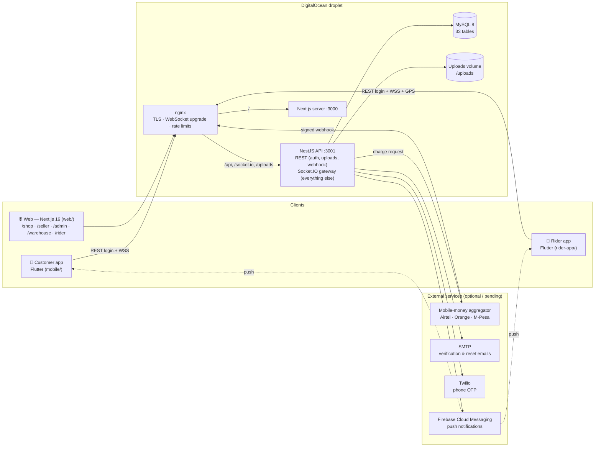
```mermaid
flowchart LR
  subgraph Clients
    CA["📱 Customer app<br/>Flutter (mobile/)"]
    RA["🛵 Rider app<br/>Flutter (rider-app/)"]
    WEB["🌐 Web — Next.js 16 (web/)<br/>/shop · /seller · /admin · /warehouse · /rider"]
  end
  subgraph Droplet["DigitalOcean droplet"]
    NGINX["nginx<br/>TLS · WebSocket upgrade · rate limits"]
    API["NestJS API :3001<br/>REST (auth, uploads, webhook)<br/>Socket.IO gateway (everything else)"]
    NEXT["Next.js server :3000"]
    DB[("MySQL 8<br/>33 tables")]
    FS[("Uploads volume<br/>/uploads")]
  end
  subgraph External["External services (optional / pending)"]
    MM["Mobile-money aggregator<br/>Airtel · Orange · M-Pesa"]
    SMTP["SMTP<br/>verification & reset emails"]
    SMS["Twilio<br/>phone OTP"]
    FCM["Firebase Cloud Messaging<br/>push notifications"]
  end
  CA -- "REST login + WSS" --> NGINX
  RA -- "REST login + WSS + GPS" --> NGINX
  WEB --> NGINX
  NGINX -- "/api, /socket.io, /uploads" --> API
  NGINX -- "/" --> NEXT
  API --> DB
  API --> FS
  API -- "charge request" --> MM
  MM -- "signed webhook" --> NGINX
  API --> SMTP
  API --> SMS
  API --> FCM
  FCM -. push .-> CA
  FCM -. push .-> RA
```

### 2.2 Deployment topology

| Component | Where | How it runs |
|---|---|---|
| nginx | Droplet host | `deploy/nginx/somba.conf`; TLS by certbot; routes `/socket.io/` (WebSocket upgrade), `/api/` (REST), `/api/v1/auth/` (rate-limited 10 req/min/IP, burst 8), `/uploads/` (static, 30-day cache), `/` (Next.js); 6 MB body limit |
| API | Droplet, pm2 (`deploy/ecosystem.config.cjs`) or Docker (`docker-compose.yml`) | `node dist/main.js`, port 3001, single instance (in-memory Socket.IO rooms) |
| Web | Droplet, pm2/Docker | Next.js server, port 3000 |
| Database | MySQL 8 on the droplet (or DO Managed MySQL) | Schema from migrations only (`DB_SYNCHRONIZE=false` in production) |
| Uploads | Local disk volume (`UPLOAD_DIR`) | Served by nginx `/uploads/` |
| Secrets | `/etc/somba/secrets.env` (generated once) + `/etc/somba/api.extra.env` (optional integrations) | `DATA_ENCRYPTION_KEY` must be backed up — losing it makes encrypted data unreadable |
| Script | `deploy/droplet-deploy.sh` | Idempotent: installs packages, writes env, builds, migrates, bootstraps admin/categories/settings/hubs, configures nginx + TLS |

### 2.3 Backend module architecture

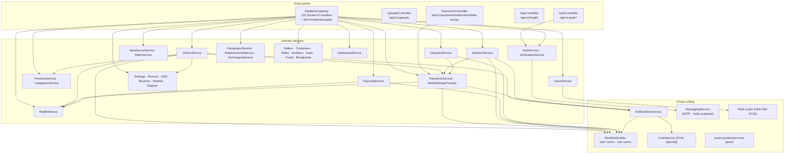
```mermaid
flowchart TB
  subgraph Entry["Entry points"]
    AC["AuthController<br/>/api/v1/auth/*"]
    UC["UploadsController<br/>/api/v1/uploads"]
    PC["PaymentsController<br/>/api/v1/payments/webhook/mobile-money"]
    HC["AppController<br/>/api/v1/health"]
    GW["RealtimeGateway<br/>115 Socket.IO handlers<br/>+ WsThrottleInterceptor"]
  end
  subgraph Core["Domain services"]
    AUTH["AuthService · VerificationService"]
    USERS["UsersService"]
    PROD["ProductsService · CategoriesService"]
    ORD["OrdersService"]
    PAY["PaymentsService · MobileMoneyProvider"]
    WAL["WalletService"]
    DEL["DeliveryService"]
    WH["WarehouseService · RiderService"]
    PO["PayoutsService"]
    DIS["DisputesService"]
    FLOW["CampaignsService · ReplacementsService · ExchangesService"]
    CONT["Settings · Promos · CMS · Reviews · Wishlist · Support"]
    OPS["Sellers · Customers · Roles · Analytics · Audit · Fraud · Broadcasts"]
    ADDR["AddressesService"]
  end
  subgraph Infra["Cross-cutting"]
    EMIT["RealtimeEmitter<br/>user rooms · role rooms"]
    NOTIF["NotificationsService"]
    PUSH["PushService (FCM, optional)"]
    MSG["MessagingService<br/>SMTP · Twilio (optional)"]
    CRYPTO["Field crypto (AES-256-GCM)"]
    GUARD["assert-production boot guard"]
  end
  AC --> AUTH
  GW --> AUTH & USERS & PROD & ORD & PAY & WAL & DEL & WH & PO & DIS & FLOW & CONT & OPS & ADDR
  PC --> PAY
  ORD --> PROD & PAY & WAL & CONT & NOTIF & EMIT
  PAY --> WAL & EMIT & NOTIF
  DEL --> PAY & NOTIF & EMIT
  PO --> WAL & EMIT
  DIS --> PAY & EMIT
  NOTIF --> PUSH & EMIT
  AUTH --> MSG
  USERS --> CRYPTO
```

**Layering rules in the code**

* Controllers and the gateway are thin: they authenticate, check the role, validate the payload and call a service. Every gateway handler returns the envelope `{ ok: true, data } | { ok: false, error }`.
* Services own the business rules and talk to TypeORM repositories directly (no separate repository layer).
* Money and stock changes use **conditional atomic updates** (`UPDATE … WHERE status IN (…)` / `WHERE stock >= qty` / `WHERE balance >= amount`) inside transactions, so concurrent requests can never double-spend, oversell or double-refund.
* Services publish changes through `RealtimeEmitter` into **rooms**: `user:<id>` (one per account) and `role:<role>` (one per role). Clients never poll.
* `PaymentsService` notifies `OrdersService` of asynchronous settlement through a registered callback (`registerOrderSettledHandler`), avoiding a circular dependency.

### 2.4 Communication protocol

**REST (only where a socket is not possible or not yet open)**

| Method | Path | Purpose | Auth |
|---|---|---|---|
| POST | `/api/v1/auth/register` | Create a customer or seller account (other roles refused) | — |
| POST | `/api/v1/auth/login` | Email + password → `{ accessToken, refreshToken, user }` | — |
| POST | `/api/v1/auth/refresh` | New token pair; refused if `tokenVersion` changed or the account is suspended | refresh token |
| GET | `/api/v1/auth/me` | Current user | Bearer |
| POST | `/api/v1/auth/logout-all` | Revoke every session (bumps `tokenVersion`) | Bearer |
| POST | `/api/v1/auth/forgot` | Send a reset link (same answer whether or not the email exists) | — |
| POST | `/api/v1/auth/reset` | Token + new password; revokes sessions | — |
| POST | `/api/v1/auth/email/send` · `/email/verify` | Email verification (24 h link, 30 s resend cooldown) | Bearer / token |
| POST | `/api/v1/auth/phone/send` · `/phone/verify` | Phone OTP (10 min, 5 attempts, 30 s cooldown) | Bearer |
| POST | `/api/v1/uploads` | Image upload (≤ 5 MB, image types only) → public URL | Bearer |
| POST | `/api/v1/payments/webhook/mobile-money` | Aggregator callback; HMAC signature over the raw body (`MM_WEBHOOK_SECRET`) | signature |
| GET | `/api/v1/health` | `{ status, db, transport }` | — |

**WebSocket (Socket.IO)**

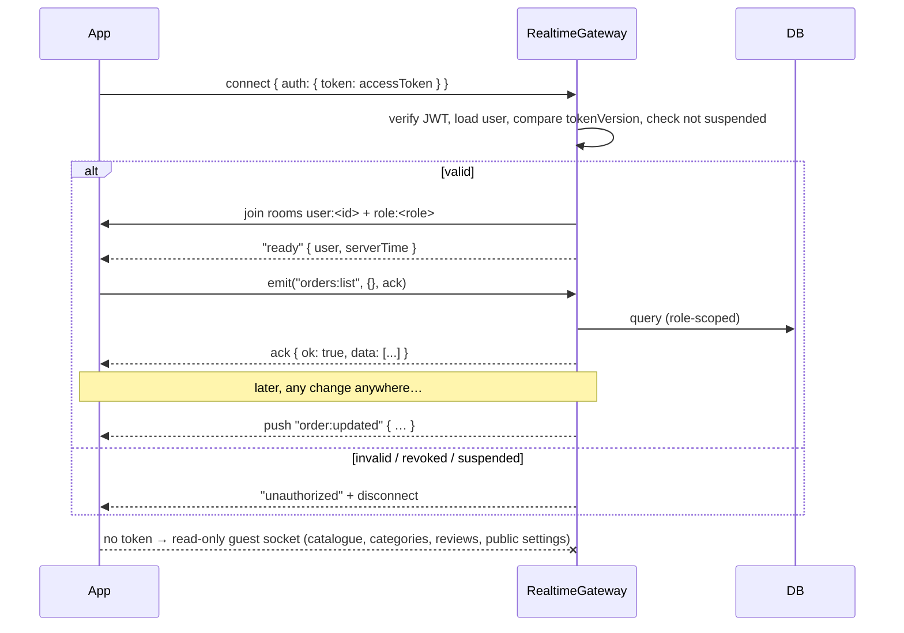
```mermaid
sequenceDiagram
  participant App
  participant API as RealtimeGateway
  participant DB
  App->>API: connect { auth: { token: accessToken } }
  API->>API: verify JWT, load user, compare tokenVersion, check not suspended
  alt valid
    API->>App: join rooms user:<id> + role:<role>
    API-->>App: "ready" { user, serverTime }
    App->>API: emit("orders:list", {}, ack)
    API->>DB: query (role-scoped)
    API-->>App: ack { ok: true, data: [...] }
    Note over API,App: later, any change anywhere…
    API-->>App: push "order:updated" { … }
  else invalid / revoked / suspended
    API-->>App: "unauthorized" + disconnect
  end
  App--xAPI: no token → read-only guest socket (catalogue, categories, reviews, public settings)
```

* **Handshake**: JWT in `auth.token` (or `Authorization: Bearer`). Clients must wait for `ready` before sending requests.
* **Guests**: a socket without a token gets role `guest` and may only call public reads. Every mutation calls `requireUser()`.
* **Throttling**: `WsThrottleInterceptor` limits events per socket; REST auth endpoints are throttled by the API and by nginx.
* **Server disconnect handling (clients)**: on `io server disconnect` the Flutter apps call refresh; 401/403 ends the session (suspension/revocation), otherwise they reconnect with the new token.
* **Rooms used for pushes**: `user:<id>`, `role:customer`, `role:guest`, `role:seller`, `role:rider`, `role:warehouse_staff`, `role:admin`, `role:admin_*`. Lists such as `OPS_ROOMS` (all admin roles + warehouse) and `FINANCE_ROOMS` decide who hears what.

### 2.5 Security architecture

| Concern | Implementation | Where |
|---|---|---|
| Passwords | bcrypt, cost 12; minimum 8 characters | `auth.service.ts` |
| Tokens | JWT access (`JWT_ACCESS_TTL`, default 15 min) and refresh (`JWT_REFRESH_TTL`, default 30 days), separate secrets; payload carries `sub`, `role`, `tokenVersion` | `auth.service.ts` |
| Revocation | `users.tokenVersion` bumped on password change/reset, logout-all, role change, suspension, deletion → old access/refresh tokens and sockets rejected; `kick()` disconnects live sockets | `auth.service.ts`, gateway |
| Encryption at rest | AES-256-GCM column transformer on `users.email/phone/address`, `addresses.*` personal fields, `orders.shippingAddress`, `delivery_tasks.address`, `payments.phone`; key `DATA_ENCRYPTION_KEY` | `common/crypto/field-crypto.ts` |
| Lookup without decryption | `users.emailHash` (deterministic hash) unique index | `users.service.ts` |
| Authorization | Role checks in each handler; admin groups (`config`, `content`, `catalog`, `people`, `insight`, `audit`, `fraud`); ownership checks (same "not found" answer for "not yours" so ids cannot be probed) | `realtime.gateway.ts` |
| Self-registration | Only `customer` and `seller`; staff accounts are created by the super admin | `AuthService.SELF_SERVICE_ROLES` |
| Server-authoritative money | Prices, discounts, delivery fees and totals computed on the server; client prices accepted only outside production for external snapshot lines | `orders.service.ts` |
| Payment webhook | HMAC over the raw request body, amount and provider reference must match, idempotent atomic settlement | `payments.controller.ts`, `payments.service.ts` |
| Production boot guard | Refuses to start in production with default secrets, missing encryption key, SQLite, `DB_SYNCHRONIZE=true` or the sandbox payment provider | `config/assert-production.ts` |
| HTTP hardening | helmet headers, CORS allow-list (`CORS_ORIGINS`), 6 MB body limit, nginx auth rate limit | `main.ts`, nginx |
| Uploads | Type and size checks, random file names, served statically | `uploads.controller.ts` |
| Audit | `audit_logs` written for sensitive admin actions (settings, roles, suspensions, refunds…) | `ops/audit.service.ts` |

**Role catalogue and admin groups**

| Role | Created by | Can do (summary) |
|---|---|---|
| `customer` | Self-registration | Shop, pay, track, review, dispute, support, wallet, addresses |
| `seller` | Self-registration + store approval | Store profile, products, campaigns, own orders (redacted), payouts, Q&A answers, reviews |
| `rider` | Super admin | Delivery pool, claim, status updates, GPS, earnings |
| `warehouse_staff` | Super admin | Parcels, batches, transfers, exceptions, assignment, exchanges/replacements status |
| `admin` | Bootstrap / super admin | Everything, including staff roles |
| `admin_operations` | Super admin | config, catalog, people, insight, audit, fraud, seller moderation, ops |
| `admin_finance` | Super admin | config, people, insight, fraud, refunds, payouts, dispute refunds |
| `admin_support` | Super admin | people (customers), suspend/reactivate customers, support tickets |
| `admin_marketing` | Super admin | content (promos, flash sales, CMS, broadcasts), catalog |
| `admin_moderation` | Super admin | fraud, seller moderation |

| Group | Roles |
|---|---|
| config | admin, admin_finance, admin_operations |
| content | admin, admin_marketing |
| catalog | admin, admin_operations, admin_marketing |
| people | admin, admin_support, admin_operations, admin_finance |
| insight | admin, admin_operations, admin_finance |
| audit | admin, admin_operations |
| fraud | admin, admin_finance, admin_operations, admin_moderation |

---

## 3. Data model — ERD

### 3.1 Overview (all 33 tables and their relationships)

All relations except `orders → order_items` are **logical** (an id column, no database foreign key). The labels show the referencing column.

```mermaid
erDiagram
    User ||--o{ Address : "userId"
    User ||--o{ DeviceToken : "userId"
    User ||--o{ VerificationToken : "userId"
    User ||--o{ Notification : "userId"
    User ||--o{ WalletTransaction : "userId"
    User ||--o| Seller : "userId"
    User ||--o{ Order : "customerId"
    User |o--o{ Order : "riderId"
    User ||--o{ Payment : "userId"
    User ||--o{ Review : "userId"
    User ||--o{ WishlistItem : "userId"
    User ||--o{ SupportTicket : "userId"
    User ||--o{ Dispute : "customerId"
    User ||--o{ Exchange : "customerId"
    User ||--o{ Replacement : "customerId"
    User |o--o{ DeliveryTask : "riderId"
    User |o--o{ WarehouseBatch : "riderId"
    User ||--o{ Payout : "sellerId = user id"
    Seller ||--o{ Product : "sellerId"
    Seller ||--o{ Campaign : "sellerId"
    Seller ||--o{ Replacement : "sellerId"
    Category ||--o{ Product : "category (name)"
    Product ||--o{ OrderItem : "productId"
    Product ||--o{ Review : "productId"
    Product ||--o{ ProductQuestion : "productId"
    Product ||--o{ WishlistItem : "productId"
    Product ||--o{ FlashSale : "productId"
    Order ||--|{ OrderItem : "orderId (real FK, cascade)"
    Order ||--o{ Payment : "orderId"
    Order ||--o| DeliveryTask : "orderId"
    Order ||--o{ Dispute : "orderId"
    Order ||--o{ Exchange : "orderId"
    Order ||--o{ Replacement : "orderId"
    Order ||--o{ FraudAlert : "orderId"
    Order |o--o{ SupportTicket : "orderId"
    Promo |o--o{ Order : "promoCode (code)"
    DeliveryTask ||--o{ WarehouseException : "taskId"
    Hub ||--o{ WarehouseBatch : "hubId"
    WarehouseBatch }o--o{ DeliveryTask : "taskIds (JSON)"
    Hub ||--o{ StockTransfer : "fromHub/toHub (name)"
    Setting ||--o{ Order : "deliveryZones → zoneId"
```

Notes on the model:

* `Setting.deliveryZones` is a JSON list `{ id, name, nameFr, city, feeUsd }`; `orders.zoneId`, `addresses.zoneId` and `delivery_tasks.zoneId` refer to those ids (there is no zones table).
* `products.sellerId` normally holds `sellers.id` but falls back to the user id for demo stores; `payouts.sellerId` holds the **user** id; `campaigns.sellerId` holds `sellers.id` or the user id. This inconsistency is listed in section 10.
* `products.category` stores the category **name** (string), not `categories.id`.
* `order_items.productId` is either a product id or `ext:<name>` for an external snapshot line (development only).
* Names such as `customerName`, `sellerName`, `productName`, `orderReference` are **denormalised snapshots** so lists render without joins.

The domain diagrams below show every column (PK = primary key, UK = unique, FK = logical reference).

### 3.2 Identity, accounts & messaging

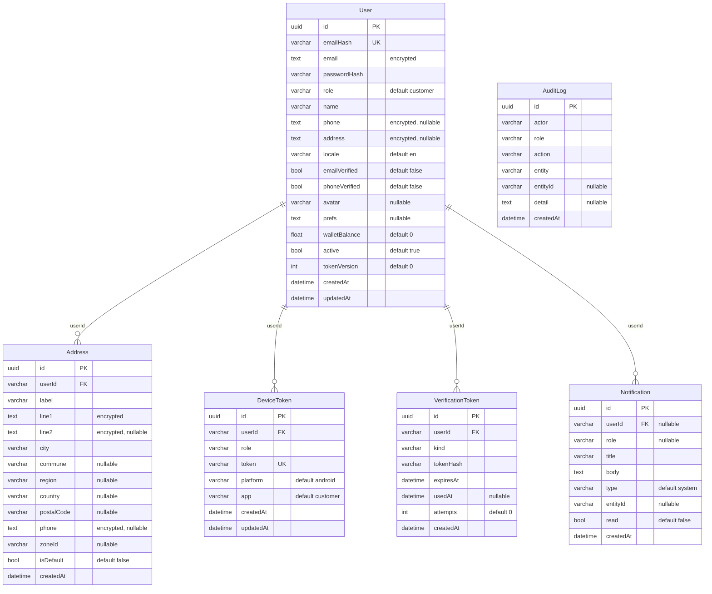
```mermaid
erDiagram
    User ||--o{ Address : "userId"
    User ||--o{ DeviceToken : "userId"
    User ||--o{ VerificationToken : "userId"
    User ||--o{ Notification : "userId"
    User {
        uuid id PK
        varchar emailHash UK
        text email  "encrypted"
        varchar passwordHash
        varchar role  "default customer"
        varchar name
        text phone  "encrypted, nullable"
        text address  "encrypted, nullable"
        varchar locale  "default en"
        bool emailVerified  "default false"
        bool phoneVerified  "default false"
        varchar avatar  "nullable"
        text prefs  "nullable"
        float walletBalance  "default 0"
        bool active  "default true"
        int tokenVersion  "default 0"
        datetime createdAt
        datetime updatedAt
    }
    Address {
        uuid id PK
        varchar userId FK
        varchar label
        text line1  "encrypted"
        text line2  "encrypted, nullable"
        varchar city
        varchar commune  "nullable"
        varchar region  "nullable"
        varchar country  "nullable"
        varchar postalCode  "nullable"
        text phone  "encrypted, nullable"
        varchar zoneId  "nullable"
        bool isDefault  "default false"
        datetime createdAt
    }
    DeviceToken {
        uuid id PK
        varchar userId FK
        varchar role
        varchar token UK
        varchar platform  "default android"
        varchar app  "default customer"
        datetime createdAt
        datetime updatedAt
    }
    VerificationToken {
        uuid id PK
        varchar userId FK
        varchar kind
        varchar tokenHash
        datetime expiresAt
        datetime usedAt  "nullable"
        int attempts  "default 0"
        datetime createdAt
    }
    Notification {
        uuid id PK
        varchar userId FK "nullable"
        varchar role  "nullable"
        varchar title
        text body
        varchar type  "default system"
        varchar entityId  "nullable"
        bool read  "default false"
        datetime createdAt
    }
    AuditLog {
        uuid id PK
        varchar actor
        varchar role
        varchar action
        varchar entity
        varchar entityId  "nullable"
        text detail  "nullable"
        datetime createdAt
    }
```

### 3.3 Catalogue, sellers & marketing

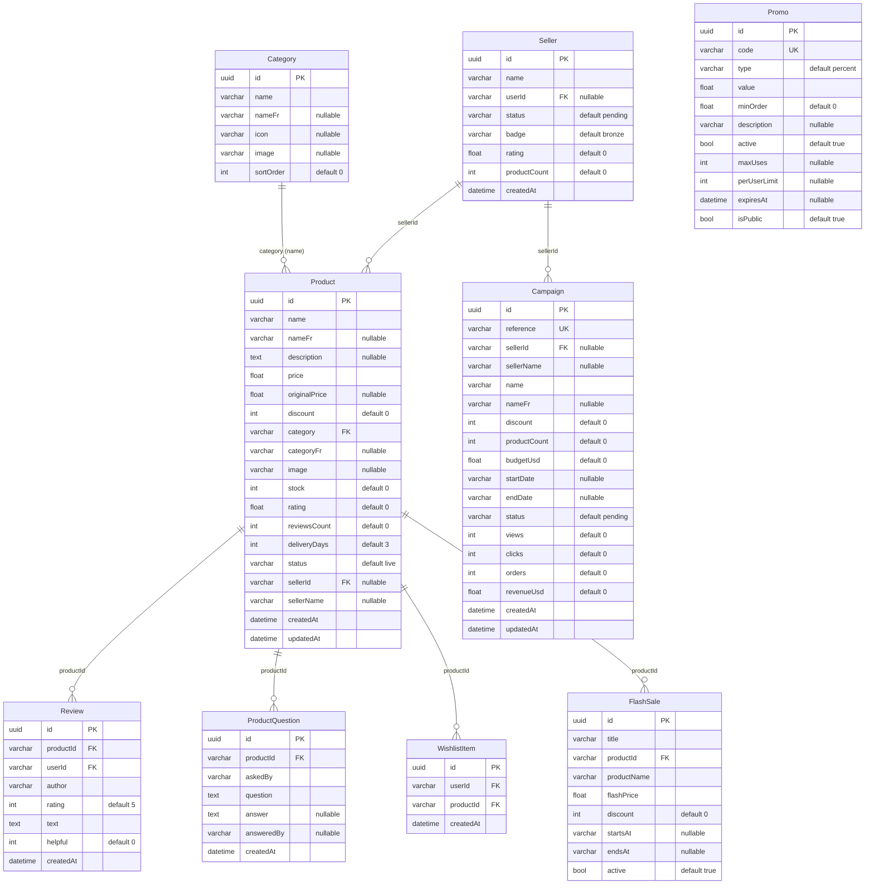
```mermaid
erDiagram
    Seller ||--o{ Product : "sellerId"
    Seller ||--o{ Campaign : "sellerId"
    Category ||--o{ Product : "category (name)"
    Product ||--o{ Review : "productId"
    Product ||--o{ ProductQuestion : "productId"
    Product ||--o{ WishlistItem : "productId"
    Product ||--o{ FlashSale : "productId"
    Seller {
        uuid id PK
        varchar name
        varchar userId FK "nullable"
        varchar status  "default pending"
        varchar badge  "default bronze"
        float rating  "default 0"
        int productCount  "default 0"
        datetime createdAt
    }
    Category {
        uuid id PK
        varchar name
        varchar nameFr  "nullable"
        varchar icon  "nullable"
        varchar image  "nullable"
        int sortOrder  "default 0"
    }
    Product {
        uuid id PK
        varchar name
        varchar nameFr  "nullable"
        text description  "nullable"
        float price
        float originalPrice  "nullable"
        int discount  "default 0"
        varchar category FK
        varchar categoryFr  "nullable"
        varchar image  "nullable"
        int stock  "default 0"
        float rating  "default 0"
        int reviewsCount  "default 0"
        int deliveryDays  "default 3"
        varchar status  "default live"
        varchar sellerId FK "nullable"
        varchar sellerName  "nullable"
        datetime createdAt
        datetime updatedAt
    }
    Review {
        uuid id PK
        varchar productId FK
        varchar userId FK
        varchar author
        int rating  "default 5"
        text text
        int helpful  "default 0"
        datetime createdAt
    }
    ProductQuestion {
        uuid id PK
        varchar productId FK
        varchar askedBy
        text question
        text answer  "nullable"
        varchar answeredBy  "nullable"
        datetime createdAt
    }
    WishlistItem {
        uuid id PK
        varchar userId FK
        varchar productId FK
        datetime createdAt
    }
    FlashSale {
        uuid id PK
        varchar title
        varchar productId FK
        varchar productName
        float flashPrice
        int discount  "default 0"
        varchar startsAt  "nullable"
        varchar endsAt  "nullable"
        bool active  "default true"
    }
    Campaign {
        uuid id PK
        varchar reference UK
        varchar sellerId FK "nullable"
        varchar sellerName  "nullable"
        varchar name
        varchar nameFr  "nullable"
        int discount  "default 0"
        int productCount  "default 0"
        float budgetUsd  "default 0"
        varchar startDate  "nullable"
        varchar endDate  "nullable"
        varchar status  "default pending"
        int views  "default 0"
        int clicks  "default 0"
        int orders  "default 0"
        float revenueUsd  "default 0"
        datetime createdAt
        datetime updatedAt
    }
    Promo {
        uuid id PK
        varchar code UK
        varchar type  "default percent"
        float value
        float minOrder  "default 0"
        varchar description  "nullable"
        bool active  "default true"
        int maxUses  "nullable"
        int perUserLimit  "nullable"
        datetime expiresAt  "nullable"
        bool isPublic  "default true"
    }
```

### 3.4 Orders, payments & money

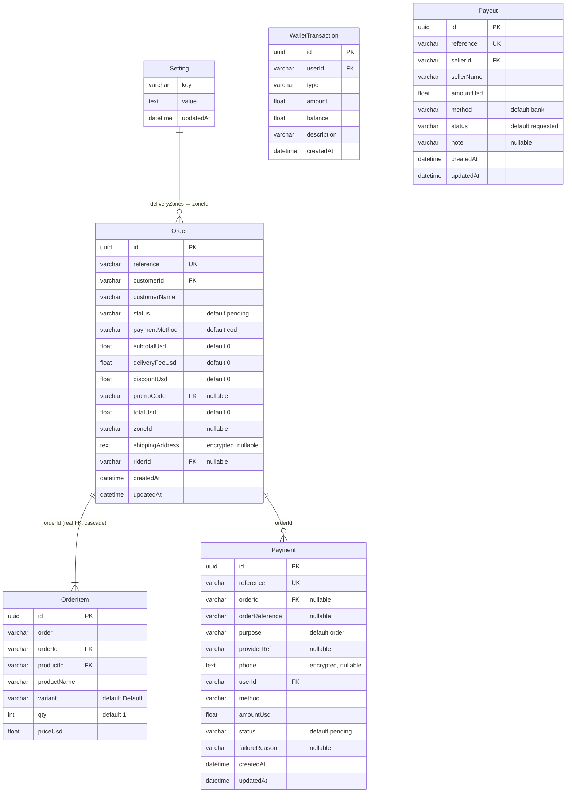
```mermaid
erDiagram
    Order ||--|{ OrderItem : "orderId (real FK, cascade)"
    Order ||--o{ Payment : "orderId"
    Setting ||--o{ Order : "deliveryZones → zoneId"
    Order {
        uuid id PK
        varchar reference UK
        varchar customerId FK
        varchar customerName
        varchar status  "default pending"
        varchar paymentMethod  "default cod"
        float subtotalUsd  "default 0"
        float deliveryFeeUsd  "default 0"
        float discountUsd  "default 0"
        varchar promoCode FK "nullable"
        float totalUsd  "default 0"
        varchar zoneId  "nullable"
        text shippingAddress  "encrypted, nullable"
        varchar riderId FK "nullable"
        datetime createdAt
        datetime updatedAt
    }
    OrderItem {
        uuid id PK
        varchar order
        varchar orderId FK
        varchar productId FK
        varchar productName
        varchar variant  "default Default"
        int qty  "default 1"
        float priceUsd
    }
    Payment {
        uuid id PK
        varchar reference UK
        varchar orderId FK "nullable"
        varchar orderReference  "nullable"
        varchar purpose  "default order"
        varchar providerRef  "nullable"
        text phone  "encrypted, nullable"
        varchar userId FK
        varchar method
        float amountUsd
        varchar status  "default pending"
        varchar failureReason  "nullable"
        datetime createdAt
        datetime updatedAt
    }
    WalletTransaction {
        uuid id PK
        varchar userId FK
        varchar type
        float amount
        float balance
        varchar description
        datetime createdAt
    }
    Payout {
        uuid id PK
        varchar reference UK
        varchar sellerId FK
        varchar sellerName
        float amountUsd
        varchar method  "default bank"
        varchar status  "default requested"
        varchar note  "nullable"
        datetime createdAt
        datetime updatedAt
    }
    Setting {
        varchar key
        text value
        datetime updatedAt
    }
```

### 3.5 Fulfilment & warehouse

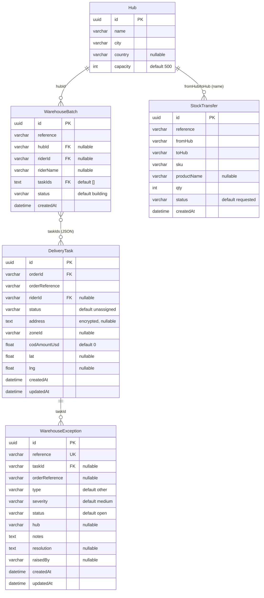
```mermaid
erDiagram
    DeliveryTask ||--o{ WarehouseException : "taskId"
    Hub ||--o{ WarehouseBatch : "hubId"
    WarehouseBatch }o--o{ DeliveryTask : "taskIds (JSON)"
    Hub ||--o{ StockTransfer : "fromHub/toHub (name)"
    DeliveryTask {
        uuid id PK
        varchar orderId FK
        varchar orderReference
        varchar riderId FK "nullable"
        varchar status  "default unassigned"
        text address  "encrypted, nullable"
        varchar zoneId  "nullable"
        float codAmountUsd  "default 0"
        float lat  "nullable"
        float lng  "nullable"
        datetime createdAt
        datetime updatedAt
    }
    Hub {
        uuid id PK
        varchar name
        varchar city
        varchar country  "nullable"
        int capacity  "default 500"
    }
    WarehouseBatch {
        uuid id PK
        varchar reference
        varchar hubId FK "nullable"
        varchar riderId FK "nullable"
        varchar riderName  "nullable"
        text taskIds FK "default []"
        varchar status  "default building"
        datetime createdAt
    }
    StockTransfer {
        uuid id PK
        varchar reference
        varchar fromHub
        varchar toHub
        varchar sku
        varchar productName  "nullable"
        int qty
        varchar status  "default requested"
        datetime createdAt
    }
    WarehouseException {
        uuid id PK
        varchar reference UK
        varchar taskId FK "nullable"
        varchar orderReference  "nullable"
        varchar type  "default other"
        varchar severity  "default medium"
        varchar status  "default open"
        varchar hub  "nullable"
        text notes
        text resolution  "nullable"
        varchar raisedBy  "nullable"
        datetime createdAt
        datetime updatedAt
    }
```

### 3.6 After-sales, support & trust

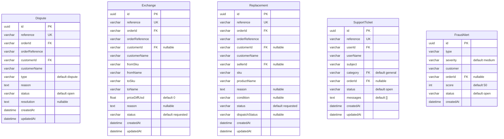
```mermaid
erDiagram
    Dispute {
        uuid id PK
        varchar reference UK
        varchar orderId FK
        varchar orderReference
        varchar customerId FK
        varchar customerName
        varchar type  "default dispute"
        text reason
        varchar status  "default open"
        text resolution  "nullable"
        datetime createdAt
        datetime updatedAt
    }
    Exchange {
        uuid id PK
        varchar reference UK
        varchar orderId FK
        varchar orderReference
        varchar customerId FK "nullable"
        varchar customerName
        varchar fromSku
        varchar fromName
        varchar toSku
        varchar toName
        float priceDiffUsd  "default 0"
        text reason  "nullable"
        varchar status  "default requested"
        datetime createdAt
        datetime updatedAt
    }
    Replacement {
        uuid id PK
        varchar reference UK
        varchar orderId FK
        varchar orderReference
        varchar customerId FK "nullable"
        varchar customerName
        varchar sellerId FK "nullable"
        varchar sku
        varchar productName
        text reason  "nullable"
        varchar condition  "nullable"
        varchar status  "default requested"
        varchar dispatchStatus  "nullable"
        datetime createdAt
        datetime updatedAt
    }
    SupportTicket {
        uuid id PK
        varchar reference UK
        varchar userId FK
        varchar userName
        varchar subject
        varchar category FK "default general"
        varchar orderId FK "nullable"
        varchar status  "default open"
        text messages  "default []"
        datetime createdAt
        datetime updatedAt
    }
    FraudAlert {
        uuid id PK
        varchar type
        varchar severity  "default medium"
        varchar customer
        varchar orderId FK "nullable"
        int score  "default 50"
        varchar status  "default open"
        datetime createdAt
    }
```

### 3.7 Content & communication

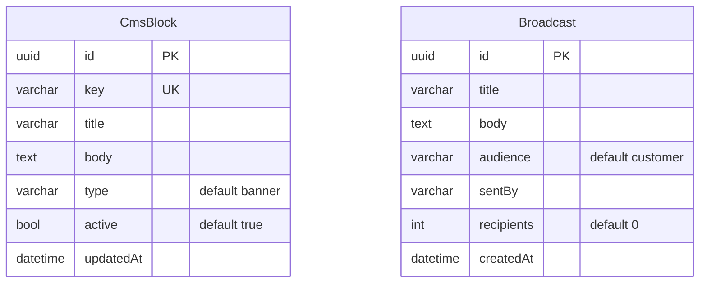
```mermaid
erDiagram
    CmsBlock {
        uuid id PK
        varchar key UK
        varchar title
        text body
        varchar type  "default banner"
        bool active  "default true"
        datetime updatedAt
    }
    Broadcast {
        uuid id PK
        varchar title
        text body
        varchar audience  "default customer"
        varchar sentBy
        int recipients  "default 0"
        datetime createdAt
    }
```

---

## 4. Data dictionary — every table and field

Generated from `api/src/database/entities/*.entity.ts`. Types are the TypeORM column types (`varchar` = VARCHAR(255) unless a length is shown; `float` is used for money today — see section 10).

### Identity, accounts & messaging

#### `users` — User  
_Source: `api/src/database/entities/user.entity.ts`_

| Field | DB type | Null | Default | Index | Notes |
|---|---|---|---|---|---|
| `id` | uuid |  |  | PK |  |
| `emailHash` | varchar(128) |  |  | unique | Deterministic lowercase hash of the email, used for uniqueness + login lookups without needing to decrypt every row. The human-readable email is stored encrypted in {@link email}. |
| `email` | text |  |  |  | **AES-256-GCM encrypted at rest**; Encrypted at rest (AES-256-GCM). |
| `passwordHash` | varchar |  |  |  |  |
| `role` | varchar(40) |  | customer |  | Values: customer, seller, admin, admin_operations, admin_finance, admin_support, admin_marketing, admin_moderation, warehouse_staff, rider |
| `name` | varchar |  |  |  |  |
| `phone` | text | yes |  |  | **AES-256-GCM encrypted at rest**; Encrypted at rest. |
| `address` | text | yes |  |  | **AES-256-GCM encrypted at rest**; Encrypted at rest — JSON blob of the default address. |
| `locale` | varchar(4) |  | en |  | Values: en, fr |
| `emailVerified` | boolean |  | false |  |  |
| `phoneVerified` | boolean |  | false |  |  |
| `avatar` | varchar(255) | yes |  |  | Public URL of the profile picture (from POST /api/v1/uploads). |
| `prefs` | text | yes |  |  | JSON: { push, email, sms, personalize, market } — see UsersService.prefs. |
| `walletBalance` | float |  | 0 |  | Wallet store-credit balance in USD. |
| `active` | boolean |  | true |  | Rider/warehouse availability toggle. |
| `tokenVersion` | int |  | 0 |  | Bumped to invalidate all previously issued tokens ("log out everywhere"). Access/refresh tokens carry the version they were minted at; a mismatch is rejected on refresh and on socket connect. |
| `createdAt` | datetime |  |  |  | Set on insert |
| `updatedAt` | datetime |  |  |  | Set on every update |

#### `addresses` — Address  
_Source: `api/src/database/entities/address.entity.ts`_

| Field | DB type | Null | Default | Index | Notes |
|---|---|---|---|---|---|
| `id` | uuid |  |  | PK |  |
| `userId` | varchar |  |  | yes |  |
| `label` | varchar |  |  |  |  |
| `line1` | text |  |  |  | **AES-256-GCM encrypted at rest** |
| `line2` | text | yes |  |  | **AES-256-GCM encrypted at rest** |
| `city` | varchar |  |  |  |  |
| `commune` | varchar | yes |  |  |  |
| `region` | varchar | yes |  |  |  |
| `country` | varchar | yes |  |  |  |
| `postalCode` | varchar | yes |  |  |  |
| `phone` | text | yes |  |  | **AES-256-GCM encrypted at rest** |
| `zoneId` | varchar | yes |  |  |  |
| `isDefault` | boolean |  | false |  |  |
| `createdAt` | datetime |  |  |  | Set on insert |

#### `device_tokens` — DeviceToken  
_Source: `api/src/database/entities/device-token.entity.ts`_

| Field | DB type | Null | Default | Index | Notes |
|---|---|---|---|---|---|
| `id` | uuid |  |  | PK |  |
| `userId` | varchar(64) |  |  | yes |  |
| `role` | varchar(32) |  |  | yes | Denormalised so role-wide broadcasts need no join. |
| `token` | varchar(255) |  |  | unique |  |
| `platform` | varchar(10) |  | android |  | Values: android, ios, web |
| `app` | varchar(10) |  | customer |  | Values: customer, rider, web |
| `createdAt` | datetime |  |  |  | Set on insert |
| `updatedAt` | datetime |  |  |  | Set on every update |

#### `verification_tokens` — VerificationToken  
_Source: `api/src/database/entities/verification-token.entity.ts`_

| Field | DB type | Null | Default | Index | Notes |
|---|---|---|---|---|---|
| `id` | uuid |  |  | PK |  |
| `userId` | varchar(64) |  |  | yes |  |
| `kind` | varchar(10) |  |  |  | Values: email, phone, reset |
| `tokenHash` | varchar(64) |  |  | yes |  |
| `expiresAt` | datetime |  |  |  |  |
| `usedAt` | datetime | yes |  |  |  |
| `attempts` | int |  | 0 |  | Wrong-code attempts so far (OTP brute-force limit). |
| `createdAt` | datetime |  |  |  | Set on insert |

#### `notifications` — Notification  
_Source: `api/src/database/entities/notification.entity.ts`_

| Field | DB type | Null | Default | Index | Notes |
|---|---|---|---|---|---|
| `id` | uuid |  |  | PK |  |
| `userId` | varchar | yes |  | yes | Target user (null = broadcast to a whole role). |
| `role` | varchar | yes |  |  | Target role room (e.g. 'admin', 'rider') for broadcasts. |
| `title` | varchar |  |  |  |  |
| `body` | text |  |  |  |  |
| `type` | varchar |  | system |  | Free-form category: order, payout, dispute, delivery, system… |
| `entityId` | varchar | yes |  |  | Optional deep-link target, e.g. an order id. |
| `read` | boolean |  | false |  |  |
| `createdAt` | datetime |  |  |  | Set on insert |

#### `audit_logs` — AuditLog  
_Source: `api/src/database/entities/audit-log.entity.ts`_

| Field | DB type | Null | Default | Index | Notes |
|---|---|---|---|---|---|
| `id` | uuid |  |  | PK |  |
| `actor` | varchar |  |  |  |  |
| `role` | varchar |  |  |  |  |
| `action` | varchar |  |  | yes |  |
| `entity` | varchar |  |  |  |  |
| `entityId` | varchar | yes |  |  |  |
| `detail` | text | yes |  |  |  |
| `createdAt` | datetime |  |  |  | Set on insert |

### Catalogue, sellers & marketing

#### `sellers` — Seller  
_Source: `api/src/database/entities/seller.entity.ts`_

| Field | DB type | Null | Default | Index | Notes |
|---|---|---|---|---|---|
| `id` | uuid |  |  | PK |  |
| `name` | varchar |  |  |  |  |
| `userId` | varchar | yes |  |  | Owning user account (nullable for seed-only demo stores). |
| `status` | varchar(20) |  | pending |  | Values: pending, approved, rejected, suspended |
| `badge` | varchar(20) |  | bronze |  | Values: gold, silver, bronze, somba_assured |
| `rating` | float |  | 0 |  |  |
| `productCount` | int |  | 0 |  |  |
| `createdAt` | datetime |  |  |  | Set on insert |

#### `categories` — Category  
_Source: `api/src/database/entities/category.entity.ts`_

| Field | DB type | Null | Default | Index | Notes |
|---|---|---|---|---|---|
| `id` | uuid |  |  | PK |  |
| `name` | varchar |  |  |  |  |
| `nameFr` | varchar | yes |  |  |  |
| `icon` | varchar | yes |  |  |  |
| `image` | varchar | yes |  |  |  |
| `sortOrder` | int |  | 0 |  |  |

#### `products` — Product  
_Source: `api/src/database/entities/product.entity.ts`_

| Field | DB type | Null | Default | Index | Notes |
|---|---|---|---|---|---|
| `id` | uuid |  |  | PK |  |
| `name` | varchar |  |  |  |  |
| `nameFr` | varchar | yes |  |  |  |
| `description` | text | yes |  |  |  |
| `price` | float |  |  |  | Price in USD. |
| `originalPrice` | float | yes |  |  | Pre-discount reference price (for the struck-through UI price). |
| `discount` | int |  | 0 |  | Percentage discount shown on cards. |
| `category` | varchar |  |  | yes |  |
| `categoryFr` | varchar | yes |  |  |  |
| `image` | varchar | yes |  |  |  |
| `stock` | int |  | 0 |  |  |
| `rating` | float |  | 0 |  |  |
| `reviewsCount` | int |  | 0 |  | Number of customer reviews (denormalised for cards/listings). |
| `deliveryDays` | int |  | 3 |  | Estimated delivery time in days. |
| `status` | varchar(20) |  | live | yes | Values: draft, pending, approved, rejected, live, removed |
| `sellerId` | varchar | yes |  |  |  |
| `sellerName` | varchar | yes |  |  |  |
| `createdAt` | datetime |  |  |  | Set on insert |
| `updatedAt` | datetime |  |  |  | Set on every update |

#### `reviews` — Review  
_Source: `api/src/database/entities/review.entity.ts`_

| Field | DB type | Null | Default | Index | Notes |
|---|---|---|---|---|---|
| `id` | uuid |  |  | PK |  |
| `productId` | varchar |  |  | yes |  |
| `userId` | varchar |  |  |  |  |
| `author` | varchar |  |  |  |  |
| `rating` | int |  | 5 |  |  |
| `text` | text |  |  |  |  |
| `helpful` | int |  | 0 |  | How many shoppers found this review helpful. |
| `createdAt` | datetime |  |  |  | Set on insert |

#### `product_questions` — ProductQuestion  
_Source: `api/src/database/entities/product-question.entity.ts`_

| Field | DB type | Null | Default | Index | Notes |
|---|---|---|---|---|---|
| `id` | uuid |  |  | PK |  |
| `productId` | varchar |  |  | yes |  |
| `askedBy` | varchar |  |  |  |  |
| `question` | text |  |  |  |  |
| `answer` | text | yes |  |  |  |
| `answeredBy` | varchar | yes |  |  |  |
| `createdAt` | datetime |  |  |  | Set on insert |

#### `wishlist_items` — WishlistItem  
_Source: `api/src/database/entities/wishlist-item.entity.ts`_

| Field | DB type | Null | Default | Index | Notes |
|---|---|---|---|---|---|
| `id` | uuid |  |  | PK |  |
| `userId` | varchar |  |  | yes |  |
| `productId` | varchar |  |  |  |  |
| `createdAt` | datetime |  |  |  | Set on insert |

Composite unique index: ['userId', 'productId']

#### `flash_sales` — FlashSale  
_Source: `api/src/database/entities/flash-sale.entity.ts`_

| Field | DB type | Null | Default | Index | Notes |
|---|---|---|---|---|---|
| `id` | uuid |  |  | PK |  |
| `title` | varchar |  |  |  |  |
| `productId` | varchar |  |  |  |  |
| `productName` | varchar |  |  |  |  |
| `flashPrice` | float |  |  |  |  |
| `discount` | int |  | 0 |  |  |
| `startsAt` | varchar | yes |  |  |  |
| `endsAt` | varchar | yes |  |  |  |
| `active` | boolean |  | true |  |  |

#### `campaigns` — Campaign  
_Source: `api/src/database/entities/campaign.entity.ts`_

| Field | DB type | Null | Default | Index | Notes |
|---|---|---|---|---|---|
| `id` | uuid |  |  | PK |  |
| `reference` | varchar(24) |  |  | unique |  |
| `sellerId` | varchar | yes |  | yes |  |
| `sellerName` | varchar | yes |  |  |  |
| `name` | varchar |  |  |  |  |
| `nameFr` | varchar | yes |  |  |  |
| `discount` | int |  | 0 |  | Percentage discount applied to the promoted products. |
| `productCount` | int |  | 0 |  | Number of products included in the campaign. |
| `budgetUsd` | float |  | 0 |  |  |
| `startDate` | varchar | yes |  |  |  |
| `endDate` | varchar | yes |  |  |  |
| `status` | varchar(20) |  | pending | yes | Values: draft, pending, scheduled, active, ended, rejected |
| `views` | int |  | 0 |  | ── Engagement metrics ── |
| `clicks` | int |  | 0 |  |  |
| `orders` | int |  | 0 |  |  |
| `revenueUsd` | float |  | 0 |  |  |
| `createdAt` | datetime |  |  |  | Set on insert |
| `updatedAt` | datetime |  |  |  | Set on every update |

#### `promos` — Promo  
_Source: `api/src/database/entities/promo.entity.ts`_

| Field | DB type | Null | Default | Index | Notes |
|---|---|---|---|---|---|
| `id` | uuid |  |  | PK |  |
| `code` | varchar(40) |  |  | unique |  |
| `type` | varchar(20) |  | percent |  | Values: percent, fixed |
| `value` | float |  |  |  |  |
| `minOrder` | float |  | 0 |  |  |
| `description` | varchar | yes |  |  |  |
| `active` | boolean |  | true |  |  |
| `maxUses` | int | yes |  |  | Total redemptions allowed across all customers (null = unlimited). |
| `perUserLimit` | int | yes |  |  | Redemptions allowed per customer (null = unlimited). |
| `expiresAt` | datetime | yes |  |  | After this moment the code stops working (null = never). |
| `isPublic` | boolean |  | true |  | Listed in the app's Coupons screen? Private codes are handed out directly. |

### Orders, payments & money

#### `orders` — Order  
_Source: `api/src/database/entities/order.entity.ts`_

| Field | DB type | Null | Default | Index | Notes |
|---|---|---|---|---|---|
| `id` | uuid |  |  | PK |  |
| `reference` | varchar(20) |  |  | unique | Short human-facing reference, e.g. SOM-1042. |
| `customerId` | varchar |  |  | yes |  |
| `customerName` | varchar |  |  |  |  |
| `status` | varchar(20) |  | pending | yes | Values: pending, confirmed, processing, shipped, out_for_delivery, delivered, cancelled, returned |
| `paymentMethod` | varchar(20) |  | cod |  | Values: stripe_card, cod, airtel_money, orange_money, vodacom_mpesa, wallet |
| `subtotalUsd` | float |  | 0 |  |  |
| `deliveryFeeUsd` | float |  | 0 |  |  |
| `discountUsd` | float |  | 0 |  | Promo discount already deducted from the total (server-validated). |
| `promoCode` | varchar(40) | yes |  |  |  |
| `totalUsd` | float |  | 0 |  |  |
| `zoneId` | varchar | yes |  |  |  |
| `shippingAddress` | text | yes |  |  | **AES-256-GCM encrypted at rest**; Encrypted at rest — full JSON delivery address. |
| `riderId` | varchar | yes |  |  | Assigned rider (set when a delivery task is accepted). |
| items | relation | — | — | — | One-to-many `OrderItem[]` (eager, cascade) |
| `createdAt` | datetime |  |  |  | Set on insert |
| `updatedAt` | datetime |  |  |  | Set on every update |

#### `order_items` — OrderItem  
_Source: `api/src/database/entities/order-item.entity.ts`_

| Field | DB type | Null | Default | Index | Notes |
|---|---|---|---|---|---|
| `id` | uuid |  |  | PK |  |
| order | relation | — | — | — | Many-to-one `Order` |
| `orderId` | varchar |  |  |  |  |
| `productId` | varchar |  |  |  |  |
| `productName` | varchar |  |  |  |  |
| `variant` | varchar |  | Default |  |  |
| `qty` | int |  | 1 |  |  |
| `priceUsd` | float |  |  |  |  |

#### `payments` — Payment  
_Source: `api/src/database/entities/payment.entity.ts`_

| Field | DB type | Null | Default | Index | Notes |
|---|---|---|---|---|---|
| `id` | uuid |  |  | PK |  |
| `reference` | varchar(24) |  |  | unique |  |
| `orderId` | varchar | yes |  | yes | null for wallet top-ups, which have no order. |
| `orderReference` | varchar | yes |  |  |  |
| `purpose` | varchar(10) |  | order |  | Values: order, topup; What the money is for: an order, or a wallet top-up. |
| `providerRef` | varchar(100) | yes |  |  | The mobile-money aggregator's own transaction id (for reconciliation). |
| `phone` | text | yes |  |  | **AES-256-GCM encrypted at rest**; Subscriber number that approves the charge. Encrypted at rest. |
| `userId` | varchar |  |  | yes |  |
| `method` | varchar(20) |  |  |  |  |
| `amountUsd` | float |  |  |  |  |
| `status` | varchar(20) |  | pending |  | Values: pending, succeeded, failed, refunded |
| `failureReason` | varchar | yes |  |  |  |
| `createdAt` | datetime |  |  |  | Set on insert |
| `updatedAt` | datetime |  |  |  | Set on every update |

#### `wallet_transactions` — WalletTransaction  
_Source: `api/src/database/entities/wallet-transaction.entity.ts`_

| Field | DB type | Null | Default | Index | Notes |
|---|---|---|---|---|---|
| `id` | uuid |  |  | PK |  |
| `userId` | varchar |  |  | yes |  |
| `type` | varchar(20) |  |  |  | Values: credit, debit, cashback, refund, topup |
| `amount` | float |  |  |  |  |
| `balance` | float |  |  |  | Running balance after this transaction. |
| `description` | varchar |  |  |  |  |
| `createdAt` | datetime |  |  |  | Set on insert |

#### `payouts` — Payout  
_Source: `api/src/database/entities/payout.entity.ts`_

| Field | DB type | Null | Default | Index | Notes |
|---|---|---|---|---|---|
| `id` | uuid |  |  | PK |  |
| `reference` | varchar(24) |  |  | unique |  |
| `sellerId` | varchar |  |  | yes |  |
| `sellerName` | varchar |  |  |  |  |
| `amountUsd` | float |  |  |  |  |
| `method` | varchar(20) |  | bank |  |  |
| `status` | varchar(20) |  | requested | yes | Values: requested, approved, rejected, paid |
| `note` | varchar | yes |  |  |  |
| `createdAt` | datetime |  |  |  | Set on insert |
| `updatedAt` | datetime |  |  |  | Set on every update |

#### `settings` — Setting  
_Source: `api/src/database/entities/setting.entity.ts`_

| Field | DB type | Null | Default | Index | Notes |
|---|---|---|---|---|---|
| `key` | varchar |  |  |  |  |
| `value` | text |  |  |  |  |
| `updatedAt` | datetime |  |  |  | Set on every update |

### Fulfilment & warehouse

#### `delivery_tasks` — DeliveryTask  
_Source: `api/src/database/entities/delivery-task.entity.ts`_

| Field | DB type | Null | Default | Index | Notes |
|---|---|---|---|---|---|
| `id` | uuid |  |  | PK |  |
| `orderId` | varchar |  |  | yes |  |
| `orderReference` | varchar |  |  |  |  |
| `riderId` | varchar | yes |  | yes |  |
| `status` | varchar(20) |  | unassigned |  | Values: unassigned, assigned, picked_up, in_transit, delivered, failed |
| `address` | text | yes |  |  | **AES-256-GCM encrypted at rest**; Encrypted at rest — delivery address text. |
| `zoneId` | varchar | yes |  |  |  |
| `codAmountUsd` | float |  | 0 |  | COD amount to collect (USD); 0 for prepaid. |
| `lat` | float | yes |  |  | Live rider position, updated over the socket. |
| `lng` | float | yes |  |  |  |
| `createdAt` | datetime |  |  |  | Set on insert |
| `updatedAt` | datetime |  |  |  | Set on every update |

#### `hubs` — Hub  
_Source: `api/src/database/entities/hub.entity.ts`_

| Field | DB type | Null | Default | Index | Notes |
|---|---|---|---|---|---|
| `id` | uuid |  |  | PK |  |
| `name` | varchar |  |  |  |  |
| `city` | varchar |  |  |  |  |
| `country` | varchar | yes |  |  |  |
| `capacity` | int |  | 500 |  |  |

#### `warehouse_batches` — WarehouseBatch  
_Source: `api/src/database/entities/warehouse-batch.entity.ts`_

| Field | DB type | Null | Default | Index | Notes |
|---|---|---|---|---|---|
| `id` | uuid |  |  | PK |  |
| `reference` | varchar(24) |  |  |  |  |
| `hubId` | varchar | yes |  |  |  |
| `riderId` | varchar | yes |  |  |  |
| `riderName` | varchar | yes |  |  |  |
| `taskIds` | text |  | [] |  | JSON array of delivery-task ids in the batch. |
| `status` | varchar(20) |  | building |  |  |
| `createdAt` | datetime |  |  |  | Set on insert |

#### `stock_transfers` — StockTransfer  
_Source: `api/src/database/entities/stock-transfer.entity.ts`_

| Field | DB type | Null | Default | Index | Notes |
|---|---|---|---|---|---|
| `id` | uuid |  |  | PK |  |
| `reference` | varchar(24) |  |  |  |  |
| `fromHub` | varchar |  |  |  |  |
| `toHub` | varchar |  |  |  |  |
| `sku` | varchar |  |  |  |  |
| `productName` | varchar | yes |  |  |  |
| `qty` | int |  |  |  |  |
| `status` | varchar(20) |  | requested |  |  |
| `createdAt` | datetime |  |  |  | Set on insert |

#### `warehouse_exceptions` — WarehouseException  
_Source: `api/src/database/entities/warehouse-exception.entity.ts`_

| Field | DB type | Null | Default | Index | Notes |
|---|---|---|---|---|---|
| `id` | uuid |  |  | PK |  |
| `reference` | varchar(24) |  |  | unique |  |
| `taskId` | varchar | yes |  | yes |  |
| `orderReference` | varchar | yes |  |  |  |
| `type` | varchar(20) |  | other |  | Values: damaged, missing_item, wrong_item, address_issue, lost, other |
| `severity` | varchar(10) |  | medium |  | Values: low, medium, high |
| `status` | varchar(20) |  | open | yes | Values: open, investigating, resolved, escalated |
| `hub` | varchar | yes |  |  |  |
| `notes` | text |  |  |  |  |
| `resolution` | text | yes |  |  |  |
| `raisedBy` | varchar | yes |  |  |  |
| `createdAt` | datetime |  |  |  | Set on insert |
| `updatedAt` | datetime |  |  |  | Set on every update |

### After-sales, support & trust

#### `disputes` — Dispute  
_Source: `api/src/database/entities/dispute.entity.ts`_

| Field | DB type | Null | Default | Index | Notes |
|---|---|---|---|---|---|
| `id` | uuid |  |  | PK |  |
| `reference` | varchar(24) |  |  | unique |  |
| `orderId` | varchar |  |  | yes |  |
| `orderReference` | varchar |  |  |  |  |
| `customerId` | varchar |  |  | yes |  |
| `customerName` | varchar |  |  |  |  |
| `type` | varchar(20) |  | dispute |  | Values: dispute, return |
| `reason` | text |  |  |  |  |
| `status` | varchar(20) |  | open | yes | Values: open, resolved, rejected |
| `resolution` | text | yes |  |  |  |
| `createdAt` | datetime |  |  |  | Set on insert |
| `updatedAt` | datetime |  |  |  | Set on every update |

#### `exchanges` — Exchange  
_Source: `api/src/database/entities/exchange.entity.ts`_

| Field | DB type | Null | Default | Index | Notes |
|---|---|---|---|---|---|
| `id` | uuid |  |  | PK |  |
| `reference` | varchar(24) |  |  | unique |  |
| `orderId` | varchar |  |  | yes |  |
| `orderReference` | varchar |  |  |  |  |
| `customerId` | varchar | yes |  | yes |  |
| `customerName` | varchar |  |  |  |  |
| `fromSku` | varchar |  |  |  |  |
| `fromName` | varchar |  |  |  |  |
| `toSku` | varchar |  |  |  |  |
| `toName` | varchar |  |  |  |  |
| `priceDiffUsd` | float |  | 0 |  |  |
| `reason` | text | yes |  |  |  |
| `status` | varchar(20) |  | requested | yes | Values: requested, approved, received, ready, dispatched, rejected |
| `createdAt` | datetime |  |  |  | Set on insert |
| `updatedAt` | datetime |  |  |  | Set on every update |

#### `replacements` — Replacement  
_Source: `api/src/database/entities/replacement.entity.ts`_

| Field | DB type | Null | Default | Index | Notes |
|---|---|---|---|---|---|
| `id` | uuid |  |  | PK |  |
| `reference` | varchar(24) |  |  | unique |  |
| `orderId` | varchar |  |  | yes |  |
| `orderReference` | varchar |  |  |  |  |
| `customerId` | varchar | yes |  | yes |  |
| `customerName` | varchar |  |  |  |  |
| `sellerId` | varchar | yes |  |  |  |
| `sku` | varchar |  |  |  |  |
| `productName` | varchar |  |  |  |  |
| `reason` | text | yes |  |  |  |
| `condition` | varchar | yes |  |  |  |
| `status` | varchar(20) |  | requested | yes | Values: requested, approved, received, allocated, dispatched, rejected |
| `dispatchStatus` | varchar | yes |  |  |  |
| `createdAt` | datetime |  |  |  | Set on insert |
| `updatedAt` | datetime |  |  |  | Set on every update |

#### `support_tickets` — SupportTicket  
_Source: `api/src/database/entities/support-ticket.entity.ts`_

| Field | DB type | Null | Default | Index | Notes |
|---|---|---|---|---|---|
| `id` | uuid |  |  | PK |  |
| `reference` | varchar(24) |  |  | unique |  |
| `userId` | varchar |  |  | yes |  |
| `userName` | varchar |  |  |  |  |
| `subject` | varchar |  |  |  |  |
| `category` | varchar |  | general |  |  |
| `orderId` | varchar | yes |  |  |  |
| `status` | varchar(20) |  | open | yes | Values: open, pending, resolved, closed |
| `messages` | text |  | [] |  | Messages stored as a JSON array [{ from, role, text, at }]. |
| `createdAt` | datetime |  |  |  | Set on insert |
| `updatedAt` | datetime |  |  |  | Set on every update |

#### `fraud_alerts` — FraudAlert  
_Source: `api/src/database/entities/fraud-alert.entity.ts`_

| Field | DB type | Null | Default | Index | Notes |
|---|---|---|---|---|---|
| `id` | uuid |  |  | PK |  |
| `type` | varchar |  |  |  |  |
| `severity` | varchar(10) |  | medium |  | Values: low, medium, high |
| `customer` | varchar |  |  |  |  |
| `orderId` | varchar | yes |  |  |  |
| `score` | int |  | 50 |  |  |
| `status` | varchar(12) |  | open | yes | Values: open, reviewed, blocked |
| `createdAt` | datetime |  |  |  | Set on insert |

### Content & communication

#### `cms_blocks` — CmsBlock  
_Source: `api/src/database/entities/cms-block.entity.ts`_

| Field | DB type | Null | Default | Index | Notes |
|---|---|---|---|---|---|
| `id` | uuid |  |  | PK |  |
| `key` | varchar |  |  | unique |  |
| `title` | varchar |  |  |  |  |
| `body` | text |  |  |  |  |
| `type` | varchar |  | banner |  |  |
| `active` | boolean |  | true |  |  |
| `updatedAt` | datetime |  |  |  | Set on every update |

#### `broadcasts` — Broadcast  
_Source: `api/src/database/entities/broadcast.entity.ts`_

| Field | DB type | Null | Default | Index | Notes |
|---|---|---|---|---|---|
| `id` | uuid |  |  | PK |  |
| `title` | varchar |  |  |  |  |
| `body` | text |  |  |  |  |
| `audience` | varchar |  | customer |  | Target audience role, or 'all'. |
| `sentBy` | varchar |  |  |  |  |
| `recipients` | int |  | 0 |  |  |
| `createdAt` | datetime |  |  |  | Set on insert |

---

## 5. State machines

Where a transition is **enforced atomically** by the server it is marked 🔒. Transitions that the server does not yet restrict (any → any by an authorised role) are flagged ⚠ and listed in section 10.

### 5.1 Order (`orders.status`)

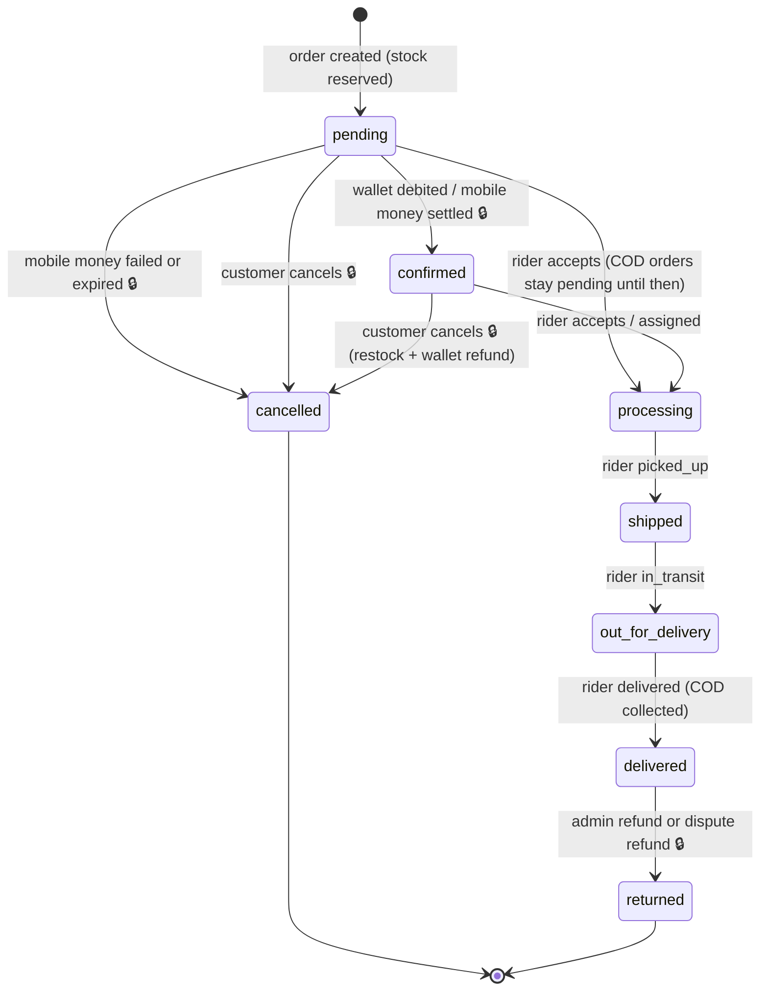
```mermaid
stateDiagram-v2
  [*] --> pending: order created (stock reserved)
  pending --> confirmed: wallet debited / mobile money settled 🔒
  pending --> cancelled: mobile money failed or expired 🔒
  pending --> cancelled: customer cancels 🔒
  confirmed --> cancelled: customer cancels 🔒 (restock + wallet refund)
  pending --> processing: rider accepts (COD orders stay pending until then)
  confirmed --> processing: rider accepts / assigned
  processing --> shipped: rider picked_up
  shipped --> out_for_delivery: rider in_transit
  out_for_delivery --> delivered: rider delivered (COD collected)
  delivered --> returned: admin refund or dispute refund 🔒
  cancelled --> [*]
  returned --> [*]
```

| Rule | Where |
|---|---|
| Customer can cancel only from `pending` or `confirmed`; one cancel wins (atomic) | `OrdersService.cancel` |
| Ops (`orders:updateStatus`) may move an order to any status except `cancelled`; a `delivered` order can only become `returned`; `cancelled`/`returned` are final; an order with a pending mobile-money payment cannot be fulfilled ⚠ (otherwise free-form) | `OrdersService.updateStatus` |
| Delivery milestones drive the order status: assigned→processing, picked_up→shipped, in_transit→out_for_delivery, delivered→delivered; a cancelled/returned order is never resurrected | `DeliveryService.updateStatus` |
| A **failed** delivery does not change the order status ⚠ (no re-attempt / return-to-sender flow) | — |

### 5.2 Payment (`payments.status`)

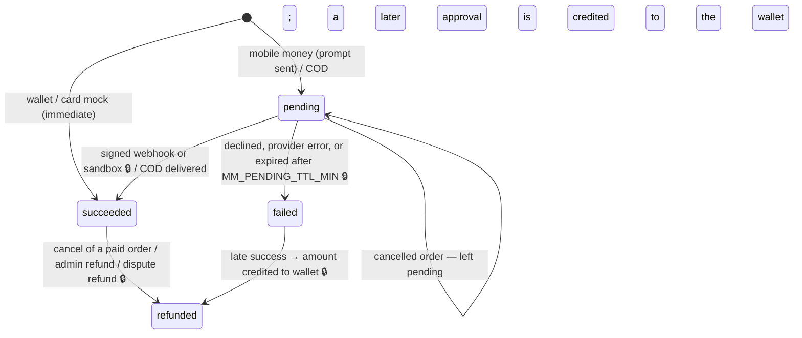
```mermaid
stateDiagram-v2
  [*] --> succeeded: wallet / card mock (immediate)
  [*] --> pending: mobile money (prompt sent) / COD
  pending --> succeeded: signed webhook or sandbox 🔒 / COD delivered
  pending --> failed: declined, provider error, or expired after MM_PENDING_TTL_MIN 🔒
  failed --> refunded: late success → amount credited to wallet 🔒
  succeeded --> refunded: cancel of a paid order / admin refund / dispute refund 🔒
  pending --> pending: cancelled order — left pending; a later approval is credited to the wallet
```

Purposes: `order` (linked to an order) and `topup` (wallet top-up; on success the wallet is credited in the same transaction).

### 5.3 Delivery task (`delivery_tasks.status`) 🔒 forward-only

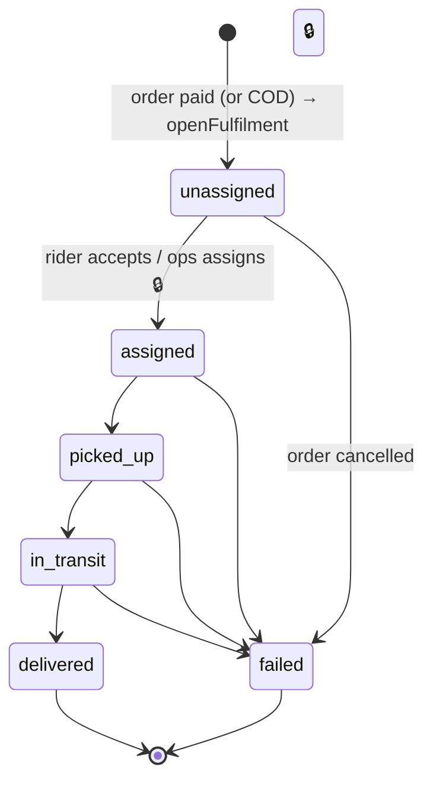
```mermaid
stateDiagram-v2
  [*] --> unassigned: order paid (or COD) → openFulfilment
  unassigned --> assigned: rider accepts / ops assigns 🔒
  assigned --> picked_up 🔒
  picked_up --> in_transit 🔒
  in_transit --> delivered 🔒
  assigned --> failed
  picked_up --> failed
  in_transit --> failed
  unassigned --> failed: order cancelled
  delivered --> [*]
  failed --> [*]
```

### 5.4 Other lifecycles

| Entity | States | Enforcement |
|---|---|---|
| Seller (`sellers.status`) | `pending` → `approved` / `rejected`; `approved` ↔ `suspended` | Admin (`sellers:setStatus`); suspension revokes the owner's sessions. Only `approved` stores may list products |
| Product (`products.status`) | `draft`, `pending`, `approved`, `rejected`, `live`, `removed` | New listings go **straight to `live`** ⚠ (no review queue); delete = `removed`; only admins change status |
| Dispute / return (`disputes.status`) | `open` → `resolved` (optional refund) / `rejected` | 🔒 atomic; one open request per order; only paid, non-cancelled orders |
| Payout (`payouts.status`) | `requested` → `paid` / `rejected` (`approved` exists in the enum but is unused) | 🔒 atomic; `paid` = credited to the seller's **in-app wallet** ⚠ |
| Exchange | `requested` → `approved` → `received` → `ready` → `dispatched`, or `rejected` | ⚠ not enforced (ops can set any) |
| Replacement | `requested` → `approved` → `received` → `allocated` → `dispatched`, or `rejected`; `dispatchStatus` follows | ⚠ not enforced |
| Warehouse exception | `open` → `investigating` → `resolved` / `escalated` | ⚠ not enforced |
| Campaign | `draft` → `pending` → `scheduled` → `active` → `ended`, or `rejected` | ⚠ not enforced; no scheduler activates/ends campaigns |
| Support ticket | `open` ↔ `pending` (staff reply → pending, customer reply → open) → `resolved` / `closed` | Partly automatic |
| Fraud alert | `open` → `reviewed` / `blocked` | Manual; alerts raised only for COD orders above `codCapUsd` |
| Warehouse batch | `building` → … | Minimal |
| Stock transfer | `requested` → … | Minimal (no stock actually moves) |
| Verification token | issued → consumed / expired; OTP `attempts` ≤ 5 | email 24 h, phone 10 min, reset 60 min; 30 s resend cooldown |

---

## 6. Business flows

Each flow lists the actors, the exact events, the rules the server applies and the live pushes that keep every screen in sync. Status: ✅ implemented · 🟡 partial · ❌ missing.

### F1. Registration and verification ✅

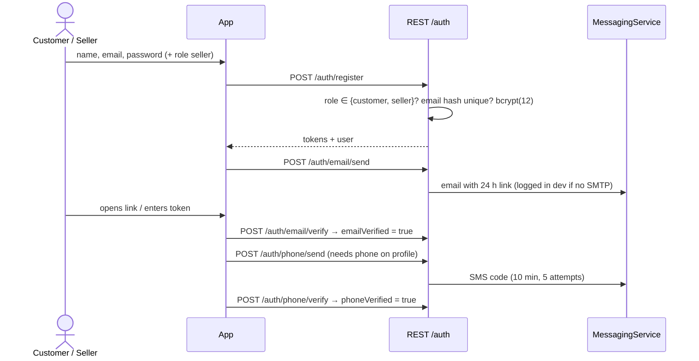
```mermaid
sequenceDiagram
  actor C as Customer / Seller
  participant App
  participant API as REST /auth
  participant MSG as MessagingService
  C->>App: name, email, password (+ role seller)
  App->>API: POST /auth/register
  API->>API: role ∈ {customer, seller}? email hash unique? bcrypt(12)
  API-->>App: tokens + user
  App->>API: POST /auth/email/send
  API->>MSG: email with 24 h link (logged in dev if no SMTP)
  C->>App: opens link / enters token
  App->>API: POST /auth/email/verify → emailVerified = true
  App->>API: POST /auth/phone/send (needs phone on profile)
  API->>MSG: SMS code (10 min, 5 attempts)
  App->>API: POST /auth/phone/verify → phoneVerified = true
```

Gaps: verification is **not required** before ordering (recommend: verified phone for mobile money / high-value orders); no social login (by decision); no CAPTCHA on register.

### F2. Login, session and real-time connection ✅

1. `POST /auth/login` → access + refresh tokens. The Flutter apps keep the refresh token in `SharedPreferences` and the web in `localStorage` ⚠ (recommend `flutter_secure_storage` / Keychain-Keystore and an httpOnly cookie on the web).
2. Socket connects with the access token → server checks signature, `tokenVersion`, `active` → joins rooms → `ready`.
3. Client hydrates in parallel: `me:get`, `me:prefs`, `products:list`, `categories:list`, `orders:list`, `wallet:get`, `wallet:transactions`, `payments:list`, `addresses:list`, `wishlist:list`, `notifications:list`, `settings:get`, `cms:list`, `promos:list`.
4. Before expiry the client calls `/auth/refresh`; the socket's `auth` callback always supplies the newest token on reconnect.
5. **Suspension / role change / password change** → server bumps `tokenVersion` and disconnects the user's sockets → client's refresh gets 401/403 → app returns to the sign-in screen with a message.

Gaps: no login lockout / progressive delay per account; refresh tokens are not rotated or stored server-side (no "active devices" list, no single-session revoke); no 2FA for staff.

### F3. Browsing the catalogue ✅ / 🟡

* Guests and customers: `products:list` (live only), `products:get`, `categories:list`, `reviews:list`, `questions:list`, `flashsales:list`, `sellers:storefront`, `cms:list`, `settings:get` (public subset: `fxRate`, `codEnabled`, `codCapUsd`, `deliveryZones`).
* Live pushes `product:created/updated`, `categories:updated`, `flashsale:updated`, `cms:updated`, `settings:updated` update every open screen (e.g. a price change appears in carts instantly).
* Gaps: `products:list` returns **everything** (no pagination, sort or server search); search is done on the client; no recommendations, recently viewed or "buy again" on the server.

### F4. Checkout paid by wallet ✅

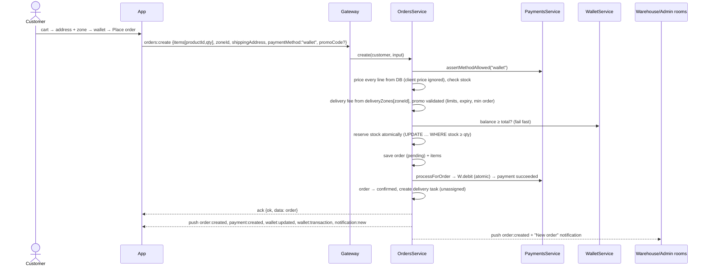
```mermaid
sequenceDiagram
  actor C as Customer
  participant App
  participant GW as Gateway
  participant O as OrdersService
  participant P as PaymentsService
  participant W as WalletService
  participant Ops as Warehouse/Admin rooms
  C->>App: cart → address + zone → wallet → Place order
  App->>GW: orders:create {items[productId,qty], zoneId, shippingAddress, paymentMethod:"wallet", promoCode?}
  GW->>O: create(customer, input)
  O->>P: assertMethodAllowed("wallet")
  O->>O: price every line from DB (client price ignored), check stock
  O->>O: delivery fee from deliveryZones[zoneId], promo validated (limits, expiry, min order)
  O->>W: balance ≥ total? (fail fast)
  O->>O: reserve stock atomically (UPDATE … WHERE stock ≥ qty)
  O->>O: save order (pending) + items
  O->>P: processForOrder → W.debit (atomic) → payment succeeded
  O->>O: order → confirmed, create delivery task (unassigned)
  O-->>App: ack {ok, data: order}
  O-->>App: push order:created, payment:created, wallet:updated, wallet:transaction, notification:new
  O-->>Ops: push order:created + "New order" notification
```

Any failure after stock was reserved releases it; a payment failure marks the order `cancelled` so nothing dangles.

### F5. Checkout paid by mobile money (Airtel / Orange / M-Pesa) 🟡

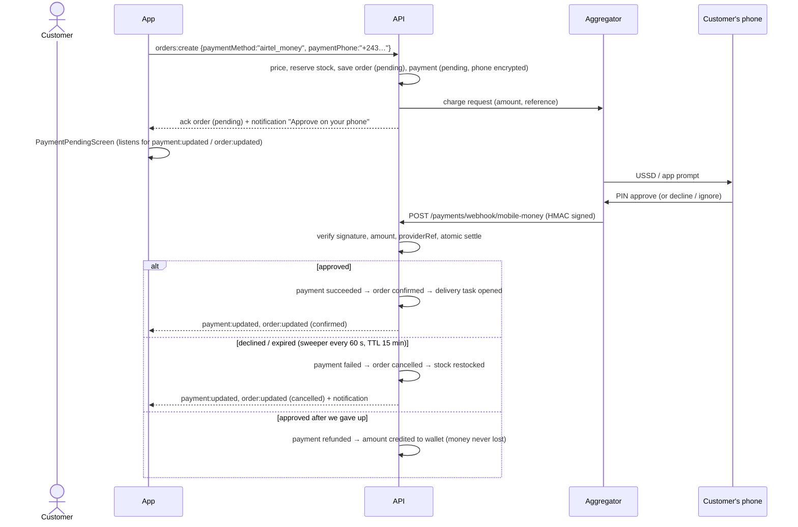
```mermaid
sequenceDiagram
  actor C as Customer
  participant App
  participant API
  participant MM as Aggregator
  participant Phone as Customer's phone
  App->>API: orders:create {paymentMethod:"airtel_money", paymentPhone:"+243…"}
  API->>API: price, reserve stock, save order (pending), payment (pending, phone encrypted)
  API->>MM: charge request (amount, reference)
  API-->>App: ack order (pending) + notification "Approve on your phone"
  App->>App: PaymentPendingScreen (listens for payment:updated / order:updated)
  MM->>Phone: USSD / app prompt
  Phone->>MM: PIN approve (or decline / ignore)
  MM->>API: POST /payments/webhook/mobile-money (HMAC signed)
  API->>API: verify signature, amount, providerRef, atomic settle
  alt approved
    API->>API: payment succeeded → order confirmed → delivery task opened
    API-->>App: payment:updated, order:updated (confirmed)
  else declined / expired (sweeper every 60 s, TTL 15 min)
    API->>API: payment failed → order cancelled → stock restocked
    API-->>App: payment:updated, order:updated (cancelled) + notification
  else approved after we gave up
    API->>API: payment refunded → amount credited to wallet (money never lost)
  end
```

Status: lifecycle, webhook, idempotency, expiry and late-success handling are implemented and tested with the **sandbox** provider (`MM_PROVIDER=sandbox`, development only). **Missing: the adapter for the real aggregator** (contract + credentials needed). Production default `MM_PROVIDER=none` refuses mobile money.

### F6. Wallet top-up 🟡

`wallet:topup {amountUsd, method, phone}` → payment `topup` pending (max 3 open per user) → same settlement path as F5 → wallet credited atomically + `wallet:transaction` push. Depends on the aggregator adapter. No withdrawal from wallet to mobile money ❌.

### F7. Cancellation and refunds ✅

* **Customer cancel** (`orders:cancel`): atomic claim from `pending`/`confirmed` → if money was received, payment `refunded` + wallet credit (one transaction); pending mobile money is abandoned (late approval goes to wallet) → stock restocked → delivery task `failed` → pushes to customer, ops and the assigned rider.
* **Admin refund** (`orders:refund`, admin/finance): only a `succeeded` payment; to wallet (instant) or "original method" (recorded only — no provider refund call ❌); order → `returned`.
* **Dispute refund**: see F12.

### F8. Fulfilment and last-mile delivery 🟡

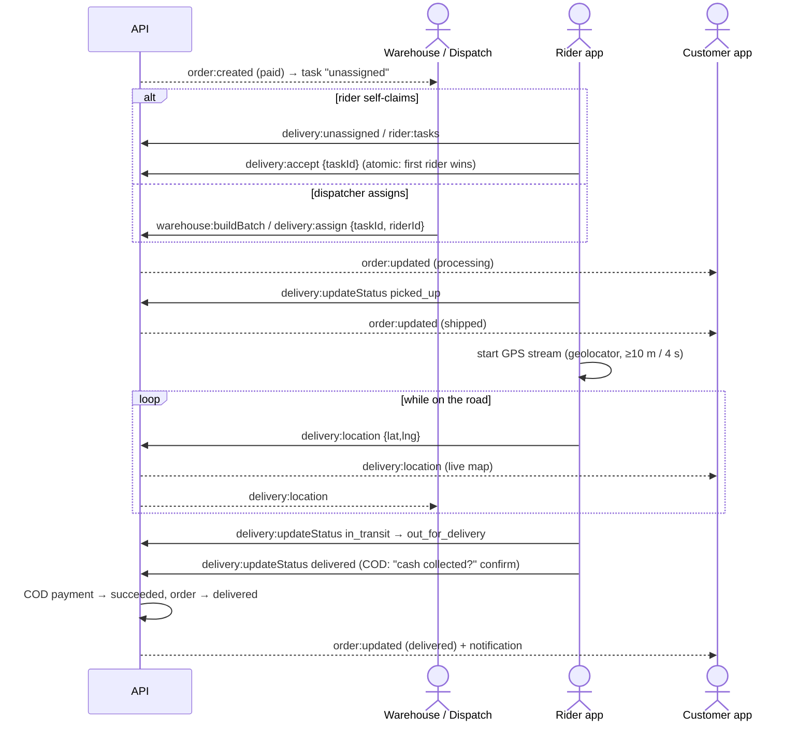
```mermaid
sequenceDiagram
  participant API
  actor WH as Warehouse / Dispatch
  actor R as Rider app
  actor C as Customer app
  API-->>WH: order:created (paid) → task "unassigned"
  alt rider self-claims
    R->>API: delivery:unassigned / rider:tasks
    R->>API: delivery:accept {taskId} (atomic: first rider wins)
  else dispatcher assigns
    WH->>API: warehouse:buildBatch / delivery:assign {taskId, riderId}
  end
  API-->>C: order:updated (processing)
  R->>API: delivery:updateStatus picked_up
  API-->>C: order:updated (shipped)
  R->>R: start GPS stream (geolocator, ≥10 m / 4 s)
  loop while on the road
    R->>API: delivery:location {lat,lng}
    API-->>C: delivery:location (live map)
    API-->>WH: delivery:location
  end
  R->>API: delivery:updateStatus in_transit → out_for_delivery
  R->>API: delivery:updateStatus delivered (COD: "cash collected?" confirm)
  API->>API: COD payment → succeeded, order → delivered
  API-->>C: order:updated (delivered) + notification
```

Missing for a professional operation: **seller fulfilment step** (seller accepts, packs, marks ready; pickup from seller or drop-off at hub), **inbound / receiving / sorting** at the hub (pages exist, not modelled), **proof of delivery** (customer OTP, photo, signature — the web has a `pod` page, mock), **failed-delivery handling** (reason codes, re-attempt scheduling, return to hub, customer contact), **delivery slots**, **zone/shift assignment for riders**, **route optimisation**, **rider cash hand-over ledger** (reconcile exists as a read-only aggregate), **multi-seller orders split into parcels**.

### F9. Cash on delivery ✅ (disabled)

Off by default (`codEnabled=false`). When enabled by an admin: payment `pending` from creation, fulfilment opens immediately, the order is flagged to fraud review when total > `codCapUsd`, the rider confirms cash on `delivered`, `warehouse:reconcile` sums cash per rider.

### F10. Seller onboarding and listing 🟡

1. Register with role `seller` (F1) → `sellers:register {name}` → store `pending` → admins get `seller:updated`.
2. Admin/moderation/operations `sellers:setStatus approved` (or `rejected` / `suspended` → sessions revoked).
3. Approved seller: `products:create` (validated: name, price, category, stock, image URL from `/uploads`, description) → **immediately `live`** → `product:created` pushed to shoppers.
4. Edit (`products:update`), remove (`products:delete` → `removed`), answer questions, view reviews, campaigns.

Missing: KYC documents (ID, business registration, tax number), bank / mobile-money payout account, store profile (logo, banner, policies, address), product moderation queue, variants/SKUs and multiple images, bulk import, seller subscription plans (pages exist, mock), seller staff accounts.

### F11. Seller payouts 🟡

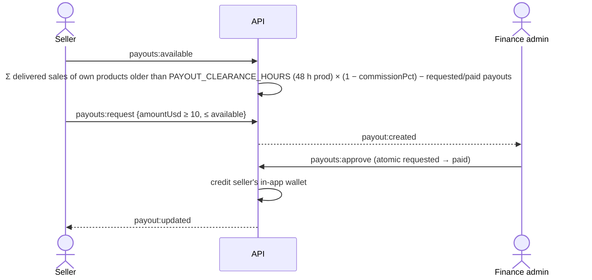
```mermaid
sequenceDiagram
  actor S as Seller
  participant API
  actor F as Finance admin
  S->>API: payouts:available
  API->>API: Σ delivered sales of own products older than PAYOUT_CLEARANCE_HOURS (48 h prod) × (1 − commissionPct) − requested/paid payouts
  S->>API: payouts:request {amountUsd ≥ 10, ≤ available}
  API-->>F: payout:created
  F->>API: payouts:approve (atomic requested → paid)
  API->>API: credit seller's in-app wallet
  API-->>S: payout:updated
```

Missing: real disbursement (bank transfer / mobile money B2C) and its reconciliation, payout schedule (e.g. weekly automatic), statements/invoices with commission and fees, tax reports (pages exist, mock), returns/chargebacks netted against future payouts.

### F12. Disputes and returns 🟡

`disputes:open {orderId, type: dispute|return, reason}` (customer, paid, non-cancelled, one open per order) → admins get `dispute:created` → `disputes:resolve {refund?}` (refund only by admin/finance; uses the refund path of F7) or `disputes:reject`. Missing: return shipment (pickup task, label, receipt/inspection at hub), partial refunds per item, evidence attachments, seller participation in the dispute thread, SLA timers and auto-escalation.

### F13. Exchanges and replacements 🟡

Customer `exchanges:create` / `replacements:create` against an order → ops progress the status (`*:setStatus`), customer notified on each step. Missing: enforced transitions, linking to stock movements and to a delivery task for the outbound item, price-difference payment for exchanges.

### F14. Support ✅ / 🟡

`support:open {subject, category, message, orderId?}` → ticket with a message thread → `support:reply` (staff reply sets `pending`, customer reply sets `open`) → `support:setStatus`. Missing: attachments, assignment to an agent, SLA, canned replies, email notification of replies, satisfaction rating.

### F15. Promotions, flash sales and campaigns 🟡

* **Promo codes** (`promos:create`): percent/fixed, `minOrder`, `maxUses`, `perUserLimit`, `expiresAt`, `isPublic`; previewed with `promos:validate`, **re-validated at order creation**.
* **Flash sales** (`flashsales:create`): product, flash price, window. ⚠ the flash price is **not applied by the order pricing** (checkout uses the product price).
* **Campaigns**: seller proposes, admin sets status. ⚠ campaign discounts are not applied to prices; no scheduler.
* Missing: referral programme, loyalty points, bundle / buy-X-get-Y, free-delivery rules, automatic start/end jobs.

### F16. Notifications ✅ / 🟡

`NotificationsService.toUser / toRole / toAdmins` → row in `notifications` + live `notification:new` → `PushService` sends FCM to the user's `device_tokens` (if Firebase is configured; invalid tokens pruned). Clients: `notifications:list`, `markRead`, `markAllRead`, `devices:register/unregister`. Email/SMS only for verification and reset. The Flutter apps do **not yet include** `firebase_messaging` (push needs the client's Firebase project files). Missing: transactional email/SMS for order milestones, per-category preference enforcement, templates in EN/FR, quiet hours, push deep-link handling in the apps.

### F17. Administration and moderation ✅ / 🟡

Customers (`customers:list`, `setActive` → kick + revoke), sellers (`sellers:list/setStatus`), staff and roles (`roles:staff`, `roles:setRole` → kick, audited), settings (`settings:set`, audited), audit log, fraud alerts, analytics (`analytics:admin/revenue/warehouse`), broadcasts. Missing: staff invitation flow (create staff account with temporary password + first-login change — the rider web has a mock `first-password` page), admin 2FA, zones editor UI, report exports (CSV), impersonation for support (read-only).

### F18. Account deletion ✅

`me:delete {password}` (customer/seller): PII anonymised (tombstone email, name "Deleted user", phone/address/avatar/prefs cleared), password randomised, `tokenVersion` bumped, `active=false`, sockets closed. Orders are kept for accounting. Missing: data export ("download my data"), grace period / undo.

### F19. Password reset ✅

`POST /auth/forgot` (same response for unknown emails) → 60-minute single-use token by email → `POST /auth/reset` → new bcrypt hash, `tokenVersion` bumped (all sessions end).

---

## 7. API reference

### 7.1 REST

See section 2.4 (14 endpoints). All REST errors use NestJS's `{ statusCode, message, error }`.

### 7.2 WebSocket request → ack events (115)

Call with `socket.emit(event, payload, ack)`; the ack is always `{ ok: true, data }` or `{ ok: false, error: "<readable message>" }`. "Public" means guests (no token) may call it. Generated from `api/src/realtime/realtime.gateway.ts`.

#### `products:*`

| Event | Who may call | Payload | Behaviour / rules |
|---|---|---|---|
| `products:list` | Public | `{ category?: string; status?: string }` | Guests/customers/riders: live listings only; seller: live + own drafts; admins: any status filter |
| `products:get` | Public | `{ id: string }` | Non-live product visible only to its seller and admins |
| `products:create` | seller (approved store), admins | `{ name: string; nameFr?: string; price: number; category: string; stock?: number; image?: string; description?: string; }` | Seller store must be `approved`; listing validated by `cleanListing` |
| `products:update` | Owning seller, admins | `{ id: string; patch: Record<string, unknown> }` | Only admins may change the listing status |
| `products:delete` | Owning seller, admins | `{ id: string }` | Soft remove (`removed`) |

#### `categories:*`

| Event | Who may call | Payload | Behaviour / rules |
|---|---|---|---|
| `categories:list` | Public | `—` |  |
| `categories:create` | group catalog: admin, admin_operations, admin_marketing | object — fields validated server-side |  |
| `categories:update` | group catalog | `{ id: string; patch: Record<string, unknown> }` |  |
| `categories:remove` | group catalog | `{ id: string }` |  |

#### `orders:*`

| Event | Who may call | Payload | Behaviour / rules |
|---|---|---|---|
| `orders:list` | Signed-in, role-scoped | `—` | Customer: own; rider: assigned; ops: last 200; seller: only lines of own products, no address, first name only |
| `orders:create` | Signed-in | `{ items: [{ productId?, name?, priceUsd?, qty, variant? }], paymentMethod, zoneId?, deliveryFeeUsd?, shippingAddress? (JSON), paymentPhone?, promoCode? }` | Server prices, stock reservation, promo, zone fee, payment start; COD fraud check above `codCapUsd` |
| `orders:updateStatus` | Ops (any admin_* role, warehouse_staff) | `{ orderId: string; status: OrderStatus }` | Cannot cancel via this (use cancel); cannot fulfil while mobile money pending; delivered → only returned |
| `orders:refund` | admin, admin_finance | `{ orderId: string; toWallet?: boolean }` | To wallet or original method; marks order returned |
| `orders:cancel` | Order owner, admins | `{ orderId: string }` | Atomic; only from pending/confirmed; restock + wallet refund if paid |

#### `delivery:*`

| Event | Who may call | Payload | Behaviour / rules |
|---|---|---|---|
| `delivery:list` | Ops (any admin_* role, warehouse_staff), rider (own) | `—` |  |
| `delivery:unassigned` | Ops (any admin_* role, warehouse_staff), rider | `—` | Pool of unclaimed tasks |
| `delivery:accept` | rider | `{ taskId: string }` | Atomic claim (one rider wins); order → processing |
| `delivery:updateStatus` | rider (assigned) | `{ taskId: string; status: DeliveryStatus }` | Forward-only: assigned→picked_up→in_transit→delivered, or →failed; COD collected on delivered |
| `delivery:location` | rider (assigned) | `{ taskId: string; lat: number; lng: number }` | Pushed to the customer and ops as `delivery:location` |
| `delivery:assign` | Ops (any admin_* role, warehouse_staff) | `{ taskId: string; riderId: string; riderName?: string }` | Target must be an active rider |

#### `wallet:*`

| Event | Who may call | Payload | Behaviour / rules |
|---|---|---|---|
| `wallet:get` | Signed-in (own) | `—` |  |
| `wallet:transactions` | Signed-in (own) | `—` |  |
| `wallet:topup` | Signed-in (own) | `{ amountUsd: number; method?: string; phone?: string }` | Mobile money only; max 3 pending top-ups; credited on webhook |

#### `payments:*`

| Event | Who may call | Payload | Behaviour / rules |
|---|---|---|---|
| `payments:list` | Signed-in | `—` | Own payments; finance/admin see all |
| `payments:status` | Signed-in (own) | `{ reference: string }` | Poll-free status lookup by reference (used after reconnect) |

#### `payouts:*`

| Event | Who may call | Payload | Behaviour / rules |
|---|---|---|---|
| `payouts:list` | Signed-in | `—` | Seller: own; finance: all |
| `payouts:available` | seller | `—` | Delivered sales older than PAYOUT_CLEARANCE_HOURS minus commission and committed payouts |
| `payouts:request` | seller | `{ amountUsd: number; method?: string }` | Minimum $10; ≤ available |
| `payouts:approve` | admin, admin_finance | `{ payoutId: string }` | Atomic requested→paid |
| `payouts:reject` | admin, admin_finance | `{ payoutId: string; note?: string }` |  |

#### `disputes:*`

| Event | Who may call | Payload | Behaviour / rules |
|---|---|---|---|
| `disputes:list` | Signed-in | `—` | Customer: own; admins: all |
| `disputes:open` | customer (order owner) | `{ orderId: string; type: DisputeType; reason: string }` | Order must be paid & not cancelled; one open request per order |
| `disputes:resolve` | admin, admin_finance | `{ disputeId: string; resolution?: string; refund?: boolean }` | Optional refund (finance/admin only); atomic |
| `disputes:reject` | Any admin_* role | `{ disputeId: string; resolution?: string }` |  |

#### `addresses:*`

| Event | Who may call | Payload | Behaviour / rules |
|---|---|---|---|
| `addresses:list` | Signed-in (own) | `—` |  |
| `addresses:create` | Signed-in (own) | object — fields validated server-side | Encrypted fields |
| `addresses:update` | Signed-in (own) | `{ id: string; patch: Record<string, unknown> }` |  |
| `addresses:remove` | Signed-in (own) | `{ id: string }` |  |

#### `reviews:*`

| Event | Who may call | Payload | Behaviour / rules |
|---|---|---|---|
| `reviews:list` | Public | `{ productId: string }` |  |
| `reviews:seller` | seller | `—` | Reviews on own products |
| `reviews:create` | Signed-in | `{ productId: string; rating: number; text: string }` | Rating 1–5 |
| `reviews:helpful` | Signed-in | `{ id: string }` |  |

#### `questions:*`

| Event | Who may call | Payload | Behaviour / rules |
|---|---|---|---|
| `questions:list` | Public | `{ productId: string }` |  |
| `questions:ask` | Signed-in | `{ productId: string; question: string }` |  |
| `questions:answer` | Owning seller, admins | `{ id: string; answer: string }` |  |

#### `support:*`

| Event | Who may call | Payload | Behaviour / rules |
|---|---|---|---|
| `support:list` | Signed-in | `—` | Own tickets; admins all |
| `support:open` | Signed-in | `{ subject: string; category?: string; message: string; orderId?: string }` |  |
| `support:reply` | Ticket owner, admins | `{ id: string; text: string }` |  |
| `support:setStatus` | Any admin_* role | `{ id: string; status: 'open' \| 'pending' \| 'resolved' \| 'closed' }` |  |

#### `promos:*`

| Event | Who may call | Payload | Behaviour / rules |
|---|---|---|---|
| `promos:list` | Public (public promos); group content sees all | `—` |  |
| `promos:validate` | Signed-in | `{ code: string; subtotalUsd: number }` | Preview only — order creation re-validates |
| `promos:create` | group content: admin, admin_marketing | object — fields validated server-side |  |

#### `flashsales:*`

| Event | Who may call | Payload | Behaviour / rules |
|---|---|---|---|
| `flashsales:list` | Public | `—` |  |
| `flashsales:create` | group content | object — fields validated server-side |  |

#### `cms:*`

| Event | Who may call | Payload | Behaviour / rules |
|---|---|---|---|
| `cms:list` | Public (active blocks); group content sees all | `—` |  |
| `cms:upsert` | group content | `—` |  |

#### `settings:*`

| Event | Who may call | Payload | Behaviour / rules |
|---|---|---|---|
| `settings:get` | Public subset (fxRate, codEnabled, codCapUsd, deliveryZones); group config sees all | `—` |  |
| `settings:set` | group config: admin, admin_finance, admin_operations | `{ key: string; value: string }` | Audited |

#### `sellers:*`

| Event | Who may call | Payload | Behaviour / rules |
|---|---|---|---|
| `sellers:list` | Any admin_* role | `{ status?: string }` |  |
| `sellers:storefront` | Public | `{ id: string }` | Approved store + its live products |
| `sellers:register` | seller (user) | `{ name?: string }` | Creates the Seller row in `pending` |
| `sellers:setStatus` | admin, admin_moderation, admin_operations | `{ id: string; status: 'approved' \| 'rejected' \| 'suspended' \| 'pending' }` | Approve / reject / suspend; suspension revokes sessions |
| `sellers:stats` | seller | `—` |  |
| `sellers:mine` | seller | `—` |  |
| `sellers:update` | seller (own store) | `{ name?: string }` |  |

#### `analytics:*`

| Event | Who may call | Payload | Behaviour / rules |
|---|---|---|---|
| `analytics:admin` | group insight: admin, admin_operations, admin_finance | `—` |  |
| `analytics:warehouse` | Any admin_* role, warehouse_staff | `—` |  |
| `analytics:revenue` | group insight | `—` | 7-day series |

#### `audit:*`

| Event | Who may call | Payload | Behaviour / rules |
|---|---|---|---|
| `audit:list` | group audit: admin, admin_operations | `—` |  |

#### `fraud:*`

| Event | Who may call | Payload | Behaviour / rules |
|---|---|---|---|
| `fraud:list` | group fraud: admin, admin_finance, admin_operations, admin_moderation | `—` |  |
| `fraud:setStatus` | group fraud | `{ id: string; status: 'open' \| 'reviewed' \| 'blocked' }` |  |

#### `customers:*`

| Event | Who may call | Payload | Behaviour / rules |
|---|---|---|---|
| `customers:list` | group people: admin, admin_support, admin_operations, admin_finance | `—` |  |
| `customers:setActive` | admin, admin_support | `{ id: string; active: boolean }` | Suspension kicks live sockets + revokes tokens |

#### `broadcasts:*`

| Event | Who may call | Payload | Behaviour / rules |
|---|---|---|---|
| `broadcasts:list` | group content | `—` |  |
| `broadcasts:send` | group content | `{ title: string; body: string; audience?: string }` | Creates notifications for an audience role |

#### `roles:*`

| Event | Who may call | Payload | Behaviour / rules |
|---|---|---|---|
| `roles:defs` | Public | `—` | Static role catalogue |
| `roles:staff` | admin (super admin) | `—` |  |
| `roles:setRole` | admin (super admin) | `{ id: string; role: string }` | Kicks the user; audited |

#### `warehouse:*`

| Event | Who may call | Payload | Behaviour / rules |
|---|---|---|---|
| `warehouse:hubs` | Ops (any admin_* role, warehouse_staff) | `—` |  |
| `warehouse:parcels` | Ops (any admin_* role, warehouse_staff) | `{ stage?: string }` | Delivery tasks by stage |
| `warehouse:aged` | Ops (any admin_* role, warehouse_staff) | `—` | Parcels stuck > threshold |
| `warehouse:inventory` | Ops (any admin_* role, warehouse_staff) | `—` | Stock view from products |
| `warehouse:batches` | Ops (any admin_* role, warehouse_staff) | `—` |  |
| `warehouse:buildBatch` | Ops (any admin_* role, warehouse_staff) | `{ hubId?: string; taskIds: string[]; riderId: string; riderName?: string }` | Groups task ids for one rider |
| `warehouse:reconcile` | Ops (any admin_* role, warehouse_staff) | `—` | COD cash reconciliation |
| `warehouse:transfers` | Ops (any admin_* role, warehouse_staff) | `—` |  |
| `warehouse:createTransfer` | Ops (any admin_* role, warehouse_staff) | object — fields validated server-side |  |

#### `rider:*`

| Event | Who may call | Payload | Behaviour / rules |
|---|---|---|---|
| `rider:earnings` | rider (own) | `—` |  |
| `rider:tasks` | rider | `—` | Own tasks + open pool |

#### `campaigns:*`

| Event | Who may call | Payload | Behaviour / rules |
|---|---|---|---|
| `campaigns:list` | Signed-in | `—` | Seller: own; admins: all |
| `campaigns:create` | seller, admins | `{ name: string; nameFr?: string; discount?: number; productCount?: number; budgetUsd?: number; startDate?: string; endDate?: string; }` |  |
| `campaigns:update` | Owning seller, admins | `{ id: string; patch: Record<string, unknown> }` |  |
| `campaigns:setStatus` | Any admin_* role | `{ id: string; status: 'draft' \| 'pending' \| 'scheduled' \| 'active' \| 'ended' \| 'rejected'; }` | Approve / reject / schedule |

#### `replacements:*`

| Event | Who may call | Payload | Behaviour / rules |
|---|---|---|---|
| `replacements:list` | Signed-in | `—` | Customer: own; seller: own products; ops: all |
| `replacements:create` | Signed-in (order owner) | `{ orderId: string; sku: string; productName: string; reason?: string; condition?: string; }` |  |
| `replacements:setStatus` | Ops (any admin_* role, warehouse_staff) | `{ id: string; status: 'requested' \| 'approved' \| 'received' \| 'allocated' \| 'dispatched' \| 'rejected'; }` | requested→approved→received→allocated→dispatched | rejected |

#### `exchanges:*`

| Event | Who may call | Payload | Behaviour / rules |
|---|---|---|---|
| `exchanges:list` | Signed-in | `—` | Role-scoped |
| `exchanges:create` | Signed-in (order owner) | `{ orderId: string; fromSku: string; fromName: string; toSku: string; toName: string; priceDiffUsd?: number; reason?: string; }` |  |
| `exchanges:setStatus` | Ops (any admin_* role, warehouse_staff) | `{ id: string; status: 'requested' \| 'approved' \| 'received' \| 'ready' \| 'dispatched' \| 'rejected'; }` | requested→approved→received→ready→dispatched | rejected |

#### `exceptions:*`

| Event | Who may call | Payload | Behaviour / rules |
|---|---|---|---|
| `exceptions:list` | Ops (any admin_* role, warehouse_staff) | `{ status?: string }` |  |
| `exceptions:create` | Ops (any admin_* role, warehouse_staff) | `{ taskId?: string; orderReference?: string; type?: 'damaged' \| 'missing_item' \| 'wrong_item' \| 'address_issue' \| 'lost' \| 'other'; severity?: 'low' \| 'medium' \| 'high'; hub?: string; notes: string; }` | damaged / missing_item / wrong_item / address_issue / lost … |
| `exceptions:setStatus` | Ops (any admin_* role, warehouse_staff) | `{ id: string; status: 'open' \| 'investigating' \| 'resolved' \| 'escalated'; resolution?: string; }` | open→investigating→resolved | escalated |

#### `wishlist:*`

| Event | Who may call | Payload | Behaviour / rules |
|---|---|---|---|
| `wishlist:list` | Signed-in (own) | `—` |  |
| `wishlist:toggle` | Signed-in (own) | `{ productId: string }` |  |

#### `notifications:*`

| Event | Who may call | Payload | Behaviour / rules |
|---|---|---|---|
| `notifications:list` | Signed-in (own + role broadcasts) | `—` |  |
| `notifications:markRead` | Signed-in (own) | `{ id: string }` |  |
| `notifications:markAllRead` | Signed-in (own) | `—` |  |

#### `me:*`

| Event | Who may call | Payload | Behaviour / rules |
|---|---|---|---|
| `me:get` | Signed-in | `—` |  |
| `me:update` | Signed-in | `{ name?: string; phone?: string \| null; locale?: string; avatar?: string \| null }` | Name, phone (re-verify), locale, avatar |
| `me:prefs` | Signed-in | `—` |  |
| `me:setPrefs` | Signed-in | object — fields validated server-side | push / email / sms / personalize / market |
| `me:changePassword` | Signed-in | `{ current: string; next: string }` | Bumps tokenVersion (other sessions revoked) |
| `me:delete` | customer, seller | `{ password: string }` | Password confirmation; anonymises PII, revokes sessions |

#### `devices:*`

| Event | Who may call | Payload | Behaviour / rules |
|---|---|---|---|
| `devices:register` | Signed-in | `{ token: string; platform?: 'android' \| 'ios' \| 'web'; app?: 'customer' \| 'rider' \| 'web' }` | FCM token registry (customer / rider / web) |
| `devices:unregister` | Signed-in | `{ token: string }` |  |

### 7.3 Server-pushed events (40)

| Event | Produced by | Delivered to |
|---|---|---|
| `order:created` | OrdersService | the customer; ops rooms (all admin roles + warehouse) once the order is payable |
| `order:updated` | Orders, Delivery, Payments, Warehouse | the customer; ops rooms; the assigned rider |
| `payment:created` / `payment:updated` | PaymentsService | the payer; finance rooms |
| `wallet:updated` / `wallet:transaction` | WalletService | the wallet owner |
| `delivery:updated` | Delivery, Orders, Warehouse | ops rooms; the assigned rider |
| `delivery:location` | DeliveryService | the order's customer; ops rooms |
| `batch:updated`, `transfer:updated`, `exception:updated` | WarehouseService | ops rooms |
| `payout:created` / `payout:updated` | PayoutsService | the seller; finance rooms |
| `dispute:created` / `dispute:updated` | DisputesService | the customer; admin rooms |
| `exchange:updated` / `replacement:updated` | Flows | the customer; ops rooms |
| `support:updated` | SupportService | the ticket owner; `admin_support` + admin rooms |
| `product:created` / `product:updated` | ProductsService | customers (+ guests on removal); admin rooms |
| `categories:updated` | CategoriesService | customers, guests, admins |
| `review:created/updated`, `question:created/updated` | Reviews | customers; admins |
| `flashsale:updated`, `cms:updated` | Promos / CMS | customers; admins |
| `promo:updated` | PromosService | admin rooms |
| `settings:updated` | SettingsService | public subset to customer, guest, seller, rider, warehouse; full set to admins |
| `campaign:updated` | CampaignsService | admin + marketing rooms; the owning seller |
| `seller:updated` | SellersService | admin rooms; the store owner |
| `customer:updated`, `roles:updated`, `fraud:created/updated`, `audit:created`, `broadcast:created` | Ops services | admin rooms |
| `notification:new` | NotificationsService | a user, or a whole role (broadcasts) |
| `me:updated`, `addresses:updated`, `wishlist:updated` | Gateway / Addresses / Wishlist | the user (all their devices) |
| `ready` / `unauthorized` | Gateway (connection) | the connecting socket |

Minor gaps: sellers do not receive `product:updated` for their own listings and guests do not receive `product:created` (they refresh on reconnect).

---

## 8. Client applications

### 8.1 Customer app — Flutter (`mobile/`)

**Stack**: Flutter (verified with 3.47.6, minimum 3.35.7), `socket_io_client`, `http`, `shared_preferences`, `cached_network_image`, `intl`; EN/FR strings in `l10n/strings.dart`. Configured with `--dart-define=API_URL=… --dart-define=SOCKET_URL=…`.

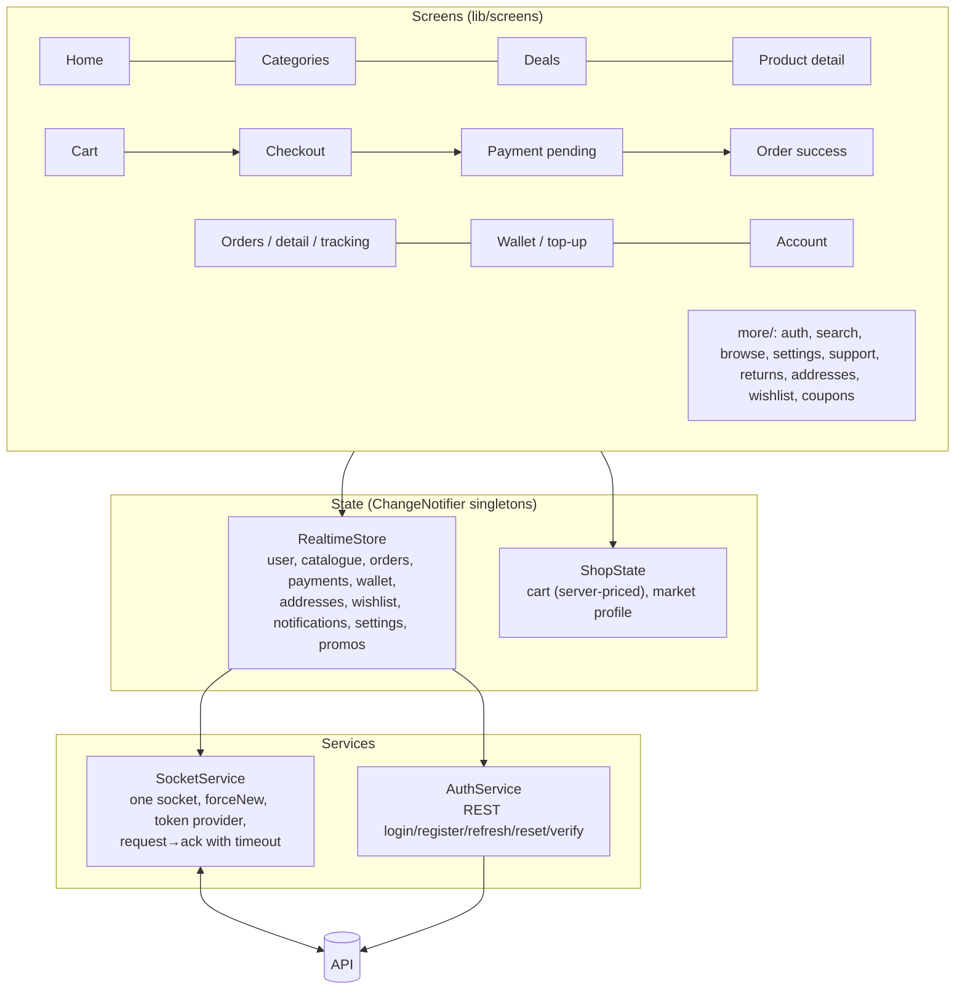
```mermaid
flowchart TB
  subgraph UI["Screens (lib/screens)"]
    HOME[Home] --- CAT[Categories] --- DEALS[Deals] --- PD[Product detail]
    CART[Cart] --> CO[Checkout] --> PP[Payment pending] --> OS[Order success]
    ORD[Orders / detail / tracking] --- WAL[Wallet / top-up] --- ACC[Account]
    MORE["more/: auth, search, browse, settings, support, returns, addresses, wishlist, coupons"]
  end
  subgraph State["State (ChangeNotifier singletons)"]
    RS["RealtimeStore<br/>user, catalogue, orders, payments, wallet,<br/>addresses, wishlist, notifications, settings, promos"]
    SS["ShopState<br/>cart (server-priced), market profile"]
  end
  subgraph Services
    AUTH["AuthService<br/>REST login/register/refresh/reset/verify"]
    SOCK["SocketService<br/>one socket, forceNew, token provider,<br/>request→ack with timeout"]
  end
  UI --> RS & SS
  RS --> SOCK & AUTH
  SOCK <--> API[(API)]
  AUTH --> API
```

| Concern | How it works |
|---|---|
| Start-up | `main.dart` → `tryRestore()` (stored refresh token → new tokens) with timeout → home or sign-in |
| Session end | `onSessionEnded` callback (suspension, revoked, deleted) → back to sign-in with a message |
| Hydration | On socket `ready` (never on raw `connect`), parallel requests listed in F2 |
| Live sync | Listeners for 14 pushed events update the store; widgets rebuild via `ListenableBuilder` |
| Cart | Client-side (lines hold product ids); totals always re-priced from live products; checkout sends ids only |
| Checkout | Address + zone (from `deliveryZones`), promo preview, wallet or mobile money (phone), server errors shown verbatim |
| Mobile money | `PaymentPendingScreen` waits for `payment:updated` / `order:updated`; on reconnect checks `payments:status` |
| No guest checkout | Account mandatory (client decision); browsing works signed-out over the guest socket |
| Tests | 3 widget tests; 15 live-API tests (`test/live_api_test.dart`) covering register → delete account |

Gaps: push notifications (no `firebase_messaging`), deep links / push-tap navigation, secure token storage, offline cache, image caching of catalogue lists beyond `cached_network_image`, crash reporting, analytics, forced-update check, accessibility review, iOS build configuration, real-device testing.

### 8.2 Rider app — Flutter (`rider-app/`)

| Layer | Content |
|---|---|
| Screens | `RiderLoginScreen` (no prefilled credentials, no offline entry), `ForgotPasswordScreen`, `RiderShell` with tabs **Deliveries** (Active / Available / Done, claim, next step, fail with confirmation, cash confirmation for COD), **Earnings** (delivered count, active, earnings, cash collected), **Profile** (notifications, language EN/FR, sign out) |
| State | `RiderStore` (ChangeNotifier): `myTasks`, `pool`, `earnings`, `notifications`, connection status |
| Services | `AuthService`, `SocketService` (same as customer app), `LocationReporter` (geolocator stream, high accuracy, 10 m distance filter, max one fix / 4 s, immediate first fix; starts on `picked_up`, stops when no delivery is on the road) |
| Permissions | `ACCESS_FINE_LOCATION`, `ACCESS_COARSE_LOCATION` (Android) |
| Tests | 3 widget tests; live-API test (sign in → claim → picked up → in transit → GPS reaches customer → delivered → earnings → forward-only rule) |

Gaps: background location (foreground service + `ACCESS_BACKGROUND_LOCATION`, battery handling), navigation hand-off (Google Maps intent), proof of delivery (OTP / photo), failed-delivery reasons, shift/availability toggle (the `users.active` "availability" comment exists but no rider UI), batches view, cash hand-over, push notifications for new tasks.

### 8.3 Web — Next.js 16 / React 19 (`web/`)

**Structure**

| Part | Content |
|---|---|
| `src/app/` | 184 routes in portals: `/shop` (34), `/seller` (43), `/admin` (59), `/warehouse` (28), `/rider` (11), plus `/login`, `/live`, `/sell-online`, `/get-app`, `/legal`, `/purchase` |
| `src/context/` | 17 providers mounted in the root layout: Locale, **Realtime**, Market, WarehouseStaff, **Auth**, Notification, Dispute, SellerSubscription, WarehouseAdmin, Moderation, Categories, Support, Reviews, Replacement, RiderZone, Shop, Toast |
| `src/lib/realtime/` | `socket-client.ts` (singleton socket), `auth-api.ts` (REST auth; tokens in `localStorage` ⚠), `types.ts` |
| `src/lib/{seller,admin,warehouse,rider,catalog,orders}.ts` | Live hooks that call socket events (e.g. `lib/admin.ts` wraps 26 admin events) |
| `src/lib/mock-data.ts` and `*-entities.ts` | Demo data still used by the pages listed below |
| `RealtimeProvider` | Holds live products, orders, deliveries, wallet, payments, payouts, disputes, notifications and exposes actions (`placeOrder`, `cancelOrder`, `acceptDelivery`, `topUpWallet`, `refundOrder`, `requestPayout`, `resolveDispute`, …) |

**Pages still rendering demo data (no live data anywhere in their component tree)**

| Portal | Live / total | Pages still on demo data |
|---|---|---|
| Admin | 31 / 59 | analytics, broadcasts, categories, disputes, finance, fulfillment/(analytics, batch-builder, deliveries, dispatch, exceptions, exceptions/[id], exchanges, exchanges/[id], replacements, returns, settings), marketing, promotions, refunds, returns, reviews, settings, support, support/[id], warehouses, warehouses/[id], warehouses/staff, zones |
| Seller | 27 / 43 | analytics/(customers, inventory, products, revenue), disputes, disputes/[id], finance/statements, finance/tax, notifications, pending, register, replacements/[id], resubmit, storefront, storefront/preview, support/[id] |
| Shop | 22 / 34 | account, account/delete, cart (local by design), disputes/[id], exchange, help, orders/[id]/confirmed, orders/success, products/[id]/reviews, refer, returns/[id], support/[id] |
| Warehouse | 15 / 28 | analytics, batch-builder, deliveries, dispatch, exceptions, exceptions/[id], exchanges, exchanges/[id], replacements, returns, returns/[id], settings, transfers |
| Rider (web) | 9 / 11 | first-password, notifications |

"Live" means at least one live hook is used in the page's tree; several live pages still mix in demo widgets (charts, KPI tiles). For most demo pages the backend handler already exists — the work is wiring (section 11).

The **demo persona picker** on `/login` is shown unless `NEXT_PUBLIC_DEMO_MODE=false` — it must be off in production.

### 8.4 Shared package (`shared/`)

`types/index.ts` (shared TypeScript types), `mock/entities.ts`, `screens/registry.ts` (screen catalogue used by the screenshot site), `market-profiles.ts` (currency / market presets). It is **not** consumed by the API; API and clients define their own DTOs ⚠ (recommend generating client types from the API).

---

## 9. Configuration, environments, CI/CD and testing

### 9.1 Environment variables (API)

| Variable | Default | Purpose |
|---|---|---|
| `NODE_ENV` | development | `production` enables the boot guard |
| `PORT` | 3001 | |
| `CORS_ORIGINS` | localhost | Comma-separated allow-list (REST + socket) |
| `JWT_SECRET`, `JWT_REFRESH_SECRET` | dev values (refused in prod) | Token signing |
| `JWT_ACCESS_TTL`, `JWT_REFRESH_TTL` | 15m, 30d | |
| `DATA_ENCRYPTION_KEY` | dev value (refused in prod) | AES-256-GCM key for encrypted columns — **back it up** |
| `DB_TYPE` | sqlite | `mysql` in production |
| `DB_HOST/PORT/USERNAME/PASSWORD/DATABASE`, `DB_SQLITE_FILE` | | |
| `DB_SYNCHRONIZE` | true (dev) / false (prod) | Production uses migrations only |
| `DB_MIGRATIONS_RUN` | — | Run migrations at boot |
| `UPLOAD_DIR`, `UPLOAD_MAX_BYTES`, `PUBLIC_API_URL` | ./uploads, 5 MB | Uploads |
| `WEB_URL` | | Links in emails |
| `MM_PROVIDER` | none | `none` / `sandbox` (dev only) / aggregator adapter |
| `MM_WEBHOOK_SECRET` | | Webhook HMAC secret |
| `MM_PENDING_TTL_MIN` | 15 | Mobile-money approval window |
| `MM_SANDBOX_AUTOCONFIRM_MS` | | Sandbox auto-approve delay |
| `PAYOUT_CLEARANCE_HOURS` | 48 prod / 0 dev | Payout hold |
| `MAX_DELIVERY_FEE_USD` | 50 | Cap when no zones are configured |
| `ALLOW_CLIENT_PRICED_ITEMS` | false in prod | Dev-only external snapshot lines |
| `WS_RATE_MAX`, `WS_MAX_PAYLOAD_BYTES` | 40 / window, 64 KB | Socket throttling |
| `SMTP_HOST/PORT/USER/PASS`, `MAIL_FROM` | | Email (optional) |
| `TWILIO_ACCOUNT_SID/AUTH_TOKEN/FROM` | | SMS (optional) |
| `FIREBASE_SERVICE_ACCOUNT_JSON` or `GOOGLE_APPLICATION_CREDENTIALS` | | Push (optional) |

**Admin-editable settings** (`settings` table): `fxRate` (CDF per USD), `codEnabled`, `codCapUsd`, `deliveryZones`, `commissionPct`.

### 9.2 Database lifecycle

* Development: SQLite with `synchronize`, `npm run seed` (demo users for every role, catalogue, orders, campaigns…; seed switches COD back off).
* Production: MySQL, `npm run migration:run` (4 hand-written migrations, verified up/down/up on MariaDB), `bootstrap:prod` (admin, categories, settings, hubs). The demo seed must never run in production.

### 9.3 CI (GitHub Actions)

| Workflow / job | Runs |
|---|---|
| `ci.yml` → `api` | build, unit tests, seed + socket smoke (30) + account smoke (123) + authz smoke (114) on SQLite |
| `ci.yml` → `api-mysql` | migrations on real MySQL 8, entity drift check, bootstrap, end-to-end suites |
| `ci.yml` → `web` | Next.js production build |
| `ci.yml` → `flutter` (matrix: mobile, rider-app) | `flutter analyze`, `flutter test` |
| `customer-app-apk.yml`, `rider-app-apk.yml` | Release APK builds |

Not automated: the Flutter live-API tests (need a running API), browser end-to-end tests of the web portals, load tests, security scanning (dependency audit, SAST).

---

## 10. Gap analysis — what a professional marketplace still needs

Priority: **P0** = blocks a real launch with real money · **P1** = expected by users/clients of a professional marketplace · **P2** = scale, efficiency, polish.

### 10.1 Data model and database

| # | Gap | Today | Why it matters | Recommendation | Pri |
|---|---|---|---|---|---|
| D1 | Money stored as `FLOAT` | `price`, `totalUsd`, `amountUsd`, `walletBalance`, … are floats | Rounding errors accumulate in balances, commissions and reports | Migrate to `DECIMAL(12,2)` (or integer cents) with a TypeORM transformer; round only at the edges | P0 |
| D2 | Only one real foreign key | All other relations are id strings | Orphans and inconsistent data are possible; no cascade rules | Add FKs with explicit `ON DELETE` (RESTRICT for money tables), after a clean-up script | P1 |
| D3 | `sellerId` means different things | Seller id or user id (products, campaigns), user id (payouts) | Bugs in seller dashboards, payouts and reports | Always reference `sellers.id`; migrate data; keep `sellers.userId` as the owner link | P1 |
| D4 | No product variants / SKUs | One price, one stock, `order_items.variant` is a free string | Fashion, shoes, phones need size/colour/storage with their own stock and price | `product_variants` (sku, attributes JSON, price, stock, barcode); order items reference the variant | P1 |
| D5 | Single image per product | `products.image` | Product pages need galleries | `product_images` (url, sort, alt) | P1 |
| D6 | Category by name, flat | `products.category` string | Renaming breaks links; no sub-categories; no attributes per category | `categoryId` FK, `categories.parentId`, `slug`, category attribute templates | P1 |
| D7 | No inventory per hub, no stock ledger | Single `products.stock` | Cannot know what is in which hub; transfers do not move stock; no audit of stock changes | `inventory_levels` (productVariantId, hubId, onHand, reserved) + `stock_movements` (type, qty, ref) | P1 |
| D8 | No order status history | Only the current status and `updatedAt` | Tracking timeline, SLA metrics and disputes need timestamps of each step | `order_events` (orderId, from, to, actor, at, note) | P1 |
| D9 | Multi-seller orders are not split | One order, one delivery task, items from many sellers | Each seller must prepare its own parcel; payouts and returns are per seller | `seller_orders` (sub-order per seller with its own status) and `shipments`/parcels | P1 |
| D10 | Zones live in a JSON setting | `settings.deliveryZones` | No editing UI, no geometry, no per-zone rules | `zones` table (name, city, polygon/communes, fee, ETA, active, COD allowed) | P1 |
| D11 | Wallet is a single balance + log | `users.walletBalance` + `wallet_transactions` | Finance needs a provable ledger across wallet, commissions, payouts, refunds | Double-entry `ledger_entries` (account, debit, credit, ref) with balances derived/checked | P1 |
| D12 | Dates as strings | `flash_sales.startsAt/endsAt`, campaign dates are varchar | Cannot query/schedule reliably | `DATETIME` columns + timezone policy (store UTC) | P2 |
| D13 | Random order reference | `SOM-` + time + random | Small collision risk; unique index will reject a duplicate insert | Sequence table or retry on duplicate | P2 |
| D14 | No soft-delete/versioning on key records | Hard updates | Price history, product edits and policy changes are lost | `deletedAt`, price history table, audit of edits | P2 |
| D15 | Indexes for scale | Few composite indexes | Lists will slow down with volume | Composite indexes (e.g. `orders(customerId, createdAt)`, `delivery_tasks(status, zoneId)`, `payments(status, method, createdAt)`) | P2 |

### 10.2 Payments and finance

| # | Gap | Recommendation | Pri |
|---|---|---|---|
| P1 | No real mobile-money adapter | Implement the chosen aggregator (e.g. a DRC aggregator covering Airtel, Orange, M-Pesa): `charge`, status query, webhook signature; reconcile daily with the provider statement. Fallback: manual confirmation by finance with proof reference | P0 |
| P2 | Payouts only credit the in-app wallet | Seller payout accounts (`payout_accounts`: method, number, holder, verified), B2C disbursement through the aggregator or bank batch file, `paid` only after provider confirmation, failure handling | P0 |
| P3 | Refund "to original method" is only recorded | Call the provider refund/reversal API or route through finance with a tracked manual task | P1 |
| P4 | No wallet withdrawal | Customer cash-out to mobile money with limits and KYC level | P2 |
| P5 | No invoices / receipts / statements | PDF receipt per order, seller monthly statement (sales, commission, fees, payouts), tax report | P1 |
| P6 | Commission is a single global % | Per-category / per-seller commission, subscription plans (pages exist), fee lines on the statement | P1 |
| P7 | Currency | USD stored, CDF shown via `fxRate` | Lock the FX rate on each order (`fxRateAtOrder`), allow CDF pricing if the business requires it | P1 |
| P8 | Idempotency of order creation | A retried request can create two orders | Client-generated `idempotencyKey` on `orders:create` and `wallet:topup` | P1 |
| P9 | Daily reconciliation | Not present | Job comparing payments vs provider report vs ledger; alerts on mismatch | P1 |

### 10.3 Catalogue, search and merchandising

| # | Gap | Recommendation | Pri |
|---|---|---|---|
| C1 | Listings go live without review | Moderation queue (`pending` → `approved`/`rejected` with reason), automatic checks (price outliers, banned words, image) | P1 |
| C2 | No pagination / server search | `products:list {q, categoryId, filters, sort, cursor, limit}`; MySQL FULLTEXT first, then Meilisearch/OpenSearch for typo-tolerant FR/EN search | P1 |
| C3 | Flash-sale and campaign prices are not applied at checkout | Central `PricingService` (base price → active flash sale → campaign → promo) used by product display **and** order creation | P1 |
| C4 | Recommendations, recently viewed, buy again, follow store | Simple server tables first (`recent_views`, `store_follows`), then collaborative recommendations | P2 |
| C5 | Seller storefront | Logo, banner, description, policies, ratings, follower count | P1 |
| C6 | Bulk import / export | CSV/Excel product import with validation report | P2 |
| C7 | Review moderation | Reports/abuse flag, seller reply, photos | P2 |

### 10.4 Orders, fulfilment and delivery

| # | Gap | Recommendation | Pri |
|---|---|---|---|
| O1 | No seller fulfilment step | Seller accepts the sub-order, packs, prints label, marks *ready*; SLA timer; auto-cancel if not accepted in N hours | P1 |
| O2 | No proof of delivery | 4–6 digit OTP shown in the customer app and checked by the rider; optional photo/signature upload; store on a `delivery_proofs` table | P0 |
| O3 | Failed deliveries are a dead end | Reason codes, re-attempt scheduling, return-to-hub, customer contact log, automatic refund/cancel after N attempts | P1 |
| O4 | Hub operations not modelled | Receiving (scan in), sorting by zone, dispatch manifest, returns intake — tie to `inventory_levels` and `shipments` | P1 |
| O5 | Rider management | Shifts/availability, zone assignment, capacity, ratings, documents (licence, ID), payout of rider earnings, cash hand-over ledger with sign-off | P1 |
| O6 | Dispatch optimisation | Auto-assignment by zone/distance/load, batching, route ordering (Google Directions / OSRM) | P2 |
| O7 | Delivery promise | ETA per zone, delivery slots, cross-city / open-box flags (scope items) | P1 |
| O8 | Order status rules for ops | Restrict `orders:updateStatus` to an explicit transition table with reasons | P1 |
| O9 | Order modifications | Change address before dispatch, partial cancellation per item | P2 |

### 10.5 After-sales and support

| # | Gap | Recommendation | Pri |
|---|---|---|---|
| A1 | Returns have no logistics | `return_requests` + `return_items` (qty, reason, photos) → pickup task → inspection at hub → refund per item → restock or write-off | P1 |
| A2 | Exchange/replacement transitions not enforced | Transition table + stock reservation + outbound delivery task + price-difference payment | P1 |
| A3 | Dispute collaboration | Thread with customer, seller and admin, evidence attachments, SLA, escalation | P1 |
| A4 | Support desk features | Assignment, priorities, SLA, canned replies, email notifications, CSAT | P2 |
| A5 | Buyer–seller messaging | Pre-sale questions exist (public Q&A); private chat per order is missing | P2 |

### 10.6 Identity, security and compliance

| # | Gap | Recommendation | Pri |
|---|---|---|---|
| S1 | No per-account login lockout | Progressive delay / temporary lock after N failures + alert; CAPTCHA after repeated failures | P0 |
| S2 | Refresh tokens not rotated/stored | `sessions` table (device, IP, last seen, refresh hash), rotation with reuse detection, "sign out this device" | P1 |
| S3 | Tokens in SharedPreferences / localStorage | `flutter_secure_storage`; httpOnly secure cookie for the web refresh token | P1 |
| S4 | No 2FA for staff | TOTP for all `admin*` roles and finance actions | P1 |
| S5 | Staff onboarding | Invitation with one-time link and forced password change (mock page exists) | P1 |
| S6 | Seller KYC | `seller_documents` (type, file, status, reviewer), verification levels gating payouts | P1 |
| S7 | Fraud rules are minimal | Velocity checks (orders/device/phone), new-account limits, mismatch of phone/name, blocklists; fraud score on each order | P1 |
| S8 | Data protection | Data export (portability), retention policy, consent records, privacy policy linked in apps, key rotation procedure for `DATA_ENCRYPTION_KEY` | P1 |
| S9 | Audit coverage | Audit every money, role, status and settings change (currently a handful of actions) with before/after values | P1 |
| S10 | Security testing | Dependency audit in CI, SAST, a penetration test before launch | P1 |

### 10.7 Notifications and communication

| # | Gap | Recommendation | Pri |
|---|---|---|---|
| N1 | Push not wired in the apps | Add Firebase project files + `firebase_messaging`; register device tokens (backend ready); handle taps with deep links | P1 |
| N2 | Transactional email/SMS | Order confirmation, shipped, delivered, refund, payout — templated EN/FR, respecting `prefs` | P1 |
| N3 | Real providers | SMTP (e.g. a transactional email service), SMS provider with DRC coverage (Twilio or local aggregator), WhatsApp Business optional | P0 for OTP/reset |
| N4 | Notification centre UX | Categories, mute, quiet hours | P2 |

### 10.8 Platform, operations and scale

| # | Gap | Recommendation | Pri |
|---|---|---|---|
| X1 | Backups | Daily `mysqldump` (or managed DB backups) to Spaces, restore drill; back up `secrets.env` off-server | P0 |
| X2 | Monitoring & alerting | Uptime check on `/api/v1/health`, Sentry (API, web, Flutter), structured logs, metrics (Prometheus/Grafana or DO monitoring), alert on payment webhook failures | P0 |
| X3 | Single API instance | Socket.IO Redis adapter + sticky sessions before running more than one instance | P2 |
| X4 | Background jobs in `setInterval` | Move the mobile-money sweeper, notifications fan-out, scheduled campaigns/flash sales and reconciliation to a queue (BullMQ + Redis) | P1 |
| X5 | Uploads on local disk | DigitalOcean Spaces (S3 API) + CDN + image resizing (thumbnails, WebP) | P1 |
| X6 | Load and resilience tests | k6 / Artillery for socket fan-out and checkout; chaos test of restarts | P2 |
| X7 | Staging environment | Separate droplet + database + sandbox provider credentials | P1 |
| X8 | API typing for clients | Publish an event schema (JSON Schema / TypeScript types) and generate Dart/TS models | P2 |

### 10.9 Client applications

| # | Gap | Recommendation | Pri |
|---|---|---|---|
| U1 | ~74 web pages on demo data | Wire them to the existing handlers (section 8.3) — mostly wiring, few new endpoints | P1 |
| U2 | Demo login on the web | Ensure `NEXT_PUBLIC_DEMO_MODE=false` in production | P0 |
| U3 | Apps not tested on devices | Android device/emulator pass, iOS project setup and TestFlight, store listings, permissions copy | P0 |
| U4 | Rider background GPS | Foreground service with persistent notification; handle Android 14 restrictions and battery optimisation | P1 |
| U5 | Offline tolerance | Cache last catalogue/orders, queue rider status updates when offline and replay | P2 |
| U6 | App update policy | Minimum version check from settings, forced-update screen | P1 |
| U7 | Accessibility & localisation | Screen-reader labels, text scaling, Lingala/Swahili if the market needs it | P2 |
| U8 | Analytics | Product analytics events (view, add-to-cart, checkout steps) for conversion funnels | P2 |

### 10.10 Proposed target data model (additions)

The diagram shows the **new** tables recommended above and how they attach to the existing ones (existing tables in plain boxes).

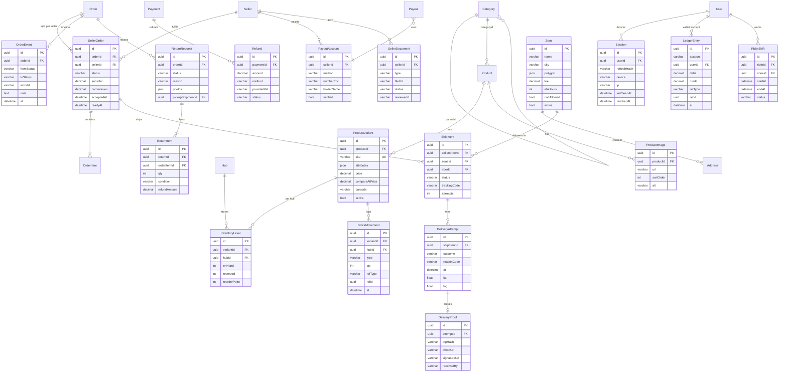
```mermaid
erDiagram
  Product ||--o{ ProductVariant : has
  Product ||--o{ ProductImage : has
  Category ||--o{ Category : "parentId"
  Category ||--o{ Product : "categoryId"
  ProductVariant ||--o{ InventoryLevel : "per hub"
  Hub ||--o{ InventoryLevel : stores
  ProductVariant ||--o{ StockMovement : logs
  Order ||--|{ SellerOrder : "split per seller"
  Seller ||--o{ SellerOrder : fulfils
  SellerOrder ||--|{ OrderItem : contains
  SellerOrder ||--o{ Shipment : ships
  Shipment ||--o{ DeliveryAttempt : tries
  DeliveryAttempt ||--o| DeliveryProof : proves
  Order ||--o{ OrderEvent : timeline
  Order ||--o{ ReturnRequest : returns
  ReturnRequest ||--|{ ReturnItem : lines
  Payment ||--o{ Refund : refunds
  Seller ||--o{ PayoutAccount : "paid to"
  Seller ||--o{ SellerDocument : KYC
  Payout }o--|| PayoutAccount : uses
  User ||--o{ Session : devices
  User ||--o{ LedgerEntry : "wallet account"
  Zone ||--o{ Address : contains
  Zone ||--o{ Shipment : "delivered in"
  User ||--o{ RiderShift : works

  ProductVariant {
    uuid id PK
    uuid productId FK
    varchar sku UK
    json attributes
    decimal price
    decimal compareAtPrice
    varchar barcode
    bool active
  }
  ProductImage {
    uuid id PK
    uuid productId FK
    varchar url
    int sortOrder
    varchar alt
  }
  InventoryLevel {
    uuid id PK
    uuid variantId FK
    uuid hubId FK
    int onHand
    int reserved
    int reorderPoint
  }
  StockMovement {
    uuid id PK
    uuid variantId FK
    uuid hubId FK
    varchar type
    int qty
    varchar refType
    uuid refId
    datetime at
  }
  SellerOrder {
    uuid id PK
    uuid orderId FK
    uuid sellerId FK
    varchar status
    decimal subtotal
    decimal commission
    datetime acceptedAt
    datetime readyAt
  }
  Shipment {
    uuid id PK
    uuid sellerOrderId FK
    uuid zoneId FK
    uuid riderId FK
    varchar status
    varchar trackingCode
    int attempts
  }
  DeliveryAttempt {
    uuid id PK
    uuid shipmentId FK
    varchar outcome
    varchar reasonCode
    datetime at
    float lat
    float lng
  }
  DeliveryProof {
    uuid id PK
    uuid attemptId FK
    varchar otpHash
    varchar photoUrl
    varchar signatureUrl
    varchar receivedBy
  }
  OrderEvent {
    uuid id PK
    uuid orderId FK
    varchar fromStatus
    varchar toStatus
    varchar actorId
    text note
    datetime at
  }
  ReturnRequest {
    uuid id PK
    uuid orderId FK
    varchar status
    varchar reason
    json photos
    uuid pickupShipmentId FK
  }
  ReturnItem {
    uuid id PK
    uuid returnId FK
    uuid orderItemId FK
    int qty
    varchar condition
    decimal refundAmount
  }
  Refund {
    uuid id PK
    uuid paymentId FK
    decimal amount
    varchar method
    varchar providerRef
    varchar status
  }
  PayoutAccount {
    uuid id PK
    uuid sellerId FK
    varchar method
    varchar numberEnc
    varchar holderName
    bool verified
  }
  SellerDocument {
    uuid id PK
    uuid sellerId FK
    varchar type
    varchar fileUrl
    varchar status
    varchar reviewerId
  }
  Session {
    uuid id PK
    uuid userId FK
    varchar refreshHash
    varchar device
    varchar ip
    datetime lastSeenAt
    datetime revokedAt
  }
  LedgerEntry {
    uuid id PK
    varchar account
    uuid userId FK
    decimal debit
    decimal credit
    varchar refType
    uuid refId
    datetime at
  }
  Zone {
    uuid id PK
    varchar name
    varchar city
    json polygon
    decimal fee
    int etaHours
    bool codAllowed
    bool active
  }
  RiderShift {
    uuid id PK
    uuid riderId FK
    uuid zoneId FK
    datetime startAt
    datetime endAt
    varchar status
  }
```

---

## 11. Recommendations and roadmap

### 11.1 Phase 0 — launch blockers (≈ 3–5 weeks, can run in parallel)

1. **Aggregator adapter** for Airtel / Orange / M-Pesa (needs contract + sandbox credentials) and daily reconciliation; or the manual-confirmation fallback for a soft launch.
2. **Seller payout disbursement** (payout accounts + provider B2C or bank batch) — or a documented manual process with finance confirmation.
3. **Proof of delivery** (customer OTP) in the rider app and API.
4. **Money as DECIMAL** migration; **login lockout**; **backups**, **monitoring/Sentry**, **staging**.
5. **Email + SMS providers** configured (verification, reset, order confirmations).
6. **First real droplet deployment** with the script, smoke tests from the test plan, device testing of both apps, `NEXT_PUBLIC_DEMO_MODE=false`.

### 11.2 Phase 1 — professional parity (≈ 6–10 weeks)

1. Catalogue v2: variants/SKUs, image gallery, category tree + `categoryId`, moderation queue, server search + pagination, central pricing (flash sales and campaigns applied at checkout).
2. Multi-seller orders: `seller_orders` + seller fulfilment step + shipments; order timeline (`order_events`); explicit transition tables for orders, exchanges, replacements, exceptions, campaigns.
3. Hub operations: inventory per hub, stock movements, receiving/sorting/dispatch, real transfers.
4. Returns logistics and refunds per item; dispute thread with evidence.
5. Rider operations: shifts, zones, background GPS, failed-delivery workflow, cash hand-over.
6. Push notifications end-to-end (Firebase), transactional email/SMS templates, deep links.
7. Finish wiring the ~74 demo web pages; staff invitations + 2FA; seller KYC; invoices and statements.
8. Security: sessions table with refresh rotation, secure token storage, audit of every sensitive change, dependency scanning.

### 11.3 Phase 2 — scale and growth

Redis adapter + job queue, object storage + CDN, dispatch optimisation, recommendations, referral and loyalty, analytics warehouse and exports, load testing, generated client SDKs, offline-first rider app.

### 11.4 Decisions needed from the client

| Decision | Options |
|---|---|
| Mobile-money aggregator | Which provider / contract; sandbox credentials; webhook secret |
| Payout method for sellers | Mobile money B2C, bank transfer, or both; payout frequency |
| Proof of delivery | OTP only, OTP + photo, signature |
| Commission model | Single %, per category, subscription plans |
| Pricing currency | USD only, or CDF prices; FX policy |
| Multi-seller cart | Allowed (requires sub-orders) or one seller per order |
| Zones | List of communes/zones, fees, ETAs, COD per zone |
| Firebase | Project files for push (optional) |
| Email/SMS providers | Accounts and sender identities |

---

## 12. Appendix

### 12.1 Repository map

| Path | Content |
|---|---|
| `api/src/main.ts` | Bootstrap: helmet, CORS, raw body for webhooks, validation, Socket.IO adapter |
| `api/src/app.module.ts` | Module wiring, TypeORM config (SQLite/MySQL) |
| `api/src/realtime/` | `realtime.gateway.ts` (115 handlers), `realtime-emitter.ts` (rooms), `ws-throttle.interceptor.ts` |
| `api/src/auth/` | REST controller, JWT strategy/guard, `auth.service.ts`, `verification.service.ts` |
| `api/src/orders/`, `payments/`, `wallet/`, `delivery/`, `payouts/`, `disputes/` | Core commerce services |
| `api/src/warehouse/` | Warehouse + rider services |
| `api/src/flows/` | Campaigns, replacements, exchanges |
| `api/src/content/` | Settings, promos/flash sales, CMS, reviews/questions, wishlist, support |
| `api/src/ops/` | Sellers, customers, roles, analytics, audit, fraud, broadcasts |
| `api/src/notifications/`, `messaging/`, `uploads/` | Notifications + FCM, email/SMS, image upload |
| `api/src/common/` | Field encryption, validation helpers |
| `api/src/config/` | Configuration + production boot guard |
| `api/src/database/` | Entities, migrations, data source, seed, production bootstrap |
| `api/test/` | Socket smoke, account smoke, authz smoke |
| `mobile/lib/` | Customer app (services, data, screens, widgets, theme, l10n) |
| `rider-app/lib/` | Rider app (services incl. GPS, screens, theme) |
| `web/src/` | Next.js app routes, contexts, lib (live hooks + demo data), components |
| `deploy/` | Droplet script, nginx config, pm2 ecosystem |
| `docs/` | Audits, deployment guide, remaining backend, flows, payment inventory, this document |

### 12.2 Glossary

| Term | Meaning |
|---|---|
| Ack | The response of a Socket.IO request: `{ ok, data \| error }` |
| Room | A Socket.IO group; every user is in `user:<id>` and `role:<role>` |
| Ops rooms | All admin roles + warehouse staff |
| Settle | Apply the final result of a mobile-money payment (idempotent, atomic) |
| Sweeper | Background timer that expires unapproved mobile-money payments |
| Clearance | Hours a delivered sale waits before it counts towards a seller payout |
| Snapshot line | Order line priced by the client (development only), product id `ext:<name>` |
| tokenVersion | Per-user counter embedded in JWTs; bumping it revokes every session |

