# Somba&Teka — Users, Apps and Flows

| | |
|---|---|
| **Document** | Every user type, every app and portal, every screen and the options on it, and a flowchart for every major and minor flow |
| **Covers** | Customer mobile app (Flutter), customer web shop, seller web portal, admin web portal (with its sub-roles), warehouse web portal, rider mobile app (Flutter) and rider web portal, and how each one talks to the backend |
| **Also covers** | Every broken or illogical flow found, with severity, a flowchart of where it breaks and the fix (section 11) |
| **Source** | Read from the code on branch `claude/somba-api-analysis-4rg0y7`, October 2026. Companion to `docs/ARCHITECTURE.md` (data model, API and gap analysis) |

### How to read the flowcharts

| Shape / mark | Meaning |
|---|---|
| Rounded box | A screen or page the user sees |
| Rectangle | An action the user takes or the system performs |
| Diamond | A decision or a check (validation, server rule, user choice) |
| `event:name` on an arrow | The real-time request the app sends to the server (WebSocket) |
| `POST /api/v1/…` | A one-off REST call (login, register, password reset, upload) |
| ⚡ | A live update pushed by the server to the screen, with no refresh |
| **LIVE** | The option reads or writes real data on the server |
| **LOCAL** | The option works on the device only (for example the cart, filters, language) |
| **MOCK** | The page shows demo data and the option does not reach the server yet |
| **STUB** | The control is visible but only shows a message or does nothing yet |

## Contents

1. Users and the apps they use
2. How the apps talk to the backend
3. One order, every user — the end-to-end lifecycle
4. Customer — mobile app (Flutter)
5. Customer and visitor — web shop and public pages
6. Seller — web portal
7. Admin — web portal and its sub-roles
8. Warehouse staff — web portal
9. Rider — mobile app and web portal
10. Which app does what — side by side
11. Broken flows and flows that do not make sense

---

## 1. Users and the apps they use

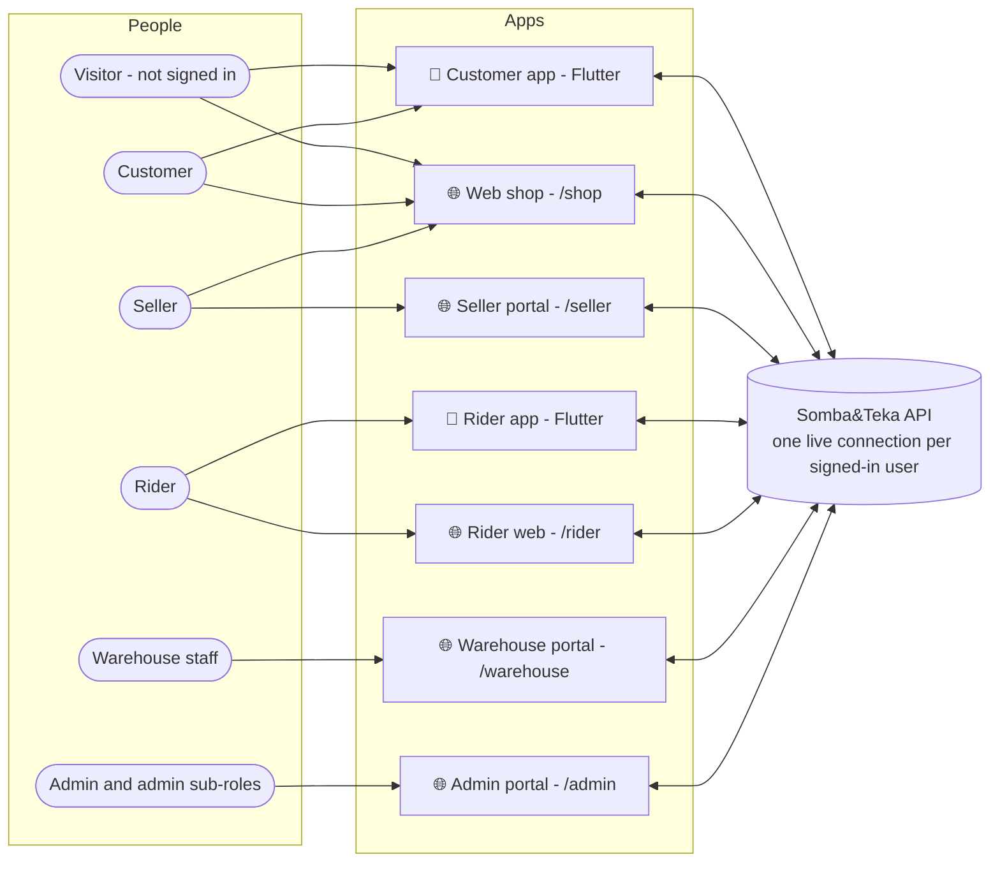
```mermaid
flowchart LR
  subgraph People
    G([Visitor - not signed in])
    C([Customer])
    S([Seller])
    R([Rider])
    W([Warehouse staff])
    A([Admin and admin sub-roles])
  end
  subgraph Apps
    CM["📱 Customer app - Flutter"]
    WS["🌐 Web shop - /shop"]
    SP["🌐 Seller portal - /seller"]
    RM["📱 Rider app - Flutter"]
    RW["🌐 Rider web - /rider"]
    WP["🌐 Warehouse portal - /warehouse"]
    AP["🌐 Admin portal - /admin"]
  end
  API[("Somba&Teka API<br/>one live connection per signed-in user")]
  G --> CM & WS
  C --> CM & WS
  S --> SP & WS
  R --> RM & RW
  W --> WP
  A --> AP
  CM & WS & SP & RM & RW & WP & AP <--> API
```

| User | How the account is created | Apps | Main jobs |
|---|---|---|---|
| Visitor | — | Customer app, web shop | Browse products, categories, deals, stores, reviews; must sign in to buy |
| Customer | Self sign-up (email + password) | Customer app, web shop | Buy, pay (wallet or mobile money), track deliveries live, cancel, return/dispute, review, support, wallet, addresses, wishlist |
| Seller | Self sign-up as seller, then store approval by an admin | Seller portal (and the shop) | Store profile, products and stock, orders containing their products, promotions/campaigns, reviews and questions, payouts, analytics |
| Rider | Created by the admin (role `rider`) | Rider app, rider web | Take deliveries from the pool or by assignment, pick up, deliver, share live location, collect cash (if COD is on), see earnings |
| Warehouse staff | Created by the admin (role `warehouse_staff`) | Warehouse portal | Parcels by stage, batches, assign riders, exceptions, transfers, exchanges, replacements, returns, cash reconciliation |
| Admin (super admin) | Bootstrap account | Admin portal | Everything, including staff roles |
| Admin — operations | Admin assigns the role | Admin portal | Orders, sellers, catalogue, customers, fulfilment, settings, audit, fraud |
| Admin — finance | Admin assigns the role | Admin portal | Payments, refunds, payouts, disputes with refunds, settings, analytics, fraud |
| Admin — support | Admin assigns the role | Admin portal | Customers (suspend/reactivate), support tickets |
| Admin — marketing | Admin assigns the role | Admin portal | Promo codes, flash sales, CMS banners, broadcasts, categories |
| Admin — moderation | Admin assigns the role | Admin portal | Seller approval/suspension, fraud review |

**Where each user lands after signing in on the web** (`/login` or `/shop/login`): customer → `/shop/account`, seller → `/seller`, any admin role → `/admin`, warehouse staff → `/warehouse`, rider → `/rider`. Each portal refuses users of other roles (portal isolation in `web/src/lib/portal-access.ts`); the server checks the role again on every request.

---

## 2. How the apps talk to the backend

### 2.1 One connection, request → answer, live pushes

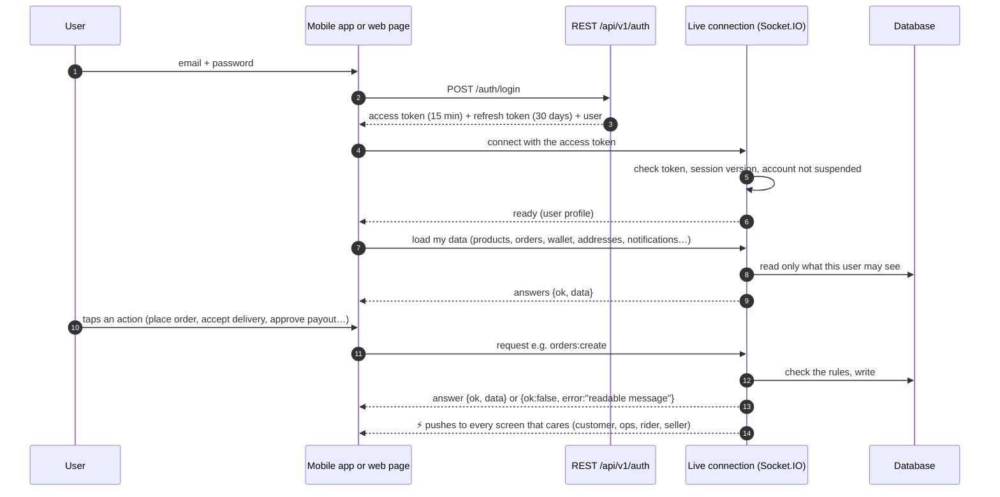
```mermaid
sequenceDiagram
  autonumber
  participant U as User
  participant App as Mobile app or web page
  participant REST as REST /api/v1/auth
  participant WS as Live connection (Socket.IO)
  participant DB as Database
  U->>App: email + password
  App->>REST: POST /auth/login
  REST-->>App: access token (15 min) + refresh token (30 days) + user
  App->>WS: connect with the access token
  WS->>WS: check token, session version, account not suspended
  WS-->>App: ready (user profile)
  App->>WS: load my data (products, orders, wallet, addresses, notifications…)
  WS->>DB: read only what this user may see
  WS-->>App: answers {ok, data}
  U->>App: taps an action (place order, accept delivery, approve payout…)
  App->>WS: request e.g. orders:create
  WS->>DB: check the rules, write
  WS-->>App: answer {ok, data} or {ok:false, error:"readable message"}
  WS-->>App: ⚡ pushes to every screen that cares (customer, ops, rider, seller)
```

* The apps **never poll**: lists change on screen because the server pushes the change (`order:updated`, `delivery:location`, `wallet:updated`, …).
* REST is only used before the live connection exists: sign-up, sign-in, refresh, forgot/reset password, email and phone verification, photo upload, and the mobile-money provider's callback.
* Every error comes back as a readable sentence that the apps show as-is (for example "Only 2 of "Nike Air Max" left in stock.").

### 2.2 Session lifecycle in the mobile apps

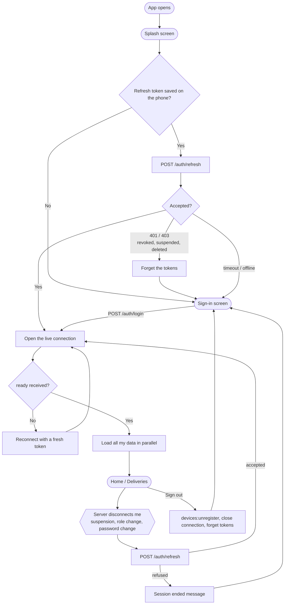
```mermaid
flowchart TD
  Start([App opens]) --> Splash([Splash screen])
  Splash --> Stored{Refresh token saved on the phone?}
  Stored -- No --> Login([Sign-in screen])
  Stored -- Yes --> Refresh["POST /auth/refresh"]
  Refresh --> RefreshOK{Accepted?}
  RefreshOK -- "401 / 403<br/>revoked, suspended, deleted" --> Clear[Forget the tokens] --> Login
  RefreshOK -- "timeout / offline" --> Login
  RefreshOK -- Yes --> Connect[Open the live connection]
  Login -- "POST /auth/login" --> Connect
  Connect --> Ready{ready received?}
  Ready -- No --> Retry[Reconnect with a fresh token] --> Connect
  Ready -- Yes --> Hydrate[Load all my data in parallel] --> Home([Home / Deliveries])
  Home --> Live{{Server disconnects me<br/>suspension, role change, password change}}
  Live --> Verify["POST /auth/refresh"]
  Verify -- accepted --> Connect
  Verify -- refused --> Ended[Session ended message] --> Login
  Home -- "Sign out" --> Out["devices:unregister, close connection, forget tokens"] --> Login
```

### 2.3 How a notification reaches a user

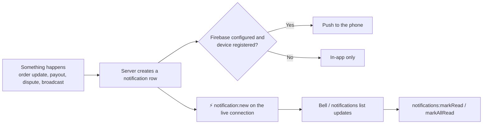
```mermaid
flowchart LR
  Event[Something happens<br/>order update, payout, dispute, broadcast] --> Svc[Server creates a notification row]
  Svc --> Live[⚡ notification:new on the live connection]
  Svc --> Push{Firebase configured and<br/>device registered?}
  Push -- Yes --> FCM[Push to the phone]
  Push -- No --> Skip[In-app only]
  Live --> Bell[Bell / notifications list updates]
  Bell --> Read["notifications:markRead / markAllRead"]
```

---

## 3. One order, every user — the end-to-end lifecycle

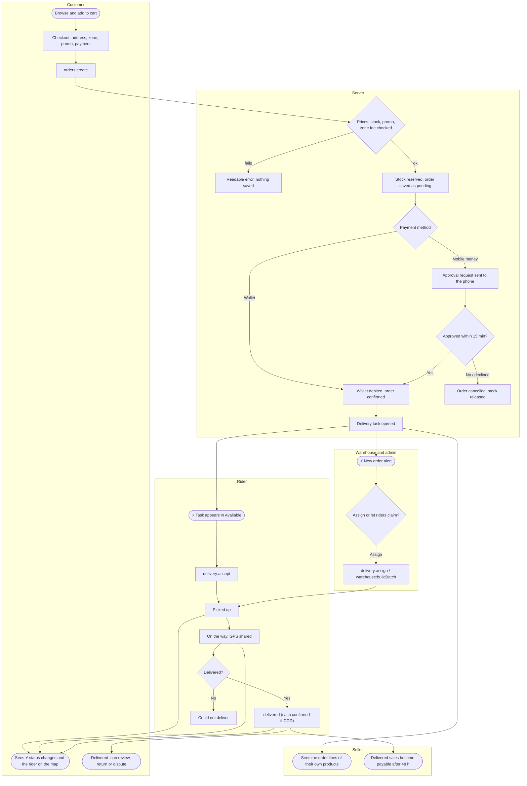
```mermaid
flowchart TD
  subgraph Customer
    C1([Browse and add to cart]) --> C2[Checkout: address, zone, promo, payment]
    C2 --> C3["orders:create"]
    C9([Sees ⚡ status changes and the rider on the map])
    C10([Delivered: can review, return or dispute])
  end
  subgraph Server
    S1{Prices, stock, promo,<br/>zone fee checked} -->|fails| SX[Readable error, nothing saved]
    S1 -->|ok| S2[Stock reserved, order saved as pending]
    S2 --> S3{Payment method}
    S3 -- Wallet --> S4[Wallet debited, order confirmed]
    S3 -- Mobile money --> S5[Approval request sent to the phone]
    S5 --> S6{Approved within 15 min?}
    S6 -- Yes --> S4
    S6 -- "No / declined" --> S7[Order cancelled, stock released]
    S4 --> S8[Delivery task opened]
  end
  subgraph Warehouse_and_Admin["Warehouse and admin"]
    W1([⚡ New order alert]) --> W2{Assign or let riders claim?}
    W2 -- Assign --> W3["delivery:assign / warehouse:buildBatch"]
  end
  subgraph Rider
    R1([⚡ Task appears in Available]) --> R2["delivery:accept"]
    R2 --> R3[Picked up] --> R4[On the way, GPS shared] --> R5{Delivered?}
    R5 -- Yes --> R6["delivered (cash confirmed if COD)"]
    R5 -- No --> R7[Could not deliver]
  end
  subgraph Seller
    SL1([Sees the order lines of their own products])
    SL2([Delivered sales become payable after 48 h])
  end
  C3 --> S1
  S8 --> W1 & R1 & SL1
  W3 --> R3
  R3 & R4 & R6 --> C9
  R6 --> C10 & SL2
```

---

## 4. Customer — mobile app (Flutter)

### 4.1 Navigation map

Five tabs in a floating bar: **Home · Categories · Deals · Orders · Account**. Everything else opens on top of a tab.

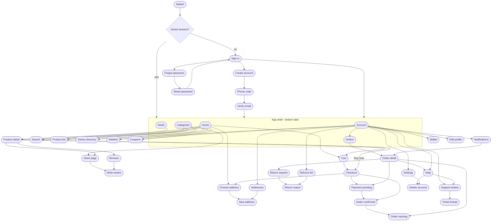
```mermaid
flowchart TD
  Splash([Splash]) --> Restore{Saved session?}
  Restore -- no --> Login([Sign in])
  Restore -- yes --> Shell
  Login --> Register([Create account]) --> OTP([Phone code]) --> VerifyEmail([Verify email]) --> Shell
  Login --> Forgot([Forgot password]) --> Reset([Reset password]) --> Login
  Login --> Shell
  subgraph Shell["App shell - bottom tabs"]
    Home([Home])
    Cats([Categories])
    Deals([Deals])
    Orders([Orders])
    Account([Account])
  end
  Home --> Search([Search]) & PList([Product list]) & Stores([Stores directory]) & Wish([Wishlist]) & Coupons([Coupons]) & Cart([Cart]) & AddrPick([Choose address]) & PD([Product detail])
  Cats --> PList & Store([Store page]) & Stores & Search
  Deals --> PD
  PD --> Store & Reviews([Reviews]) --> Compose([Write review])
  PD --> Cart --> Checkout([Checkout])
  PD -- Buy now --> Checkout
  Checkout --> AddrPick --> AddrForm([New address])
  Checkout --> Pending([Payment pending]) --> Success([Order confirmed])
  Checkout --> Success --> Track([Order tracking])
  Orders --> OD([Order detail])
  OD --> Pending & Track & Return([Return request]) & Help([Help])
  Return --> RStatus([Return status])
  Account --> Orders & Wish & Addr([Addresses]) & Wallet([Wallet]) & Returns([Returns list]) & Coupons & Edit([Edit profile]) & Notif([Notifications]) & Support([Support tickets]) & Settings([Settings]) & Help
  Addr --> AddrForm
  Returns --> RStatus
  Notif --> OD
  Support --> Ticket([Ticket thread])
  Help --> Support & Delete([Delete account])
  Settings --> Delete
```

### 4.2 Every screen and its options

| Screen | Reached from | Shows | Options |
|---|---|---|---|
| Splash | App start | Logo, spinner | Automatic: restore session (`POST /auth/refresh`) → Home or Sign in |
| Sign in | Not signed in, after sign-out or session end | Email, password | **Sign in** (LIVE `POST /auth/login`) · Forgot password? · Create an account |
| Create account | Sign in | Name, mobile (country code +243 default, +242, +33, +32, +254, +27), email, password, confirm, terms checkbox | **Create account** (LIVE `POST /auth/register`, role customer) — errors placed under the matching field |
| Phone code | After sign-up | 6 code boxes, 30 s resend timer | Sends code on open (LIVE `POST /auth/phone/send`) · **Verify** (LIVE `POST /auth/phone/verify`) · Resend · Skip for now |
| Verify email | After phone code | Instructions | Sends email on open (LIVE `POST /auth/email/send`) · **I've verified — continue** (LIVE `me:get`) · Resend · Skip for now |
| Forgot password | Sign in | Email | **Send reset link** (LIVE `POST /auth/forgot`, same answer for unknown emails) |
| Reset password | Forgot password | Code, new password, confirm | **Save new password** (LIVE `POST /auth/reset`) → Sign in |
| Home | Tab 1 | Deliver-to chip, banners (admin CMS), quick actions, top categories, deals row (≥ 15 % off), recommended feed | Deliver to (choose address, LOCAL) · EN/FR (LIVE `me:update`) · Cart icon with count · Search bar · Quick actions Deals / Stores / Wishlist / Coupons · Category → product list · See all · Feed chips For you / Trending / New / Popular (LOCAL sort) · Product card: open, **+** add to cart (LOCAL), ♥ (LIVE `wishlist:toggle`) |
| Categories | Tab 2 | Category grid with counts, popular stores | Search categories and stores (LOCAL) · Category → product list · Store → store page · See all stores · Search all products for "…" |
| Deals | Tab 3 | Products ≥ 15 % off, biggest first | Open product · + add to cart · ♥ |
| Orders | Tab 4 / Account | Live order list (⚡ `order:created/updated`) | Filter All / Active / Delivered / Cancelled (LOCAL) · Open order |
| Account | Tab 5 | Initials, name, email, verified badge, order / wishlist / wallet counts | My orders · Wishlist · Addresses · Wallet · Returns & refunds · Coupons · Language EN/FR (LIVE `me:update`) · Edit profile · Notifications · Support · Settings · Help · **Log out** (confirm sheet) |
| Product detail | Home, Deals, related products | Image, stock badge, price (FC + USD), discount, delivery note, description, seller, 2 reviews, questions & answers, related items | ♥ · Quantity 1–min(stock, 20) · Visit store · See all / write reviews · **Ask a question** (LIVE `questions:ask`) · Add to cart (LOCAL) · **Buy now** → checkout · disabled when out of stock or unlisted |
| Reviews | Product detail | Average, 5→1 distribution, list (LIVE `reviews:list`) | Write a review |
| Write review | Reviews | 1–5 stars, text | **Submit** (LIVE `reviews:create`; server allows it only after delivery) |
| Store page | Product detail, categories, stores, search | Store name, rating, badge (LIVE `sellers:storefront`), its products | ♥ on products |
| Stores directory | Home, categories | Stores derived from live products | Search (LOCAL) · Visit |
| Search | Home, categories | Results over the live catalogue | Text · Products / Stores · **Filters**: sort (relevance, price ↑, price ↓, top rated, biggest discount), category, price range, minimum rating, deals only, reset, show N results · quick sorts (all LOCAL) |
| Product list | Home, categories | Products of a category / deals / all | Search in list · Filters · quick sorts (LOCAL) |
| Wishlist | Home, Account | Saved products (LIVE `wishlist:list`, ⚡ `wishlist:updated`) | ♥ removes |
| Coupons | Home, Account | Public promo codes (LIVE `promos:list`) | Copy code (LOCAL) |
| Cart | Home cart icon, "Added to cart" message | Lines, subtotal, delivery, promo, total | Swipe to remove · Quantity 1–stock · **Promo code → Apply** (LIVE `promos:validate`) · **Checkout** |
| Checkout | Cart, Buy now | Address, delivery zones with fees (from server settings), payment methods, wallet balance, totals | Change / add address · Zone (LOCAL) · Pay with **Wallet / Airtel Money / Orange Money / Vodacom M-Pesa** · mobile-money number (9–15 digits) · **Place order** (LIVE `orders:create`) |
| Payment pending | Checkout (mobile money), Order detail "Pay" | "Approve on your phone", amount, reference (⚡ `order:updated`, `payment:updated`) | **Cancel order** (LIVE `orders:cancel`) · Continue shopping · after failure **Try again** (refills the cart, LOCAL) |
| Order confirmed | Checkout (wallet), Payment pending (approved) | Reference | Track order · Continue shopping |
| Order detail | Orders, notification, links | Status, items, totals, payment state | **Pay** (pending mobile money) · **Track** (processing / shipped / out for delivery) · **Cancel order** (pending / confirmed, LIVE `orders:cancel`) · **Return** (delivered) · Help |
| Order tracking | Order detail, Order confirmed | Rider status and live position (⚡ `delivery:location`), timeline Placed → Confirmed → Processing → Shipped → Out for delivery → Delivered | Back |
| Return request | Order detail (delivered) | Items | Reason: damaged, wrong item, not as described, no longer needed, other · details · **Submit** (LIVE `disputes:open` type return) |
| Returns list / status | Account | Requests and their state (LIVE `disputes:list`) | Open a request |
| Wallet | Account | Balance (FC + USD), pending top-ups, history (⚡ `wallet:updated`, `wallet:transaction`) | **Top up with mobile money**: amount (≥ $1), network, number → LIVE `wallet:topup` |
| Addresses | Account; picker from Home / Checkout | Saved addresses (LIVE `addresses:list`) | Add new · Delete (LIVE `addresses:remove`) · in picker: tap to choose (LOCAL) |
| New address | Addresses | Label, rider phone, street (required), commune, city (required), default | **Save** (LIVE `addresses:create`) |
| Notifications | Account | List with unread count (⚡ `notification:new`) | Tap: mark read (LIVE `notifications:markRead`), order → order detail · **Mark all** (LIVE `notifications:markAllRead`) |
| Edit profile | Account | Name, phone, email (read-only in practice) | **Save** (LIVE `me:update`) |
| Settings | Account | Toggles and account actions | Push / Email / SMS / Personalised (LIVE `me:setPrefs`) · Prices in FC or USD (LOCAL + LIVE `me:setPrefs market`) · **Change password** (LIVE `me:changePassword`) · About · Delete account |
| Delete account | Settings, Help | Warning, password | **Permanently delete** (LIVE `me:delete`) · Keep my account |
| Help | Account, Order detail | 5 FAQs | Contact support · Delete my account |
| Support tickets | Account, Help | Tickets (LIVE `support:list`) | **New ticket** (LIVE `support:open`) · open a ticket |
| Ticket thread | Support tickets | Messages | **Reply** (LIVE `support:reply`) |

### 4.3 Flowcharts

#### C-1 Sign up with phone and email verification

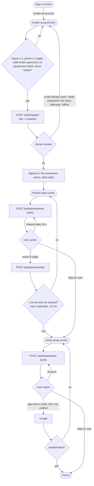
```mermaid
flowchart TD
  A([Sign in screen]) -->|Create an account| B([Create account form])
  B --> V{Name ≥ 2, phone ≥ 6 digits,<br/>valid email, password ≥ 8,<br/>passwords match, terms ticked?}
  V -- no --> B
  V -- yes --> R["POST /auth/register<br/>role = customer"]
  R --> RO{Server answer}
  RO -- "email already used / weak password / too many attempts / offline" --> B
  RO -- ok --> S[Signed in, live connection opens, data loads]
  S --> O([Phone code screen])
  O --> OS["POST /auth/phone/send (auto)"]
  OS --> OC{User action}
  OC -- "enters 6 digits" --> OV["POST /auth/phone/verify"]
  OV --> OVR{Correct and not expired?<br/>max 5 attempts, 10 min}
  OVR -- no --> O
  OVR -- yes --> E
  OC -- "Resend after 30 s" --> OS
  OC -- "Skip for now" --> E([Verify email screen])
  E --> ES["POST /auth/email/send (auto)"]
  ES --> EC{User action}
  EC -- "taps link in email, then I've verified" --> EM["me:get"]
  EM --> EMV{emailVerified?}
  EMV -- no --> E
  EMV -- yes --> H([Home])
  EC -- Resend --> ES
  EC -- "Skip for now" --> H
```

#### C-2 Sign in, forgot and reset password

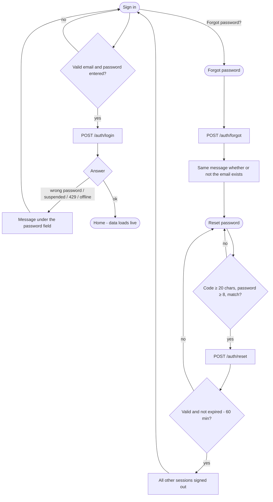
```mermaid
flowchart TD
  L([Sign in]) --> LV{Valid email and password entered?}
  LV -- no --> L
  LV -- yes --> LP["POST /auth/login"]
  LP --> LR{Answer}
  LR -- "wrong password / suspended / 429 / offline" --> LE[Message under the password field] --> L
  LR -- ok --> H([Home - data loads live])
  L -->|Forgot password?| F([Forgot password])
  F --> FP["POST /auth/forgot"]
  FP --> FM[Same message whether or not the email exists] --> RS([Reset password])
  RS --> RV{Code ≥ 20 chars, password ≥ 8, match?}
  RV -- no --> RS
  RV -- yes --> RP["POST /auth/reset"]
  RP --> RR{Valid and not expired - 60 min?}
  RR -- no --> RS
  RR -- yes --> RO[All other sessions signed out] --> L
```

#### C-3 Browse, search and filter

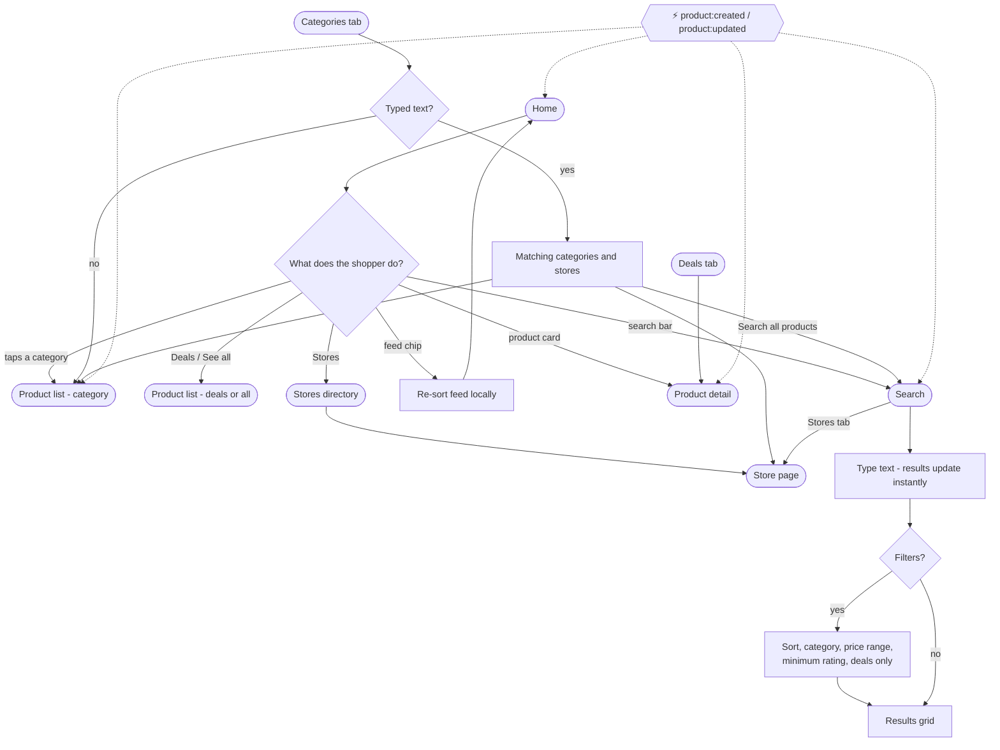
```mermaid
flowchart TD
  H([Home]) --> Q{What does the shopper do?}
  Q -- "taps a category" --> PL([Product list - category])
  Q -- "Deals / See all" --> PL2([Product list - deals or all])
  Q -- "search bar" --> SR([Search])
  Q -- "feed chip" --> Sort[Re-sort feed locally] --> H
  Q -- "product card" --> PD([Product detail])
  Q -- "Stores" --> SD([Stores directory]) --> ST([Store page])
  C([Categories tab]) --> CS{Typed text?}
  CS -- no --> PL
  CS -- yes --> CM[Matching categories and stores] --> PL & ST
  CM -->|Search all products| SR
  SR --> T[Type text - results update instantly]
  T --> FT{Filters?}
  FT -- yes --> FS[Sort, category, price range,<br/>minimum rating, deals only] --> Res
  FT -- no --> Res[Results grid]
  SR -->|Stores tab| ST
  D([Deals tab]) --> PD
  Live{{⚡ product:created / product:updated}} -.-> H & PL & SR & PD
```

The catalogue is downloaded once (`products:list`) and kept current by live pushes; search, sort and filters run on the phone.

#### C-4 Product detail, wishlist, reviews and questions

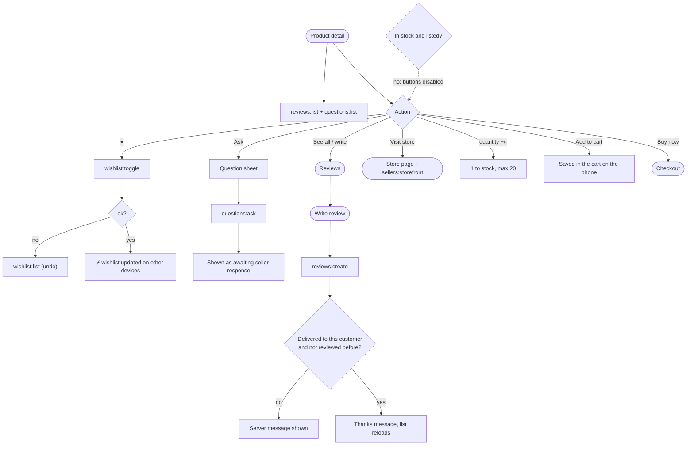
```mermaid
flowchart TD
  PD([Product detail]) --> L["reviews:list + questions:list"]
  PD --> A{Action}
  A -- "♥" --> W["wishlist:toggle"] --> WR{ok?}
  WR -- no --> WL["wishlist:list (undo)"]
  WR -- yes --> WS[⚡ wishlist:updated on other devices]
  A -- "Ask" --> AQ[Question sheet] --> AQS["questions:ask"] --> AQR[Shown as awaiting seller response]
  A -- "See all / write" --> RV([Reviews]) --> RW([Write review]) --> RC["reviews:create"]
  RC --> RCR{Delivered to this customer<br/>and not reviewed before?}
  RCR -- no --> RE[Server message shown]
  RCR -- yes --> RT[Thanks message, list reloads]
  A -- "Visit store" --> ST([Store page - sellers:storefront])
  A -- "quantity +/-" --> QT[1 to stock, max 20]
  A -- "Add to cart" --> AC[Saved in the cart on the phone]
  A -- "Buy now" --> CO([Checkout])
  Stock{In stock and listed?} -. "no: buttons disabled" .-> A
```

#### C-5 Cart and promo code

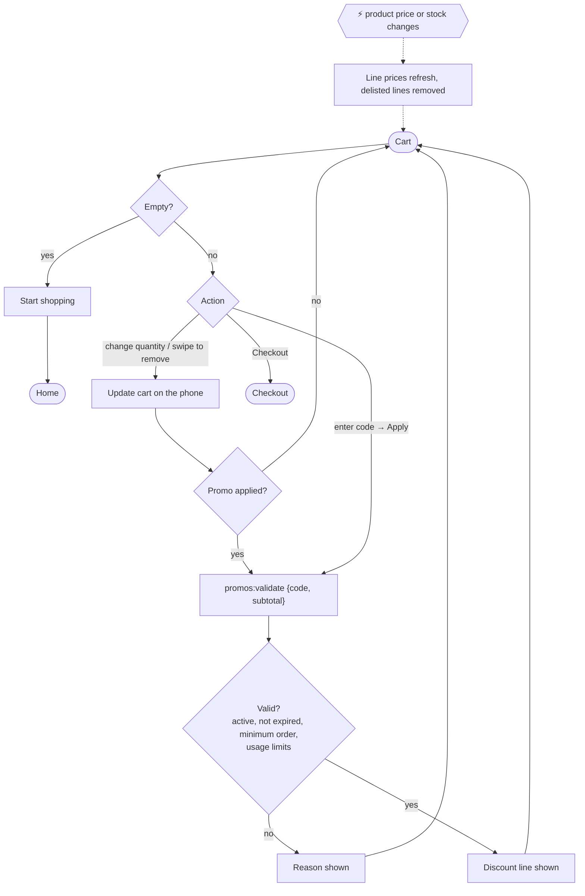
```mermaid
flowchart TD
  CT([Cart]) --> E{Empty?}
  E -- yes --> ES[Start shopping] --> H([Home])
  E -- no --> A{Action}
  A -- "change quantity / swipe to remove" --> U[Update cart on the phone] --> PR{Promo applied?}
  PR -- yes --> PV
  PR -- no --> CT
  A -- "enter code → Apply" --> PV["promos:validate {code, subtotal}"]
  PV --> PVR{Valid?<br/>active, not expired, minimum order,<br/>usage limits}
  PVR -- no --> PE[Reason shown] --> CT
  PVR -- yes --> PA[Discount line shown] --> CT
  A -- Checkout --> CO([Checkout])
  Live{{⚡ product price or stock changes}} -.-> RP[Line prices refresh, delisted lines removed] -.-> CT
```

#### C-6 Checkout and payment

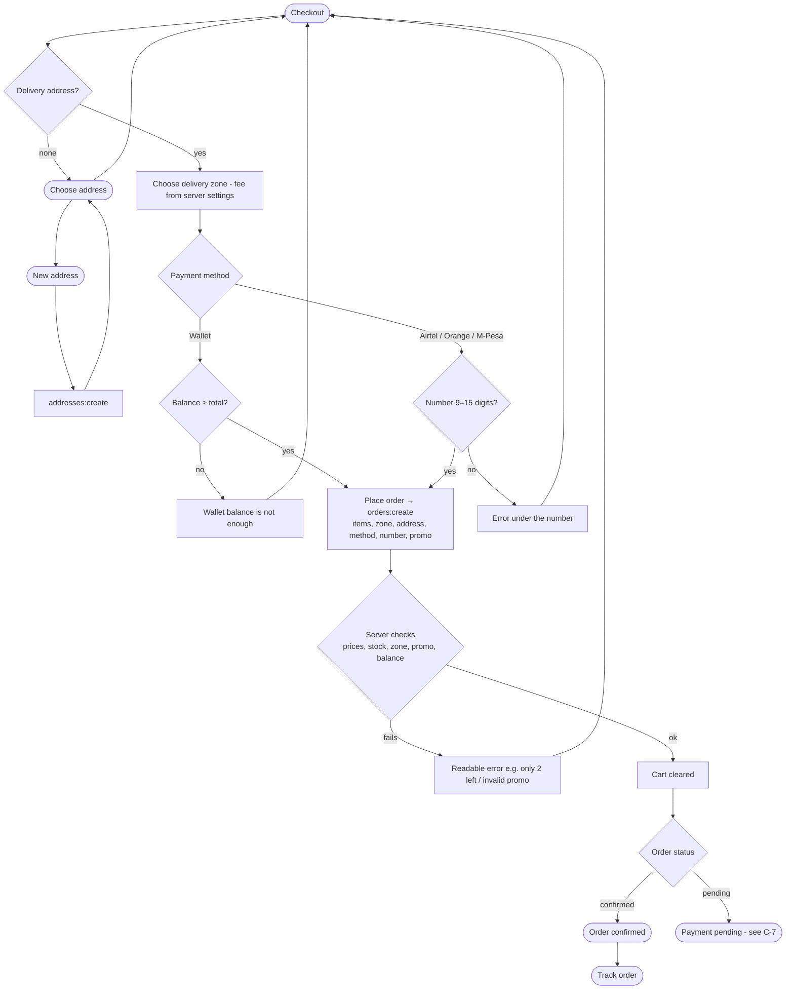
```mermaid
flowchart TD
  CO([Checkout]) --> AD{Delivery address?}
  AD -- none --> AP([Choose address]) --> AN([New address]) --> AC["addresses:create"] --> AP --> CO
  AD -- yes --> Z[Choose delivery zone - fee from server settings]
  Z --> PM{Payment method}
  PM -- Wallet --> WB{Balance ≥ total?}
  WB -- no --> WE[Wallet balance is not enough] --> CO
  WB -- yes --> PO
  PM -- "Airtel / Orange / M-Pesa" --> PN{Number 9–15 digits?}
  PN -- no --> PNE[Error under the number] --> CO
  PN -- yes --> PO["Place order → orders:create<br/>items, zone, address, method, number, promo"]
  PO --> SV{Server checks<br/>prices, stock, zone, promo, balance}
  SV -- fails --> SE["Readable error e.g. only 2 left / invalid promo"] --> CO
  SV -- ok --> CC[Cart cleared]
  CC --> ST{Order status}
  ST -- confirmed --> OK([Order confirmed])
  ST -- pending --> PP([Payment pending - see C-7])
  OK --> TR([Track order])
```

#### C-7 Mobile-money approval

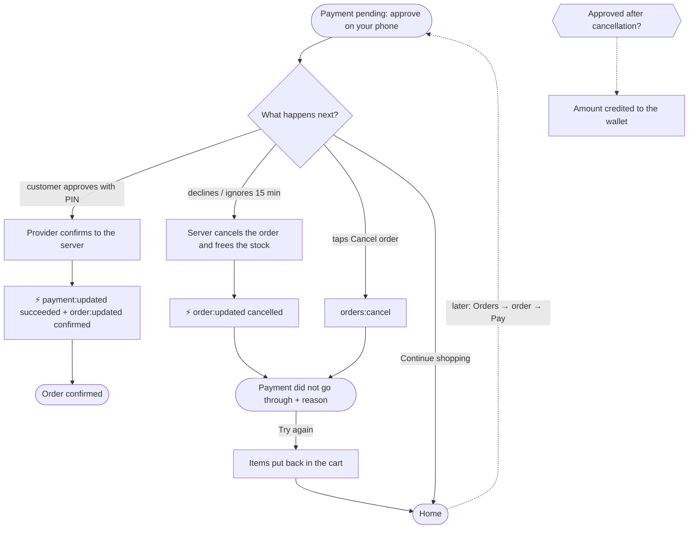
```mermaid
flowchart TD
  PP([Payment pending: approve on your phone]) --> W{What happens next?}
  W -- "customer approves with PIN" --> AP[Provider confirms to the server]
  AP --> AU[⚡ payment:updated succeeded + order:updated confirmed] --> OK([Order confirmed])
  W -- "declines / ignores 15 min" --> FL[Server cancels the order and frees the stock]
  FL --> FU[⚡ order:updated cancelled] --> FX([Payment did not go through + reason])
  FX -->|Try again| RC[Items put back in the cart] --> H([Home])
  W -- "taps Cancel order" --> CX["orders:cancel"] --> FX
  W -- "Continue shopping" --> H
  H -.->|later: Orders → order → Pay| PP
  Late{{Approved after cancellation?}} -.-> WC[Amount credited to the wallet]
```

#### C-8 Orders, tracking and cancellation

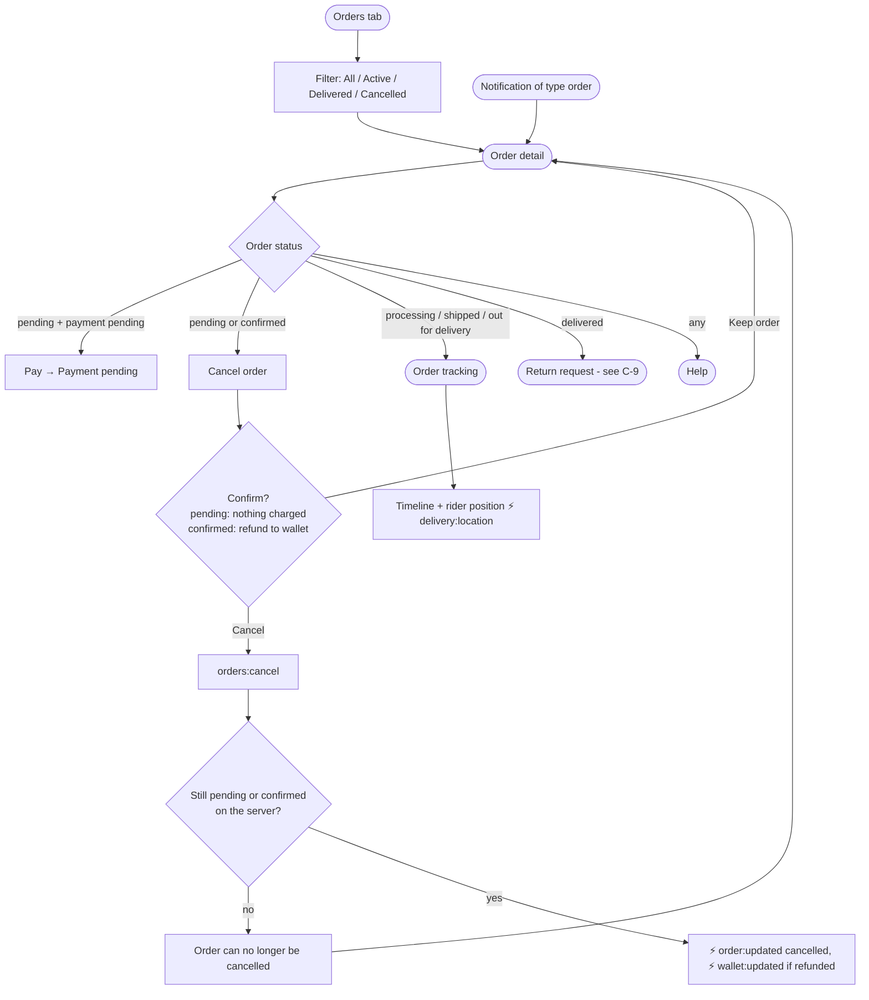
```mermaid
flowchart TD
  O([Orders tab]) --> F[Filter: All / Active / Delivered / Cancelled] --> OD([Order detail])
  N([Notification of type order]) --> OD
  OD --> S{Order status}
  S -- "pending + payment pending" --> P[Pay → Payment pending]
  S -- "pending or confirmed" --> C[Cancel order]
  C --> CD{Confirm?<br/>pending: nothing charged<br/>confirmed: refund to wallet}
  CD -- Keep order --> OD
  CD -- Cancel --> CE["orders:cancel"] --> CR{Still pending or confirmed<br/>on the server?}
  CR -- no --> CRE[Order can no longer be cancelled] --> OD
  CR -- yes --> CU[⚡ order:updated cancelled, ⚡ wallet:updated if refunded]
  S -- "processing / shipped / out for delivery" --> T([Order tracking])
  T --> TL[Timeline + rider position ⚡ delivery:location]
  S -- delivered --> R([Return request - see C-9])
  S -- any --> HP([Help])
```

#### C-9 Return request

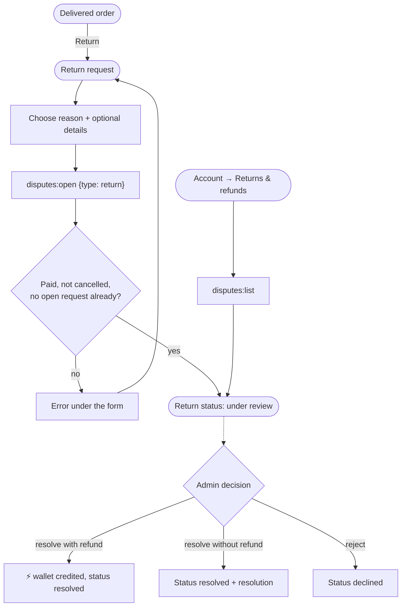
```mermaid
flowchart TD
  OD([Delivered order]) -->|Return| RQ([Return request])
  RQ --> RR[Choose reason + optional details]
  RR --> RS["disputes:open {type: return}"]
  RS --> RV{Paid, not cancelled,<br/>no open request already?}
  RV -- no --> RE[Error under the form] --> RQ
  RV -- yes --> ST([Return status: under review])
  ST -.-> AD{Admin decision}
  AD -- "resolve with refund" --> RF[⚡ wallet credited, status resolved]
  AD -- "resolve without refund" --> RS2[Status resolved + resolution]
  AD -- reject --> RJ[Status declined]
  AC([Account → Returns & refunds]) --> RL["disputes:list"] --> ST
```

#### C-10 Wallet top-up

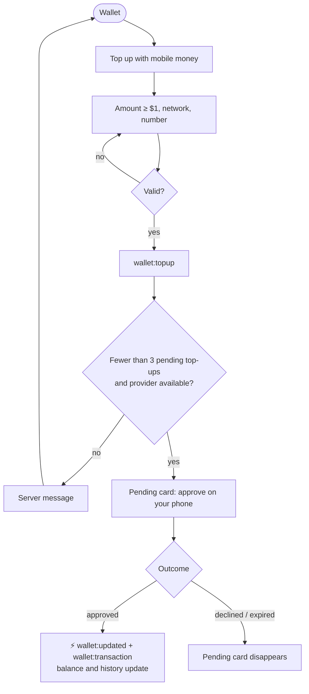
```mermaid
flowchart TD
  W([Wallet]) --> T[Top up with mobile money]
  T --> F[Amount ≥ $1, network, number]
  F --> V{Valid?}
  V -- no --> F
  V -- yes --> R["wallet:topup"]
  R --> RV{Fewer than 3 pending top-ups<br/>and provider available?}
  RV -- no --> E[Server message] --> W
  RV -- yes --> PC[Pending card: approve on your phone]
  PC --> O{Outcome}
  O -- approved --> OK[⚡ wallet:updated + wallet:transaction<br/>balance and history update]
  O -- "declined / expired" --> X[Pending card disappears]
```

#### C-11 Addresses

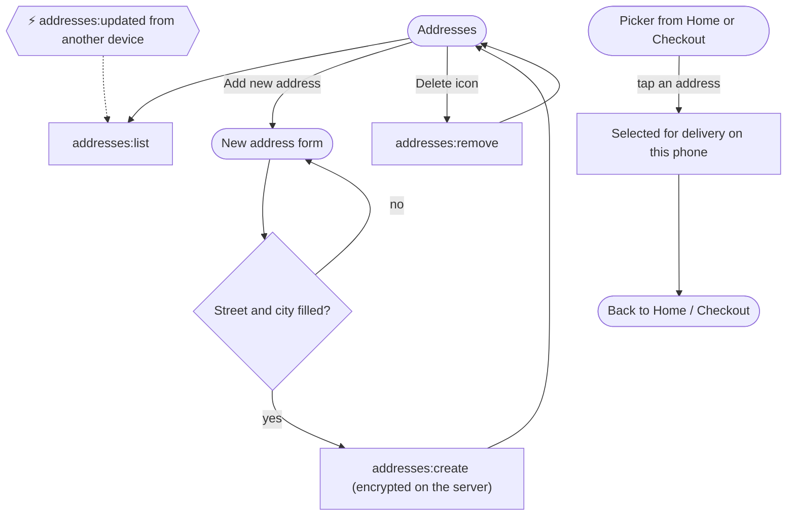
```mermaid
flowchart TD
  A([Addresses]) --> L["addresses:list"]
  A -->|Add new address| N([New address form])
  N --> V{Street and city filled?}
  V -- no --> N
  V -- yes --> C["addresses:create (encrypted on the server)"] --> A
  A -->|Delete icon| D["addresses:remove"] --> A
  P([Picker from Home or Checkout]) -->|tap an address| S[Selected for delivery on this phone] --> Back([Back to Home / Checkout])
  U{{⚡ addresses:updated from another device}} -.-> L
```

#### C-12 Account, settings, notifications and support

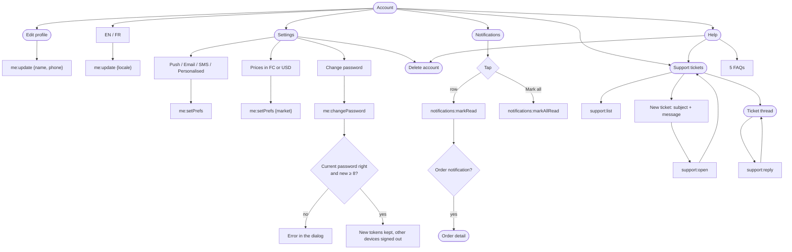
```mermaid
flowchart TD
  AC([Account]) --> EP([Edit profile]) --> EPS["me:update {name, phone}"]
  AC --> LG[EN / FR] --> LGS["me:update {locale}"]
  AC --> ST([Settings])
  ST --> TG[Push / Email / SMS / Personalised] --> TGS["me:setPrefs"]
  ST --> CUR[Prices in FC or USD] --> CURS["me:setPrefs {market}"]
  ST --> CP[Change password] --> CPS["me:changePassword"] --> CPR{Current password right<br/>and new ≥ 8?}
  CPR -- no --> CPE[Error in the dialog]
  CPR -- yes --> CPO[New tokens kept, other devices signed out]
  ST --> DEL([Delete account])
  AC --> NT([Notifications]) --> NTT{Tap}
  NTT -- row --> MR["notifications:markRead"] --> ORD{Order notification?}
  ORD -- yes --> OD([Order detail])
  NTT -- "Mark all" --> MA["notifications:markAllRead"]
  AC --> SP([Support tickets]) --> SPL["support:list"]
  SP --> NEW[New ticket: subject + message] --> NEWS["support:open"] --> SP
  SP --> TK([Ticket thread]) --> RP["support:reply"] --> TK
  AC --> HL([Help]) --> FAQ[5 FAQs] & SP & DEL
```

#### C-13 Delete account and sign out

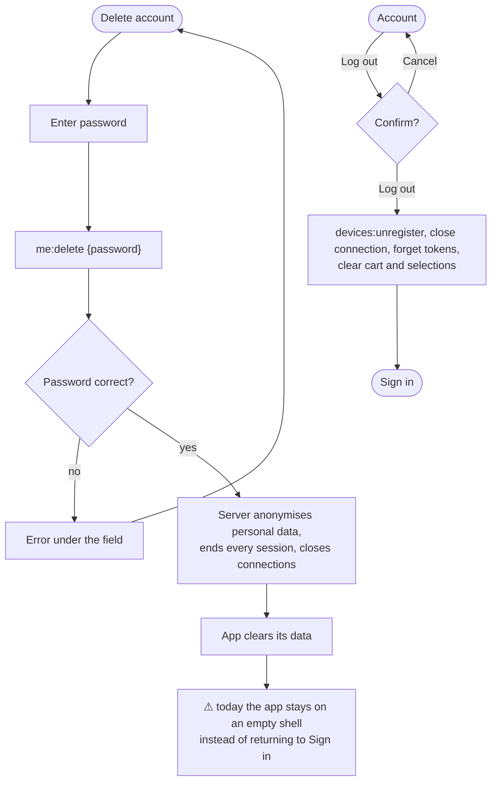
```mermaid
flowchart TD
  D([Delete account]) --> P[Enter password]
  P --> DS["me:delete {password}"]
  DS --> DR{Password correct?}
  DR -- no --> DE[Error under the field] --> D
  DR -- yes --> AN[Server anonymises personal data,<br/>ends every session, closes connections]
  AN --> LO[App clears its data]
  LO --> GAP["⚠ today the app stays on an empty shell<br/>instead of returning to Sign in"]
  A([Account]) -->|Log out| CF{Confirm?}
  CF -- Cancel --> A
  CF -- "Log out" --> LOS["devices:unregister, close connection, forget tokens,<br/>clear cart and selections"] --> SI([Sign in])
```

### 4.4 Gaps found in the customer app

| # | What the user sees | Effect |
|---|---|---|
| 1 | Product cards in **Search, Product list, Store page and Wishlist** cannot be opened and their **+** does nothing (only ♥ works) | Product detail is reachable only from Home, Deals and "You may also like" |
| 2 | **Delete account** succeeds but the app stays on an empty shell instead of returning to Sign in | Confusing end state |
| 3 | Push notifications are not wired (no Firebase in the app); the Push toggle only saves a preference | Alerts arrive only while the app is open |
| 4 | The "Prices shown in" choice is not restored at the next launch | Always starts in FC |
| 5 | Phone and email cannot be verified later if skipped at sign-up | Verified badge stays "not verified" |
| 6 | Tracking shows the rider position as coordinates, not a map; Track is hidden for confirmed orders | Weak tracking experience |
| 7 | Support replies, return status, coupons and the success screen do not refresh live | Customer must reopen the screen |
| 8 | Failed top-ups disappear without a message; no manual "check payment" on the pending screen | Unclear outcome |
| 9 | No promo field on checkout (cart only); "Buy now" merges into the whole cart | Surprising totals |
| 10 | Addresses: no edit, no "set default", no delete confirmation | |
| 11 | No exchange or dispute (non-return) request from the app; no photos on returns or reviews | |
| 12 | No share, variants or image gallery on product detail | |
| 13 | Cart is reachable only from Home and the product message; many screens are English-only; sign-up always saves English | |
| 14 | Terms link is plain text and the box is pre-ticked; avatar upload missing | |

---

## 5. Customer and visitor — web shop (`/shop`) and public pages

Important context for the client: the web shop is a **companion** to the mobile app today. It has no "Add to cart" button on product pages (the product page sends shoppers to the App Store / Google Play), and several pages still show demo data. The table marks each page.

### 5.1 Navigation

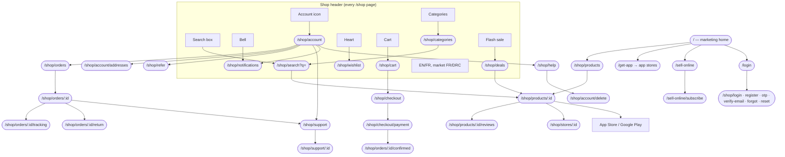
```mermaid
flowchart TD
  Landing(["/ — marketing home"]) --> Shop(["/shop/products"])
  Landing --> GetApp(["/get-app → app stores"])
  Landing --> Sell(["/sell-online"]) --> Plans(["/sell-online/subscribe"])
  Landing --> Login(["/login"])
  subgraph Header["Shop header (every /shop page)"]
    H1[Search box] --> SearchP(["/shop/search?q="])
    H2[Bell] --> Notif(["/shop/notifications"])
    H3[Account icon] --> Acc(["/shop/account"])
    H4[Heart] --> Wish(["/shop/wishlist"])
    H5[Cart] --> Cart(["/shop/cart"])
    H6[Categories] --> Cats(["/shop/categories"])
    H7[Flash sale] --> Deals(["/shop/deals"])
    H8["EN/FR, market FR/DRC"]
  end
  Shop --> PDP(["/shop/products/:id"])
  SearchP --> PDP
  Cats --> SearchP
  Deals --> PDP
  PDP --> Reviews(["/shop/products/:id/reviews"]) & Store(["/shop/stores/:id"]) & Apps["App Store / Google Play"]
  Cart --> Checkout(["/shop/checkout"]) --> Pay(["/shop/checkout/payment"]) --> Conf(["/shop/orders/:id/confirmed"])
  Acc --> Orders(["/shop/orders"]) --> OD(["/shop/orders/:id"])
  OD --> Track(["/shop/orders/:id/tracking"]) & Ret(["/shop/orders/:id/return"]) & Supp(["/shop/support"])
  Acc --> Addr(["/shop/account/addresses"]) & Refer(["/shop/refer"]) & Supp & Notif & Help(["/shop/help"])
  Help --> Del(["/shop/account/delete"])
  Supp --> Ticket(["/shop/support/:id"])
  Login --> Auth(["/shop/login · register · otp · verify-email · forgot · reset"])
```

### 5.2 Sign-in and where each role lands

```mermaid
flowchart TD
  L(["/login"]) --> Already{Already signed in?}
  Already -- yes --> Home[Go to my portal]
  Already -- no --> T{Tab / choice}
  T -- "Email + password" --> P["POST /auth/login"] --> R{Role}
  T -- "Continue as guest" --> G(["/ (shop as visitor)"])
  T -- "Demo role picker<br/>(only when NEXT_PUBLIC_DEMO_MODE ≠ false)" --> D[Pick Seller / Admin / Warehouse persona] --> B["Bridge signs into the matching seeded account"] --> R
  R -- customer --> C(["/shop/account"])
  R -- seller --> S(["/seller"])
  R -- admin --> A(["/admin"])
  R -- admin_operations --> AO(["/admin/orders"])
  R -- admin_finance --> AF(["/admin/finance"])
  R -- admin_support --> AS(["/admin/support"])
  R -- admin_marketing --> AM(["/admin/flash-sales"])
  R -- admin_moderation --> AMo(["/admin/moderation"])
  R -- warehouse_staff --> W(["/warehouse"])
  R -- rider --> RI(["/rider"])
  P -- error --> E[Server message shown] --> L
```

`/shop/login`, `/shop/register`, `/shop/otp`, `/shop/verify-email`, `/shop/forgot`, `/shop/reset` use the same REST calls as the app (`POST /auth/login`, `/register` with role customer, `/phone/verify`, `/email/verify`, `/forgot`, `/reset`). Sign-up on the web does not chain to the phone code and email screens.

### 5.3 Every page and its options

| Page | Data | Options | Status |
|---|---|---|---|
| `/` home | Demo products and categories | Search, Browse products, Sell on Somba&Teka, Shop now (→ app stores), FAQ, seller plans | MOCK |
| `/shop/products` | Live catalogue (`products:list`, ⚡ `product:*`) | Sort (popularity, price ↑↓, rating, discount), filters (category, brand, rating, discount, max price), ♥, open product, "Buy again" (recently viewed) | LIVE data, LOCAL filters |
| `/shop/search?q=` | Live catalogue | Text match on name, category, seller | LIVE |
| `/shop/categories` | `categories:list` | Category → search | LIVE |
| `/shop/deals` | Live products ≥ 13 % off | Open product | LIVE |
| `/shop/products/:id` | Live product; variants, specs and seller stats are placeholders | Variant chips, zone fee check, follow store, share / copy link, ask question, similar products, **App Store / Google Play** (no add-to-cart) | LIVE + LOCAL/STUB |
| `/shop/products/:id/reviews` | Demo reviews | Write review (local) | MOCK |
| `/shop/stores/:id` | Demo store lookup | — | MOCK |
| `/shop/wishlist` | Hearted products (this browser only) | Remove | LOCAL |
| `/shop/cart` | Cart in this browser (filled only by **Reorder**) | Quantity 1–5, remove, save for later, promo (demo codes SOMBA10, SAVE20), checkout | LOCAL |
| `/shop/checkout` | 3 fixed demo addresses, zone fees | Address, cross-city (blocked), open box, note, continue | MOCK |
| `/shop/checkout/payment` | Card (placeholder) or Airtel Money | **Pay** → `orders:create` when signed in with a non-empty cart; otherwise or on error goes to a demo confirmation | LIVE (partly) |
| `/shop/orders/:id/confirmed`, `/shop/orders/success` | Demo order | View order, track | MOCK |
| `/shop/orders` | `orders:list`, ⚡ `order:*` | View, Return (delivered) | LIVE |
| `/shop/orders/:id` | Live order | **Cancel** (`orders:cancel`), Reorder (local cart), Return, Review, Open support ticket | LIVE |
| `/shop/orders/:id/tracking` | Live status; map and ETA are placeholders | — | LIVE + MOCK |
| `/shop/orders/:id/return` | Live order | 3 steps: items, reason, confirm → local reference only (no `disputes:open`) | STUB |
| `/shop/returns/:id`, `/shop/disputes/:id`, `/shop/exchange` | Demo records | Read-only / local submit | MOCK |
| `/shop/support`, `/shop/support/:id` | Tickets stored in this browser | New ticket, chat with attachments | LOCAL |
| `/shop/notifications` | `notifications:list`, ⚡ `notification:new` | Filters, mark all read (`notifications:markAllRead`), open (`notifications:markRead`) | LIVE |
| `/shop/account` | Demo profile | Menu: orders, wishlist, refer, addresses, support, notifications, help, deals | MOCK |
| `/shop/account/addresses` | `addresses:list`, ⚡ `addresses:updated` | Add (`addresses:create`), edit (`addresses:update`), set default, delete (`addresses:remove`) | LIVE |
| `/shop/account/delete` | — | Request deletion (message only) | STUB |
| `/shop/help` | FAQ | Request deletion, open ticket | static |
| `/shop/refer` | Demo code and stats | Copy code | MOCK |
| `/sell-online`, `/sell-online/subscribe` | Plans Starter $49, Pro $99, Enterprise | Plan checkout form (no charge) → sign in / seller register | STUB |
| `/get-app` | — | Redirects phones to the store | static |
| `/live` | Developer console | Exercises real customer, seller, admin and rider events | LIVE (internal) |

### 5.4 Flowcharts

#### W-1 Browse to product (web)

```mermaid
flowchart TD
  H(["/ home"]) -->|Browse products| P(["/shop/products"])
  H -->|search| S(["/shop/search?q="])
  P --> F[Sort and filters - in the browser] --> P
  P --> PD(["Product page"])
  S --> PD
  C(["/shop/categories"]) --> S
  D(["/shop/deals"]) --> PD
  PD --> A{Shopper action}
  A -- "Buy" --> AS[App Store / Google Play link]
  A -- "Share" --> SH[Native share or copy link]
  A -- "Follow store / ask question / variant" --> LC[Saved in the browser only]
  A -- "Reviews" --> RV([Reviews page - demo])
```

#### W-2 Web checkout as it works today

```mermaid
flowchart TD
  OD(["Delivered order"]) -->|Reorder| CT(["/shop/cart"])
  CT --> PR[Promo: demo codes only] --> CO(["/shop/checkout"])
  CO --> AD[Pick one of 3 demo addresses, options, note] --> PY(["/shop/checkout/payment"])
  PY --> M{Card or Airtel}
  M --> Pay[Pay]
  Pay --> C{Signed in, connected,<br/>cart not empty?}
  C -- no --> Demo(["Demo confirmation ORD-2024-001"])
  C -- yes --> OC["orders:create (items by name, zone fee)"]
  OC --> OR{Server accepts?}
  OR -- yes --> Real(["/shop/orders/REF/confirmed"])
  OR -- "no: error toast" --> Demo
```

#### W-3 Orders, cancel and support (web)

```mermaid
flowchart TD
  O(["/shop/orders"]) --> OD(["/shop/orders/:id"])
  OD --> S{Status}
  S -- "pending / confirmed" --> CX["Cancel → orders:cancel"] --> CR{Allowed?}
  CR -- yes --> CU[⚡ order:updated cancelled, refund to wallet if paid]
  CR -- no --> CE[Toast: can no longer be cancelled]
  S -- "processing → out for delivery" --> TR(["Tracking page - status live, map placeholder"])
  S -- delivered --> DL{Option}
  DL -- Reorder --> CT(["Cart"])
  DL -- Return --> RW([Return wizard - local only])
  DL -- Review --> RV([Reviews - demo])
  OD -->|Open support ticket| SP(["/shop/support - stored in browser"])
```

#### W-4 Addresses and notifications (web)

```mermaid
flowchart TD
  A(["/shop/account/addresses"]) --> L["addresses:list"]
  A --> N[Add address form] --> V{Street and city?}
  V -- no --> N
  V -- yes --> C["addresses:create"] --> U[⚡ addresses:updated]
  A --> E[Edit] --> EU["addresses:update"]
  A --> D[Set default] --> DU["addresses:update isDefault"]
  A --> R[Delete] --> RU["addresses:remove"]
  NT(["/shop/notifications"]) --> NL["notifications:list + ⚡ notification:new"]
  NT --> MA["Mark all read → notifications:markAllRead"]
  NT --> MO["Open → notifications:markRead → linked page"]
```

### 5.5 Gaps in the web shop

| # | Gap |
|---|---|
| 1 | No add-to-cart on product pages; the cart fills only through Reorder; cart and wishlist live in the browser only |
| 2 | Checkout uses 3 fixed demo addresses (not the customer's saved addresses); promo codes are demo codes; card is a placeholder; the Airtel number and promo are not sent; failures fall through to a demo confirmation |
| 3 | Returns, return status, disputes, exchange, support tickets, refer, account profile and delete account are demo or browser-only |
| 4 | Home page, header search suggestions, store pages and product reviews use demo ids, so their links show "not found" for real products |
| 5 | Header bell count is demo data; there is no sign-out in the shop header |
| 6 | Legal pages for returns, seller and shipping are linked but missing |
| 7 | The demo role picker is on unless `NEXT_PUBLIC_DEMO_MODE=false` |

---

## 6. Seller — web portal (`/seller`)

### 6.1 Navigation and access

Sidebar (one list): **Dashboard · Storefront · Products · Inventory · Orders · Disputes · Notifications · Shipping · Returns · Replacements · Promotions · Reviews · Finance · Analytics · Support · Settings**. Header: language, persona name, logout.

```mermaid
flowchart TD
  In([Open any /seller page]) --> G1{Signed in?}
  G1 -- no --> L(["/login"])
  G1 -- yes --> G2{Role = seller?}
  G2 -- no --> Own[Sent to own portal]
  G2 -- yes --> G3{Store blocked by moderation?}
  G3 -- yes --> Blk(["Account blocked → email support"])
  G3 -- no --> G4{Active subscription?<br/>stored in the browser}
  G4 -- no --> Sub(["/seller/subscribe"]) --> Plan{Plan}
  Plan -- "Starter / Pro" --> Act[Activate - demo, no charge] --> Dash
  Plan -- Enterprise --> Mail[Email sales]
  G4 -- yes --> Dash(["/seller dashboard"])
  Dash --> M{Menu}
  M --> Store(["Storefront / Settings"])
  M --> Prod(["Products / Inventory"])
  M --> Ord(["Orders / Shipping"])
  M --> AS(["Returns / Replacements / Disputes"])
  M --> Mkt(["Promotions / Reviews"])
  M --> Fin(["Finance / Payouts"])
  M --> An(["Analytics"])
  M --> Sup(["Notifications / Support"])
```

The store approval state (pending / approved / rejected / suspended) is **enforced by the server** (a store that is not approved cannot publish products, request payouts or create campaigns), but the portal does not yet show a "pending approval" screen automatically — `/seller/register`, `/seller/pending` and `/seller/resubmit` are static pages.

### 6.2 Every page and its options

| Page | Data | Options | Status |
|---|---|---|---|
| `/seller` dashboard | Store name, rating, badge (`sellers:mine`, `sellers:stats`); revenue and orders from live orders; low-stock list; recent orders; finance snapshot | Analytics, Create product, quick actions (orders, create product, request payout, request promotion); charts, funnel, segments and activity are demo | LIVE + MOCK |
| `/seller/register` · `/pending` · `/resubmit` | Registration form, waiting and resubmission screens | Submit / resubmit (no server call) | STUB |
| `/seller/subscribe` | Plans | Activate (browser only), contact sales | LOCAL |
| `/seller/storefront` (+ preview) | Store names and descriptions | Save, preview, publish (messages only) | STUB |
| `/seller/settings` | Store name (live), monthly goals | Edit goals (browser), **Save settings** (`sellers:update`), permissions and logo (demo) | LIVE + LOCAL |
| `/seller/products` | Own products from the live catalogue | Search, status filter, view, create, Unavailable / Mark live (`products:update` — the server ignores status changes from sellers) | LIVE |
| `/seller/products/create` | 7-step wizard: basic info, media, variants, inventory, pricing, shipping, review | **Submit** → `products:create {name, nameFr, price, category, stock}`; media, variants, SKU, brand, description, weight are not sent yet; Save draft (message) | LIVE (partial) |
| `/seller/products/:id` | Live product + derived stock/pricing, orders with this product, reviews (`reviews:seller`) | Edit (opens empty wizard), mark unavailable / live | LIVE + DERIVED |
| `/seller/inventory` (+ `:sku`) | Derived from live products | Search, export CSV (browser), import CSV and adjust stock (messages) | DERIVED / STUB |
| `/seller/orders` | Orders containing own products (`orders:list`, ⚡ `order:*`) — customer first name only, no address | Search, dates, status; Accept / Mark ready (local only) | LIVE + LOCAL |
| `/seller/orders/:id` | Order lines, payment, commission 12 %, net, timeline | Package ready, flag unavailable (local only), open support | LIVE + STUB |
| `/seller/shipping` (+ `:id`) | Derived shipments from live orders | Search, filters, view | DERIVED |
| `/seller/returns` (+ `:id`) | Customer returns (`disputes:list` type return) | View only — the admin decides | LIVE (read-only) |
| `/seller/replacements` (+ `:id`) | Empty list; detail from browser data | View | MOCK |
| `/seller/disputes` (+ `:id`) | Demo disputes | Respond (browser only) | MOCK |
| `/seller/reviews` | `reviews:seller` | Reply, report (browser only, visible to admin moderation locally) | LIVE + LOCAL |
| `/seller/promotions` (+ `:id`) | Empty list | Create campaign | MOCK |
| `/seller/promotions/create` | Name, discount %, start, end | **Submit for approval** → `campaigns:create` (store must be approved; created as pending) | LIVE |
| `/seller/finance` | Revenue (live), pending and available (derived), payouts (`payouts:list`), charts (demo) | Request payout, transactions, payouts, statements, tax | LIVE + MOCK |
| `/seller/finance/transactions` | Derived from live orders | Search, dates, status | DERIVED |
| `/seller/finance/payouts` (+ `:id`, `pending`) | `payouts:list`, ⚡ `payout:created/updated` | View, breakdown | LIVE + DERIVED |
| `/seller/finance/payouts/request` | Available shown as a fixed demo figure | **Request** → `payouts:request {amountUsd}` (≥ $10, ≤ server-computed available, store approved); bank fields not sent | LIVE (partial) |
| `/seller/finance/statements`, `/tax` | Demo months / static text | Download (demo file) | STUB |
| `/seller/analytics` (+ products, revenue, customers, inventory) | Demo charts; "Best sellers" live | Period and date controls | MOCK |
| `/seller/notifications` | Demo notifications | Mark read (local) | MOCK |
| `/seller/support` (+ `:id`) | Tickets stored in the browser | New ticket (auto-filled), chat with attachments | LOCAL |

### 6.3 Flowcharts

#### S-1 Seller onboarding and approval

```mermaid
flowchart TD
  V([Visitor]) --> SO(["/sell-online"]) --> SU["Sign up as seller<br/>POST /auth/register role=seller"]
  SU --> SR["sellers:register {name}"] --> PD[Store status: pending]
  PD --> AD{{⚡ seller:updated to admins}}
  AD --> DEC{Admin / moderation / operations decision<br/>sellers:setStatus}
  DEC -- approved --> OK[Store can publish products,<br/>request payouts and create campaigns]
  DEC -- rejected --> RJ[Seller informed - resubmission screen is static today]
  DEC -- "suspended (later)" --> SP[Sessions ended, listings blocked]
  OK --> NT[⚡ seller:updated to the seller + notification]
```

#### S-2 Product listing

```mermaid
flowchart TD
  C(["/seller/products/create"]) --> W1[1 Basic info] --> W2[2 Media] --> W3[3 Variants] --> W4[4 Inventory] --> W5[5 Pricing] --> W6[6 Shipping] --> W7[7 Review]
  W7 --> SB["Submit → products:create<br/>name, nameFr, price, category, stock"]
  SB --> V{Server checks<br/>name 1–200 chars, price 0.01–1,000,000,<br/>category, store approved}
  V -- fails --> X[Nothing happens on screen today - error not shown]
  V -- ok --> LV[Product created as LIVE]
  LV --> PU[⚡ product:created to shoppers and admins]
  PU --> L(["/seller/products"])
  L --> T{Row action}
  T -- View --> D(["Product detail: stock, pricing, orders, reviews"])
  T -- "Unavailable / Mark live" --> U["products:update status - ignored for sellers"]
  T -- Edit --> C
```

#### S-3 Orders and fulfilment (seller view)

```mermaid
flowchart TD
  NO{{⚡ order:created / order:updated}} --> OL(["/seller/orders<br/>only lines of my products,<br/>first name, no address"])
  OL --> F[Search, dates, shipping status]
  OL --> OD(["Order detail"])
  OD --> A{Seller action}
  A -- "Accept / Mark ready / Package ready" --> LC[Shown locally - not sent to the server yet]
  A -- "Flag unavailable" --> FU[Choose item + reason → local message]
  A -- "Open support" --> SP(["/seller/support"])
  OD --> TL[Timeline follows the real order status set by riders and ops]
  TL --> SH(["/seller/shipping - derived shipment view"])
```

#### S-4 Payout request

```mermaid
flowchart TD
  F(["/seller/finance"]) --> RQ(["/seller/finance/payouts/request"])
  RQ --> AM[Enter amount]
  AM --> PR["payouts:request {amountUsd}"]
  PR --> V{Server rules<br/>seller role, store approved, ≥ $10,<br/>≤ available = delivered sales older than 48 h<br/>minus 12 % commission minus earlier payouts}
  V -- fails --> X[No message today]
  V -- ok --> RC[Payout requested]
  RC --> FN{{⚡ payout:created to finance}}
  FN --> D{Finance decision}
  D -- approve --> PD["payouts:approve → status paid,<br/>seller's in-app wallet credited"]
  D -- reject --> RJ["payouts:reject → status rejected"]
  PD & RJ --> U{{⚡ payout:updated → /seller/finance/payouts}}
```

#### S-5 Campaigns, reviews, returns

```mermaid
flowchart TD
  P(["/seller/promotions/create"]) --> N{Name entered?}
  N -- no --> NE[Enter a campaign name]
  N -- yes --> CC["campaigns:create {name, discount, start, end}"]
  CC --> CS{Store approved?}
  CS -- no --> X[No message today]
  CS -- yes --> PEN[Campaign pending → marketing admins notified]
  PEN --> AD["Admin campaigns:setStatus (approve / schedule / reject)"]
  R(["/seller/reviews"]) --> RL["reviews:seller"]
  R --> RP[Reply / report → saved in the browser]
  RT(["/seller/returns"]) --> RTL["disputes:list (returns of my products)"] --> RD[Read-only; admin resolves]
```

### 6.4 Gaps in the seller portal

| # | Gap |
|---|---|
| 1 | Server errors (product create, payout request, campaign create) are not shown to the seller |
| 2 | Registration, pending approval and resubmission screens are not connected to `sellers:register` / store status |
| 3 | Subscription is browser-only (no billing on the server) |
| 4 | Product wizard sends only name, price, category and stock; no edit, delete, images, variants or stock adjustment |
| 5 | Order "accept / ready / unavailable" actions are local only (the server has no seller fulfilment step yet) |
| 6 | Campaign list, disputes, replacements, notifications, support, statements, tax and most analytics are demo or browser-only |
| 7 | Payout request shows a fixed available amount (the server's `payouts:available` exists but is not called); bank details are not sent |
| 8 | Several status filters offer values that live data never produces |

---

## 7. Admin — web portal (`/admin`) and its sub-roles

### 7.1 Who sees which menu

The super admin sees every group. Every other admin sees **only its own group** and lands on its first page.

| Group | Menu items → route | Super admin | Operations | Finance | Support | Marketing | Moderation | Warehouse admin* |
|---|---|:-:|:-:|:-:|:-:|:-:|:-:|:-:|
| Administration | Dashboard `/admin` · Roles `/admin/roles` · Audit log `/admin/audit` · Settings `/admin/settings` | ✔ | | | | | | |
| Finance | Finance `/admin/finance` · Payouts `/admin/payouts` · Refunds `/admin/refunds` · Fraud & payments `/admin/fraud` · Analytics `/admin/analytics` | ✔ | | ✔ | | | | |
| Operations | Orders `/admin/orders` · Fulfilment ops `/admin/fulfillment` (+ every fulfilment page) · Disputes `/admin/disputes` · Returns `/admin/returns` · Zones `/admin/zones` | ✔ | ✔ | | | | | |
| Warehouse admin | Warehouses `/admin/warehouses` · Warehouse staff `/admin/warehouses/staff` · Inventory · Dispatch | ✔ | | | | | | ✔ |
| Moderation | Moderation `/admin/moderation` · Products `/admin/products` · Sellers `/admin/sellers` · Reviews `/admin/reviews` · Categories `/admin/categories` | ✔ | | | | | ✔ | |
| Marketing | Flash sales `/admin/flash-sales` · Promotions `/admin/promotions` · CMS `/admin/cms` · Broadcasts `/admin/broadcasts` · Marketing `/admin/marketing` | ✔ | | | | ✔ | | |
| Support | Support `/admin/support` · Customers `/admin/customers` | ✔ | | | ✔ | | | |
| **Lands on** | | `/admin` | `/admin/orders` | `/admin/finance` | `/admin/support` | `/admin/flash-sales` | `/admin/moderation` | `/admin/warehouses` |

\* Warehouse admin is a web department without its own server role yet. The server checks each request again with the real role (see the permission table in `ARCHITECTURE.md`, section 7.2).

```mermaid
flowchart TD
  L(["/login"]) --> R{Admin role}
  R -- admin --> SA(["Super admin: all groups"])
  R -- admin_operations --> OP(["Orders · Fulfilment · Disputes · Returns · Zones"])
  R -- admin_finance --> FI(["Finance · Payouts · Refunds · Fraud · Analytics"])
  R -- admin_support --> SU(["Support · Customers"])
  R -- admin_marketing --> MK(["Flash sales · Promotions · CMS · Broadcasts · Marketing"])
  R -- admin_moderation --> MO(["Moderation · Products · Sellers · Reviews · Categories"])
  SA & OP & FI & SU & MK & MO --> G{Opens a page outside the group?}
  G -- yes --> Home[Sent back to the group's first page]
  G -- no --> P[Page opens]
```

### 7.2 Every page and its options

| Page | Data | Options | Status |
|---|---|---|---|
| Dashboard `/admin` | KPIs, charts, alerts (demo); recent orders and seller queue (live) | Period, alerts, quick links, approve sellers (link); queue approve/reject (message only) | LIVE + MOCK |
| Roles `/admin/roles` | Role catalogue (`roles:defs`) | Edit permissions, save (message only); no staff list or role assignment on screen | LIVE + STUB |
| Audit log `/admin/audit` | `audit:list` | Read-only | LIVE |
| Settings `/admin/settings` | Market profile, commission, FX, minimum payout, clearance hours, zone fees | Save (message only — `settings:set` not wired) | LOCAL / STUB |
| Finance `/admin/finance` | Revenue, payouts, commission, cash flow | — | MOCK |
| Payouts `/admin/payouts` | `payouts:list`, ⚡ `payout:*` | Filters; approve / reject (screen only — `payouts:approve/reject` not wired) | LIVE + LOCAL |
| Refunds `/admin/refunds` | 2 demo refunds | Authorise (screen only) | MOCK |
| Fraud `/admin/fraud` | `fraud:list` | Filters, open order; no status change | LIVE |
| Analytics `/admin/analytics` | Charts | Period | MOCK |
| Orders `/admin/orders` (+ `:id`) | `orders:list`, ⚡ `order:*`; detail with customer, seller, payment, logistics, commission | Filters, view; **no status change, refund or cancel on screen** | LIVE |
| Disputes `/admin/disputes` (+ `:id`) | Demo disputes | Chat (local); **Resolve for buyer / for seller** → `disputes:resolve` | MOCK + LIVE |
| Returns `/admin/returns` (+ `:id`) | Demo returns | Read-only | MOCK |
| Zones `/admin/zones` | Demo zones | Add zone, assign rider, pause / activate (local) | LOCAL |
| Warehouses (+ `:id`, staff) | Demo hubs and staff | Create hub with credentials, reset password, activate / deactivate, add / edit / disable staff (local) | LOCAL |
| Moderation `/admin/moderation` | Live products | **Approve / Reject** → `products:update status` | LIVE |
| Products `/admin/products` (+ `:id`) | Live products | Review → **Approve / Reject** (`products:update`), request changes, notes, block (local) | LIVE + LOCAL |
| Sellers `/admin/sellers` (+ `:id`) | `sellers:list` | **Approve / Reject** pending store → `sellers:setStatus`; block / unblock (local) | LIVE + LOCAL |
| Reviews `/admin/reviews` | Demo reviews + seller reports | Publish / remove, resolve / dismiss reports (local) | MOCK |
| Categories `/admin/categories` | Categories stored in the browser | Add / edit with image (local) | LOCAL |
| Flash sales `/admin/flash-sales` | `flashsales:list` | Create (screen only — `flashsales:create` not wired) | LIVE + LOCAL |
| Promotions `/admin/promotions` | Demo seller promotion requests | Approve / reject (local) | MOCK |
| CMS `/admin/cms` | `cms:list` | Show / hide block (local), preview | LIVE + LOCAL |
| Broadcasts `/admin/broadcasts` | Demo broadcasts | Compose: channel, audience, title, message → send / schedule (local) | MOCK |
| Marketing `/admin/marketing` | Demo campaigns, banners | Create campaign (local) | MOCK |
| Support `/admin/support` (+ `:id`) | Tickets stored in the browser | Reply with attachments, set status (local) | LOCAL |
| Customers `/admin/customers` (+ `:id`) | `customers:list` | Filters; **Suspend / Reactivate** → `customers:setActive` | LIVE |
| Fulfilment `/admin/fulfillment/*` | Same pages as the warehouse portal (section 8) | Same options | LIVE + MOCK |

### 7.3 Flowcharts

#### A-1 Seller moderation

```mermaid
flowchart TD
  NS{{⚡ seller:updated - new store pending}} --> SL(["/admin/sellers"])
  SL --> SD(["Seller detail"])
  SD --> S{Store status}
  S -- pending --> D{Decision}
  D -- Approve --> AP["sellers:setStatus approved"] --> OK[Seller can publish, request payouts, run campaigns]
  D -- Reject --> RJ["sellers:setStatus rejected"]
  S -- "approved / other" --> BL{Block storefront?}
  BL -- yes --> LB[Blocked in this browser only today]
  AP & RJ --> PUSH{{⚡ seller:updated to the seller + notification + audit entry}}
```

#### A-2 Product moderation

```mermaid
flowchart TD
  Q(["/admin/moderation or /admin/products"]) --> P(["Product"])
  P --> ST{Status pending?}
  ST -- no --> VIEW[View only]
  ST -- yes --> D{Decision}
  D -- Approve --> A["products:update status = live"] --> V[⚡ product:updated - visible to shoppers]
  D -- Reject --> R["products:update status = rejected"] --> H[⚡ product:updated - hidden]
  D -- "Request changes / notes" --> LC[Kept on screen only today]
  Note["Today new seller listings go straight to live,<br/>so the pending queue fills only when a listing is set back to pending"] -.-> ST
```

#### A-3 Customer suspension

```mermaid
flowchart TD
  C(["/admin/customers"]) --> CD(["Customer detail: info, orders, spend"])
  CD --> S{Active?}
  S -- yes --> SU["Suspend → customers:setActive false"]
  SU --> K[Server ends every session and disconnects the customer's devices]
  K --> APP[Customer app returns to Sign in with a message]
  S -- no --> RE["Reactivate → customers:setActive true"] --> CAN[Customer can sign in again]
  SU & RE --> AU[Audit entry + ⚡ customer:updated]
```

#### A-4 Disputes and returns

```mermaid
flowchart TD
  NEW{{⚡ dispute:created from the customer app}} --> DL(["/admin/disputes"])
  DL --> DD(["Dispute detail: reason, order, buyer, seller, payment, chat"])
  DD --> D{Decision}
  D -- "Favour buyer" --> FB["disputes:resolve refund = true"]
  FB --> FR{Admin or finance?}
  FR -- yes --> RF[Payment refunded to the customer's wallet, order returned]
  FR -- no --> NR[Resolved without refund]
  D -- "Favour seller" --> FS["disputes:resolve refund = false"]
  D -- "Reject (server supports disputes:reject, no button yet)" --> RJ[Rejected]
  RF & NR & FS & RJ --> PU{{⚡ dispute:updated → customer's Returns screen}}
```

#### A-5 Finance: payouts, refunds, fraud

```mermaid
flowchart TD
  PR{{⚡ payout:created from a seller}} --> PL(["/admin/payouts"])
  PL --> PD{Requested?}
  PD -- yes --> DEC{Approve or reject}
  DEC --> SRV["Server-side: payouts:approve credits the seller wallet,<br/>payouts:reject records the note"]
  SRV -.-> GAP["⚠ buttons on this page change the screen only today"]
  RF(["/admin/refunds"]) --> RFA[Authorise - demo]
  OR(["Order"]) -.-> ORF["Server supports orders:refund (to wallet or original method) - no button yet"]
  FR(["/admin/fraud"]) --> FRL["fraud:list - COD orders above the cap are flagged"] --> FRO[Open the order]
```

#### A-6 Marketing and content

```mermaid
flowchart TD
  FS(["Flash sales"]) --> FSL["flashsales:list"] --> FSC[Create: name, dates, discount] --> FSX[Screen only today]
  PM(["Promotions"]) --> PMA[Approve / reject seller requests - demo]
  CMS(["CMS"]) --> CML["cms:list"] --> CMT[Show / hide block - screen only]
  BR(["Broadcasts"]) --> BRC[Channel push / SMS / email, audience, title, message]
  BRC --> BRV{Title entered?}
  BRV -- no --> BRE[Error message]
  BRV -- yes --> BRS[Send now / schedule - screen only today;<br/>server supports broadcasts:send]
  MK(["Marketing"]) --> MKC[Create campaign - demo]
```

#### A-7 Platform administration

```mermaid
flowchart TD
  RO(["Roles"]) --> RD["roles:defs - 7 staff roles and their scopes"]
  RO -.-> RS["Server supports roles:staff and roles:setRole<br/>(change a user's role, ends their sessions) - no screen yet"]
  AU(["Audit log"]) --> AL["audit:list - who did what, when"]
  SE(["Settings"]) --> SF[Commission, FX rate, minimum payout, clearance hours]
  SF -.-> SS["Server supports settings:set (codEnabled, codCapUsd,<br/>deliveryZones, fxRate, commissionPct) - Save not wired"]
  ZN(["Zones"]) --> ZA[Add zone, assign riders, pause - local today]
  WH(["Warehouses"]) --> WC[Create hub + portal credentials, staff - local today]
```

### 7.4 Gaps in the admin portal

| # | Gap |
|---|---|
| 1 | Only five admin actions reach the server today: seller approve/reject, product approve/reject, dispute resolve, customer suspend/reactivate (and the warehouse "Receive", which the server refuses) |
| 2 | No screen yet for: order status change, order refund or cancel, payout approve/reject, dispute reject, fraud status, role assignment and staff list, settings save (COD on/off, zones, FX, commission), promo codes, flash-sale create, CMS edit, broadcasts, categories (server CRUD), campaigns, support tickets |
| 3 | Finance, refunds, analytics, disputes list, returns, reviews, promotions, marketing, broadcasts, zones, warehouses and staff show demo or browser-only data |
| 4 | Links from admin pages to `/warehouse`, `/shop` or other groups bounce back; `/admin/fulfillment/aged` does not exist |
| 5 | In demo mode several admin personas sign into the super-admin server account |
| 6 | No exports, bulk actions or pagination on any list |

---

## 8. Warehouse staff — web portal (`/warehouse`)

### 8.1 Navigation and staff tiers

Staff have three tiers: **operator (1) · supervisor (2) · manager (3)**. The sidebar only shows what the tier allows.

| # | Menu item | Route | Minimum tier |
|---|---|---|---|
| 1 | Dashboard | `/warehouse` | operator |
| 2 | Inbound | `/warehouse/inbound` | operator |
| 3 | Receiving | `/warehouse/receiving` | operator |
| 4 | Sorting | `/warehouse/sorting` | operator |
| 5 | Batch builder | `/warehouse/batch-builder` | operator |
| 6 | Dispatch | `/warehouse/dispatch` | operator |
| – | Inventory, Parcels (no menu entry) | `/warehouse/inventory`, `/warehouse/parcels/:id` | operator |
| 7 | Riders | `/warehouse/riders` | supervisor |
| 8 | Deliveries | `/warehouse/deliveries` | supervisor |
| 9 | Transfers | `/warehouse/transfers` | supervisor |
| 10 | Returns | `/warehouse/returns` | supervisor |
| 11 | Replacements | `/warehouse/replacements` | supervisor |
| 12 | Exchanges | `/warehouse/exchanges` | supervisor |
| 13 | Aged parcels | `/warehouse/aged` | supervisor |
| 14 | Exceptions | `/warehouse/exceptions` | supervisor |
| 15 | Analytics | `/warehouse/analytics` | manager |
| – | Hubs (no menu entry) | `/warehouse/hubs` | manager |
| 16 | Settings | `/warehouse/settings` | manager |

The hub is fixed by the signed-in staff persona (Paris, Lyon, Kinshasa, Abidjan); there is no in-portal hub switcher.

```mermaid
flowchart LR
  subgraph Op["Operator"]
    D(["Dashboard"]) --- IN(["Inbound"]) --- RC(["Receiving"]) --- SO(["Sorting"]) --- BB(["Batch builder"]) --- DS(["Dispatch"])
  end
  subgraph Sup["Supervisor adds"]
    RI(["Riders"]) --- DL(["Deliveries"]) --- TR(["Transfers"]) --- RT(["Returns"]) --- RP(["Replacements"]) --- EX(["Exchanges"]) --- AG(["Aged"]) --- EC(["Exceptions"])
  end
  subgraph Man["Manager adds"]
    AN(["Analytics"]) --- ST(["Settings"]) --- HB(["Hubs"])
  end
  Op --> Sup --> Man
```

### 8.2 How parcels map to live delivery tasks

The warehouse pages derive a parcel "stage" from the live delivery task (`delivery:list`, ⚡ `delivery:updated`):

```mermaid
flowchart LR
  U["Task unassigned"] --> I(["Stage: inbound"])
  A["Task assigned to a rider"] --> S(["Stage: sorting"])
  P["picked_up"] --> R(["Stage: ready"])
  T["in_transit"] --> DS(["Stage: dispatched"])
  D["delivered"] --> DV(["Stage: delivered"])
  F["failed"] --> E(["Stage: exception"])
```

### 8.3 Every page and its options

| Page | Data | Options | Status |
|---|---|---|---|
| Dashboard | Demo KPIs, alerts, dispatch queue, leaderboard (hub name is real) | Quick links, open dispatch, alerts | MOCK |
| Inbound | All live tasks as parcels | Search, status, **Scan barcode** (simulated), View, **Receive** (sends `delivery:updateStatus`, which the server refuses for staff), Inspect | LIVE + STUB |
| Receiving | First 5 live parcels | Scan (simulated), Receive (same as above) | LIVE + STUB |
| Parcel detail | Live parcel, seller, customer, items, timeline | Receive, accept, reject (messages), create incident (opens list) | LIVE + STUB |
| Sorting | Live parcels in stage sorting | Assign zone (2-step confirm), hold — both local | LIVE + LOCAL |
| Batch builder | Demo parcels | Add / remove, optimise route (reverses), create batch & assign rider (demo riders) | MOCK |
| Dispatch (+ batch detail) | Demo batches; rider panel live | Assign / change / auto-assign rider, dispatch — local | MOCK + LOCAL |
| Inventory (+ SKU) | `warehouse:inventory` | Search; adjust / move / reserve (messages) | LIVE + STUB |
| Riders (+ detail) | Riders who have live tasks; earnings derived | Zone A–D per rider (browser), assign (message), call | LIVE + LOCAL |
| Deliveries | Demo parcels by type (local, cross-zone, inter-warehouse, return) | Tabs, expand journey | MOCK |
| Delivery detail (no link) | Live task | Call rider, escalate (message) | LIVE |
| Transfers | Demo transfer runs | Mark arrived, receive at hub (messages) | MOCK |
| Returns (+ detail) | Demo returns | Approve / reject (local) | MOCK |
| Replacements (+ detail) | Demo replacements kept in the browser | Full workflow: start inspection → approve / reject → allocate → assign rider → dispatch → delivered → close (local) | LOCAL |
| Exchanges (+ detail) | Demo exchanges | Approve, allocate variant (messages), create dispatch | MOCK |
| Aged parcels (+ detail) | All open live parcels | Mark received, accept (messages), create incident | LIVE + STUB |
| Exceptions (+ detail) | Demo incidents | Investigation notes → update resolution (local) | MOCK |
| Analytics | Demo charts | Period controls | MOCK |
| Hubs | Hub profile | Read-only | MOCK |
| Settings | Working hours, zones, batch size | Save / reset (messages) | STUB |

### 8.4 Flowcharts

#### H-1 Parcel journey through the hub (intended, with what is live today)

```mermaid
flowchart TD
  NO{{⚡ order paid → delivery task unassigned}} --> IN(["Inbound list - LIVE"])
  IN --> SC{Scan or pick parcel}
  SC -- "Scan barcode" --> SIM[Simulated today - opens a demo parcel]
  SC -- Inspect --> PD(["Parcel detail"])
  PD --> IQ{Inspection}
  IQ -- Accept --> OKM[Message only today]
  IQ -- Reject --> RJ[Message only today]
  IQ -- "Create incident" --> EXL(["Exceptions list"])
  IN --> RC["Receive → delivery:updateStatus 'assigned'"]
  RC --> RCX[Refused by the server today: riders only]
  IN --> ASG{How is a rider attached?}
  ASG -- "rider claims in the app" --> ACC["delivery:accept (rider)"] --> SORT(["Stage: sorting"])
  ASG -- "dispatcher assigns (server supports delivery:assign,<br/>web screens not wired yet)" --> SORT
  SORT --> ZN[Assign zone / hold - local] --> RDY(["Stage: ready when rider picks up"])
  RDY --> DSP(["Stage: dispatched when rider is on the way"])
  DSP --> DLV(["delivered"])
  DSP --> FLD(["exception when delivery fails"])
```

#### H-2 Batching and dispatch

```mermaid
flowchart TD
  BB(["Batch builder"]) --> ADD[Add parcels to the batch] --> OPT[Optimise route]
  OPT --> CB[Create batch & assign rider]
  CB --> M1[Search and pick a rider] --> M2{Confirm?}
  M2 -- Back --> M1
  M2 -- Confirm --> BD(["Batch detail"])
  BD --> R{Rider}
  R -- "assign / change" --> M1
  R -- "auto-assign nearest" --> AU[Nearest rider chosen]
  BD --> DIS{Batch ready?}
  DIS -- yes --> DP[Dispatch → deliveries]
  Note1["Today these steps are local;<br/>the server already offers<br/>warehouse:buildBatch and delivery:assign"] -.-> BD
```

#### H-3 Replacement workflow (as built in the portal)

```mermaid
flowchart TD
  RQ([requested]) -->|Start inspection| IS([inspecting])
  IS -->|Approve replacement| AP([approved])
  IS -->|Reject| RJ([rejected])
  AP -->|Allocate new unit| AL([allocated])
  AL --> HR{Rider assigned?}
  HR -- no --> AR[Pick a rider → Assign] --> AL
  HR -- yes --> DS([dispatched])
  DS -->|Mark delivered| DL([delivered])
  DL -->|Close case| CL([closed])
```

(Stored in the browser today; the server's `replacements:setStatus` is ready to be wired.)

#### H-4 Exceptions, returns, exchanges, aged parcels

```mermaid
flowchart TD
  EX(["Exceptions"]) --> ED(["Exception detail"]) --> NT[Investigation notes] --> UR[Update resolution - local]
  RT(["Returns"]) --> RS{Pending?}
  RS -- yes --> RA[Approve / reject - local]
  RS -- no --> RV[View]
  XC(["Exchanges"]) --> XD(["Exchange detail"]) --> XA{Pending?}
  XA -- yes --> XB[Approve / allocate variant - messages] --> XDP[Create dispatch]
  AG(["Aged parcels - LIVE open parcels"]) --> AD(["Aged detail"]) --> AA[Mark received / accept / create incident]
  TR(["Transfers"]) --> TA[Mark arrived / receive at destination - messages]
```

### 8.5 Gaps in the warehouse portal

| # | Gap |
|---|---|
| 1 | "Receive" sends a status the server refuses (only riders may move a delivery); receiving needs its own server action |
| 2 | Batches, dispatch, rider assignment, transfers, exceptions, exchanges, replacements and returns are local or demo; the server already has `warehouse:buildBatch`, `delivery:assign`, `warehouse:createTransfer`, `exceptions:*`, `exchanges:setStatus`, `replacements:setStatus` |
| 3 | COD cash reconciliation (`warehouse:reconcile`) has no screen |
| 4 | Barcode scanning is simulated (no camera) |
| 5 | Dashboard, analytics, deliveries-by-type and settings are demo |
| 6 | All warehouse staff share one server account in demo mode, so data is not scoped per hub |
| 7 | Links to admin and shop pages bounce warehouse users back to their dashboard |

---

## 9. Rider — mobile app (Flutter) and web portal (`/rider`)

The **mobile app is the complete rider tool** (claim, status updates, live GPS, cash confirmation, earnings). The web rider portal is mostly read-only today.

### 9.1 Rider mobile app — navigation

```mermaid
flowchart TD
  SP([Splash]) --> RS{Saved session and role = rider?}
  RS -- no --> LG([Sign in])
  RS -- yes --> SH
  LG -->|Forgot password?| FP([Reset password: email → code + new password]) --> LG
  LG -- "POST /auth/login (role must be rider)" --> SH
  subgraph SH["Rider shell - bottom tabs"]
    DV(["Deliveries: Active · Available · Done"])
    EA(["Earnings"])
    PR(["Profile"])
  end
  PR -->|Sign out| LG
```

| Screen | Shows | Options |
|---|---|---|
| Sign in | Email, password, "accounts are created by the fleet team" | **Sign in** (`POST /auth/login`; non-rider accounts refused) · Forgot password? |
| Reset password | Email, then code + new password | Send link (`POST /auth/forgot`) · Save (`POST /auth/reset`) |
| Deliveries | Greeting, connection pill (Online / Connecting / Error / Offline), tabs with counts | Pull to refresh (`rider:tasks`, `rider:earnings`, `notifications:list`) |
| — Available tab | Unclaimed deliveries: reference, COD amount, address, items | **Accept this delivery** (`delivery:accept`) |
| — Active tab | My deliveries: status, customer, address, phone, items, cash banner, GPS status | **Picked up the parcel** → **On my way** → **Delivered** (`delivery:updateStatus`), cash confirmation for COD, **Could not deliver** (confirm) |
| — Done tab | Delivered and failed | — |
| Earnings | Total ($2.50 per delivery), delivered, in progress, cash collected | Pull to refresh |
| Profile | Name, email, phone, language, notifications (15 latest) | EN/FR · tap notification (`notifications:markRead`) · **Sign out** |

### 9.2 Rider mobile flowcharts

#### R-1 Sign in and session

```mermaid
flowchart TD
  A([Open app]) --> T{Refresh token saved?}
  T -- no --> L([Sign in])
  T -- yes --> RF["POST /auth/refresh"] --> RR{Accepted and role = rider?}
  RR -- yes --> CN[Live connection → ready → load tasks, earnings, notifications] --> D([Deliveries])
  RR -- "401/403 or other role" --> L
  L --> LP["POST /auth/login"] --> LR{Result}
  LR -- "not a rider" --> LE[This app is for Somba&Teka riders] --> L
  LR -- "wrong password / 429 / offline" --> LE2[Message under the form] --> L
  LR -- ok --> CN
  D -.-> SE{{Suspended or role changed by admin}} -.-> L
```

#### R-2 Claim and deliver an order

```mermaid
flowchart TD
  P{{⚡ new paid order → task in Available}} --> AV([Available tab])
  AV --> AC["Accept this delivery → delivery:accept"]
  AC --> W{First rider to accept?}
  W -- no --> NA[This delivery is no longer available]
  W -- yes --> AS([Active: assigned])
  AS --> C1[⚡ customer sees processing]
  AS -->|Picked up the parcel| PU["delivery:updateStatus picked_up"]
  PU --> C2[⚡ customer: shipped] --> GPS[GPS sharing starts - see R-3]
  PU -->|On my way to the customer| IT["delivery:updateStatus in_transit"]
  IT --> C3[⚡ customer: out for delivery]
  IT -->|Delivered| COD{Cash on delivery order?}
  COD -- no --> DL["delivery:updateStatus delivered"]
  COD -- yes --> CQ{Cash collected?}
  CQ -- "Not yet" --> IT
  CQ -- "Yes, collected" --> DL
  DL --> C4[⚡ customer: delivered, cash marked collected, seller sale counts toward payout]
  DL --> DN([Done tab])
  PU & IT -->|Could not deliver| FC{Confirm mark as failed?}
  FC -- Cancel --> IT
  FC -- "Mark failed" --> FL["delivery:updateStatus failed"] --> DN
```

#### R-3 Live location sharing

```mermaid
flowchart TD
  S{A delivery is picked up or in transit?} -- no --> STOP[Stop sharing]
  S -- yes --> SV{Phone location service on?}
  SV -- no --> M1[Turn on GPS to share your position]
  SV -- yes --> PM{Permission}
  PM -- "not asked" --> AQ[Ask permission] --> PM
  PM -- denied --> M2[Location permission is off]
  PM -- "denied forever" --> M3[Location is blocked, enable it in settings]
  PM -- granted --> FX[Send first position now]
  FX --> LOOP[Every move ≥ 10 m, at most every 4 s]
  LOOP --> EV["delivery:location {taskId, lat, lng}"]
  EV --> CU[⚡ customer and ops see the rider move]
  LOOP --> S
```

#### R-4 Earnings, notifications, sign out

```mermaid
flowchart TD
  E([Earnings]) --> ER["rider:earnings"] --> EV[Total $2.50 × delivered, in progress, cash collected to hand over]
  P([Profile]) --> N[Notifications list ⚡ notification:new] --> NR["tap → notifications:markRead"]
  P --> LG[EN / FR]
  P --> SO[Sign out] --> X[Stop GPS, forget tokens, close connection] --> L([Sign in])
```

### 9.3 Rider web portal (`/rider`)

Bottom tabs: **Dashboard · Active tasks · My zone · Earnings · My account**. Bell → notifications.

| Page | Data | Options | Status |
|---|---|---|---|
| `/rider` dashboard | Name, active and completed counts, current deliveries; KPIs and charts demo | All tasks | LIVE + MOCK |
| `/rider/tasks` | `rider:tasks` (open pool shown as "assigned") | Search, status, open task | LIVE |
| `/rider/tasks/:id` | Order, customer, items, timeline | Call customer, Navigate (Google Maps), Proof of delivery, Failed delivery | LIVE |
| `/rider/tasks/:id/pod` | OTP, recipient, notes, photo placeholder | Confirm delivered (message only) | STUB |
| `/rider/tasks/:id/fail` | Reason, notes | Report failed (message only) | STUB |
| `/rider/zone` | Zone (set by warehouse, stored in browser), zone fee (demo), tasks in / outside zone | Open task | LIVE + LOCAL |
| `/rider/earnings` | — | Tab link exists but the page does not | missing |
| `/rider/profile` | Name, id, phone, current deliveries; rating and vehicle demo | Availability toggle (local), history, notifications | LIVE + LOCAL |
| `/rider/history` | Delivered tasks | Open task | LIVE |
| `/rider/notifications` | Demo notifications | Mark read (local) | MOCK |
| `/rider/batches/:id`, `/rider/first-password` | Not linked | — | STUB |

```mermaid
flowchart TD
  L(["/login - email + password"]) --> D(["/rider dashboard"])
  D --> T(["/rider/tasks"]) --> TD(["Task detail"])
  TD --> CALL[Call customer] 
  TD --> NAV[Navigate in Google Maps]
  TD --> POD(["Proof of delivery: OTP, name, notes → message only"])
  TD --> FAIL(["Failed delivery: reason, notes → message only"])
  D --> Z(["My zone"]) & PRF(["My account"]) --> H(["History"])
  Note["Accepting, status changes and GPS<br/>are done in the mobile app"] -.-> TD
```

### 9.4 Gaps for riders

| # | Gap |
|---|---|
| 1 | No proof of delivery (customer OTP / photo / signature) in the app; the web POD page is not connected |
| 2 | No reason captured when a delivery fails; "could not deliver" is not offered before pickup |
| 3 | No background location (tracking pauses when the app is closed); no button to open phone settings when permission is blocked |
| 4 | No batches, zone, shift / availability or cash hand-over in the app |
| 5 | App text is English even when French is selected (only system widgets change) |
| 6 | Web rider portal cannot accept or update deliveries; Earnings tab has no page; notifications are demo |
| 7 | Rider staff onboarding (first password) is not connected |

---

## 10. Which app does what — side by side

✅ works against the server · 🟡 partly (screen exists, part of it local or demo) · 🧪 demo / local only · — not offered

| Action | Customer app | Web shop | Seller portal | Admin portal | Warehouse portal | Rider app | Rider web | Server event |
|---|---|---|---|---|---|---|---|---|
| Sign up | ✅ | ✅ | — (register page static) | — | — | — (accounts by admin) | — | `POST /auth/register` |
| Sign in / restore session | ✅ | ✅ | ✅ | ✅ | ✅ | ✅ | ✅ | `POST /auth/login`, `/auth/refresh` |
| Phone code / email verification | ✅ | 🟡 | — | — | — | — | — | `POST /auth/phone/*`, `/auth/email/*` |
| Forgot / reset password | ✅ | ✅ | via `/login` | via `/login` | via `/login` | ✅ | via `/login` | `POST /auth/forgot`, `/auth/reset` |
| Browse, search, filter | ✅ | ✅ | — | — | — | — | — | `products:list`, `categories:list` |
| Wishlist | ✅ | 🧪 | — | — | — | — | — | `wishlist:toggle` |
| Reviews / questions | ✅ | 🧪 | 🟡 read reviews | 🧪 | — | — | — | `reviews:*`, `questions:*` |
| Cart and promo code | ✅ | 🧪 | — | — | — | — | — | `promos:validate` |
| Place order (wallet / mobile money) | ✅ | 🟡 | — | — | — | — | — | `orders:create` |
| Approve mobile-money payment | ✅ (pending screen) | — | — | — | — | — | — | webhook → ⚡ `payment:updated` |
| Track order live | ✅ (status + rider coordinates) | 🟡 (status, map placeholder) | 🟡 derived | ✅ | ✅ | — | — | ⚡ `order:updated`, `delivery:location` |
| Cancel order | ✅ | ✅ | — | — (server ready) | — | — | — | `orders:cancel` |
| Return / dispute | ✅ return | 🧪 | 🟡 read-only | 🟡 resolve | 🧪 | — | — | `disputes:open`, `disputes:resolve` |
| Wallet top-up | ✅ | — | — | — | — | — | — | `wallet:topup` |
| Addresses | ✅ (add, delete) | ✅ (add, edit, default, delete) | — | — | — | — | — | `addresses:*` |
| Notifications | ✅ | ✅ | 🧪 | — | — | ✅ | 🧪 | `notifications:*` |
| Support tickets | ✅ | 🧪 | 🧪 | 🧪 | — | — | — | `support:*` |
| Profile, preferences, password, delete account | ✅ | 🧪 | 🟡 store name | — | — | 🟡 (language, sign out) | — | `me:*` |
| Publish product | — | — | ✅ (basic fields) | — | — | — | — | `products:create` |
| Approve / reject product | — | — | — | ✅ | — | — | — | `products:update` |
| Approve / reject store | — | — | — | ✅ | — | — | — | `sellers:setStatus` |
| Campaign | — | — | ✅ create | 🧪 | — | — | — | `campaigns:*` |
| Request / approve payout | — | — | ✅ request | 🧪 approve (server ready) | — | — | — | `payouts:request`, `payouts:approve` |
| Suspend customer | — | — | — | ✅ | — | — | — | `customers:setActive` |
| Assign rider / batch | — | — | — | 🧪 (server ready) | 🧪 (server ready) | — | — | `delivery:assign`, `warehouse:buildBatch` |
| Claim delivery | — | — | — | — | — | ✅ | — | `delivery:accept` |
| Picked up → on the way → delivered / failed | — | — | — | — | — | ✅ | 🧪 | `delivery:updateStatus` |
| Share live location | — | — | — | — | — | ✅ | — | `delivery:location` |
| Cash collected (COD, when enabled) | — | — | — | — | 🧪 reconcile (server ready) | ✅ | 🧪 | `delivery:updateStatus delivered`, `warehouse:reconcile` |
| Earnings | — | — | 🟡 finance | — | 🟡 per rider | ✅ | — (tab missing) | `rider:earnings` |

### 10.1 Readiness by user

```mermaid
flowchart LR
  C["Customer mobile app<br/>✅ end-to-end on the server"]:::ok
  R["Rider mobile app<br/>✅ end-to-end on the server"]:::ok
  W["Web shop<br/>🟡 browse, orders, addresses live;<br/>checkout, returns, support partly demo"]:::part
  S["Seller portal<br/>🟡 products, campaigns, payouts live;<br/>fulfilment, analytics, support demo"]:::part
  A["Admin portal<br/>🟡 moderation, sellers, customers, disputes live;<br/>finance actions, settings, marketing demo"]:::part
  H["Warehouse portal<br/>🟡 parcel lists live;<br/>batches, dispatch, exceptions demo"]:::part
  RW["Rider web<br/>🟡 read-only task view"]:::part
  classDef ok fill:#e3f6ea,stroke:#1f8a4c,color:#0b3d22
  classDef part fill:#fff4dc,stroke:#b7791f,color:#4a3208
```

### 10.2 Recommended order to close the gaps

1. **Admin finance and operations actions** — wire payout approve/reject, order refund/cancel/status, dispute reject, fraud status, settings save (COD, zones, FX, commission), role assignment. The server already supports all of them.
2. **Warehouse and dispatch** — wire rider assignment and batches (`delivery:assign`, `warehouse:buildBatch`), exceptions, exchanges, replacements, transfers and the COD reconciliation screen; give hub "receiving" its own server action.
3. **Customer app fixes** — open product cards from search, lists, store and wishlist; return to Sign in after account deletion; push notifications; remember the price-currency choice; verify phone/email later.
4. **Rider** — proof of delivery (customer code and photo), failure reasons, background location, cash hand-over.
5. **Seller** — show server errors, real approval gating, full product editing (images, variants, stock), seller fulfilment step, payouts with the server's available amount.
6. **Web shop** — add to cart and real checkout with saved addresses and mobile-money number, returns through `disputes:open`, support tickets on the server.

---

## 11. Broken flows and flows that do not make sense

This chapter lists every flow found to be **broken** (it cannot be completed, or it ends somewhere wrong) or **illogical** (it completes, but the result contradicts what the user was told, or the business rule makes no sense). Each item was read from the code; the most serious ones were re-checked by hand.

### 11.1 Severity scale

| Severity | Meaning |
|---|---|
| 🔴 **Critical** | Money, stock or trust is wrong: the user is told something happened that did not, or a core business process cannot run in production |
| 🟠 **High** | The flow cannot be completed, or ends on a dead end |
| 🟡 **Medium** | The flow works but is confusing, inconsistent or misleading |
| ⚪ **Low** | Cosmetic, labels, filters that never match |

In the flowcharts below, red boxes mark where the flow breaks.

### 11.2 Count by app

| App | 🔴 Critical | 🟠 High | 🟡 Medium | ⚪ Low |
|---|---|---|---|---|
| Whole system (business logic) | 4 | 3 | 1 | — |
| Customer mobile app | — | 2 | 8 | 3 |
| Web shop | 3 | 4 | 5 | 2 |
| Seller portal | 2 | 4 | 5 | 2 |
| Admin portal | 4 | 4 | 3 | 2 |
| Warehouse portal | 1 | 3 | 3 | 2 |
| Rider app | — | 2 | 3 | 1 |
| Rider web | 1 | 3 | 1 | 1 |

---

### 11.3 System-wide flows that do not make sense

#### X-1 🔴 In production nobody can pay for an order

Mobile money is the chosen payment method, but no aggregator is connected, so production refuses it. The wallet is the only other method, and the wallet can only be topped up with mobile money. COD is switched off and card is refused in production. A new customer therefore has no way to pay.

```mermaid
flowchart TD
  C([Customer at checkout - production]) --> M{Payment method}
  M -- "Airtel / Orange / M-Pesa" --> MM[No aggregator configured]:::bad --> R1[Mobile money is not available yet]:::bad
  M -- Wallet --> W{Balance ≥ total?}
  W -- "no - every new account starts at $0" --> TU[Top up wallet]
  TU --> TM[Top-up needs mobile money]:::bad --> R1
  M -- "Cash on delivery" --> COD[Disabled by policy]:::bad
  M -- Card --> CARD[Refused in production]:::bad
  R1 --> DEAD([No order can be placed]):::bad
  COD --> DEAD
  CARD --> DEAD
  classDef bad fill:#fde2e1,stroke:#c0392b,color:#5c1410
```

**Fix:** connect the aggregator (or a finance manual-confirmation fallback) before launch; until then, allow an admin to credit wallets or temporarily enable COD.

#### X-2 🔴 A failed delivery leaves the order in limbo

When a rider taps **Could not deliver**, the delivery task becomes `failed`, but the order keeps its last status (`shipped` or `out for delivery`). Nothing re-attempts, returns the parcel, refunds or tells the customer. The customer can no longer cancel (only pending/confirmed can be cancelled) and cannot open a return (only delivered orders can).

```mermaid
flowchart TD
  R([Rider: could not deliver]) --> F["delivery task → failed"]
  F --> O[Order status unchanged: out for delivery]:::bad
  O --> C1{Customer options}
  C1 -- Cancel --> X1[Refused: only pending or confirmed]:::bad
  C1 -- Return --> X2[Not offered: order not delivered]:::bad
  C1 -- Track --> X3[Shows out for delivery forever]:::bad
  F --> N[No re-attempt, no return to hub, no refund, no notification]:::bad
  classDef bad fill:#fde2e1,stroke:#c0392b,color:#5c1410
```

**Fix:** a failed-delivery workflow: reason code → order `delivery_failed` → re-attempt or return to hub → automatic refund after N attempts, with customer notification.

#### X-3 🔴 Nobody knows where to pick the parcel up

The delivery task only carries the **customer's** address. There is no seller pickup address, no "ready for pickup" signal from the seller (the seller's Accept / Package ready buttons are screen-only), and the warehouse "Receive" step is refused by the server. The rider is told "Picked up the parcel" without any record of where from.

```mermaid
flowchart TD
  P([Order paid]) --> T[Delivery task: customer address only]
  T --> S{Seller prepares the parcel?}
  S -- "Accept / Package ready" --> SL[Screen only - server never told]:::bad
  T --> H{Hub receives it?}
  H -- Receive --> HR[Refused by the server: riders only]:::bad
  T --> R[Rider accepts]
  R --> PU{Pick up from where?}
  PU --> NA[No seller or hub address on the task]:::bad
  NA --> PK[Rider taps Picked up anyway]
  classDef bad fill:#fde2e1,stroke:#c0392b,color:#5c1410
```

**Fix:** add a seller fulfilment step (accept → packed → ready for pickup, with the seller's pickup address), a server action for hub receiving, and show the pickup location on the rider's task.

#### X-4 🔴 Seller payouts end in a wallet the seller cannot withdraw

Approving a payout sets it to `paid` and credits the seller's **in-app wallet**. There is no withdrawal from the wallet to bank or mobile money, so the seller's money never leaves the platform.

```mermaid
flowchart LR
  RQ([Seller requests payout]) --> AP[Finance approves] --> PD["Status 'paid'"] --> WL[Seller's in-app wallet credited]
  WL --> WD{Withdraw to bank / mobile money?}
  WD --> NO[Not available]:::bad
  classDef bad fill:#fde2e1,stroke:#c0392b,color:#5c1410
```

**Fix:** payout accounts and real disbursement; mark `paid` only after the provider confirms.

#### X-5 🟠 Refunds happen without the goods coming back

A return request is resolved by an admin with a refund, and the order is marked `returned`, but there is no pickup task, inspection or restock. The money is returned while the item stays with the customer.

```mermaid
flowchart LR
  RQ([Customer: return request]) --> AD[Admin resolves with refund] --> MN[Wallet credited, order 'returned']
  MN --> GD{Item collected and inspected?}
  GD --> NO[No pickup, no inspection, no restock]:::bad
  classDef bad fill:#fde2e1,stroke:#c0392b,color:#5c1410
```

#### X-6 🟠 Product moderation is bypassed

The seller sees "Submitted for moderation", but the server publishes the product **immediately as live**. The admin moderation queue therefore stays empty, and unreviewed listings reach shoppers.

```mermaid
flowchart LR
  S([Seller: Submit for moderation]) --> SV["products:create → status live"] --> SH[Visible to shoppers at once]:::bad
  SV --> Q[Admin moderation queue: nothing pending]:::bad
  S --> TT[Toast: Submitted for moderation]:::bad
  classDef bad fill:#fde2e1,stroke:#c0392b,color:#5c1410
```

#### X-7 🟠 Flash-sale and campaign prices are never charged

Flash sales and campaign discounts are created and displayed, but checkout always charges the normal product price.

#### X-8 🟡 Verification is never required

Phone and email verification can be skipped at sign-up and cannot be done later, yet nothing (ordering, mobile money, payouts) requires a verified account.

---

### 11.4 Customer mobile app

| ID | Flow | What happens | Severity | Fix |
|---|---|---|---|---|
| CM-1 | Search → product, Category list → product, Store → product, Wishlist → product | Product cards cannot be opened and **+** does nothing; only ♥ works. Product detail is reachable only from Home, Deals and related items | 🟠 | Pass `onTap` / `onAdd` to `ProductCard` on those screens |
| CM-2 | Delete account | Account is deleted but the app stays on an empty shell instead of returning to Sign in (the success callback is never passed) | 🟠 | End the session through the normal "session ended" path |
| CM-3 | Prices in FC / USD | The saved choice is read before preferences load, so the app always starts in FC | 🟡 | Re-apply the preference after `me:prefs` loads |
| CM-4 | Verify phone / email later | Skipped verification cannot be resumed; the "not verified" badge is not tappable | 🟡 | Make the badge open the verification screens |
| CM-5 | Wallet top-up declined | The pending card just disappears with no message | 🟡 | Show the failure reason from `payment:updated` |
| CM-6 | Payment pending | No manual "check payment" and no client timeout; "Pay" from order detail only reopens the waiting screen, it does not send a new prompt | 🟡 | Call `payments:status`; offer "send the request again" |
| CM-7 | Buy now | Adds the product to the existing cart and checks out the **whole** cart | 🟡 | Buy-now checkout of that item only |
| CM-8 | Promo at checkout | No promo field on checkout; must go back to the cart | 🟡 | Add the field on checkout |
| CM-9 | Track order | Track is hidden for confirmed orders; rider position is shown as coordinates, not a map | 🟡 | Show Track from confirmed; add a map |
| CM-10 | Support / returns / coupons | Staff replies, return decisions and coupons do not refresh live | 🟡 | Listen to `support:updated`, `dispute:updated`, `promo:updated` |
| CM-11 | Language | App starts in French, but sign-up always saves English, so the app switches to English after sign-up; many screens are English-only | ⚪ | Send the current locale on register; translate screens |
| CM-12 | Push toggle | Saves a preference, but the app never registers for push | ⚪ | Add Firebase messaging and `devices:register` |
| CM-13 | Terms | Terms checkbox is pre-ticked and the text is not a link | ⚪ | Untick by default, link the legal pages |

```mermaid
flowchart TD
  S([Search / Product list / Store / Wishlist]) --> PC[Tap a product card]
  PC --> N1[Nothing happens]:::bad
  S --> PL[Tap +]
  PL --> N2[Nothing happens]:::bad
  D([Delete account]) --> OK[me:delete succeeds] --> EM[Empty app shell, no sign-in screen]:::bad
  classDef bad fill:#fde2e1,stroke:#c0392b,color:#5c1410
```

### 11.5 Web shop

| ID | Flow | What happens | Severity | Fix |
|---|---|---|---|---|
| WS-1 | Pay | If `orders:create` fails (guest, unknown product, out of stock), the error toast is followed by a **demo "order confirmed" page** (ORD-2024-001). With an empty cart or no connection it goes straight to that page | 🔴 | Stay on payment and show the error |
| WS-2 | Return request | The 3-step return wizard shows "Pickup scheduled" with a reference, but never calls the server (`disputes:open`) | 🔴 | Call `disputes:open` |
| WS-3 | Delete account | Shows "Deletion request submitted" but nothing is sent | 🔴 | Call `me:delete` with password |
| WS-4 | Buy on the web | No add-to-cart on product pages; the cart can only be filled with **Reorder** on a delivered order | 🟠 | Add to cart from product pages |
| WS-5 | Checkout addresses | Shows 3 fixed demo addresses instead of the customer's saved addresses; the chosen address is sent only as an id | 🟠 | Use `addresses:list` and send the full address |
| WS-6 | Product links from home and search suggestions, store pages, product reviews | Use demo ids, so real products show "Product not found" / "Store not found" | 🟠 | Use live ids |
| WS-7 | Mobile money | The Airtel number and the promo code are not sent with the order; the "payment failed, retry" banner can never appear | 🟠 | Send `paymentPhone` and `promoCode`; follow the pending flow like the app |
| WS-8 | Checkout says "Guest checkout enabled" | Contradicts the decision that an account is mandatory; the guest email field is unused | 🟡 | Remove guest checkout text |
| WS-9 | Cancel order | The Cancel button is shown for processing / shipped / out-for-delivery orders, which the server refuses | 🟡 | Show only for pending / confirmed |
| WS-10 | Promo codes | Validated against two demo codes, not the server | 🟡 | Use `promos:validate` |
| WS-11 | Support tickets | Stored in the browser and visible to every customer on that browser | 🟡 | Use `support:*` |
| WS-12 | Bell and account | Bell count and account profile are demo; there is no sign-out in the shop | 🟡 | Use live notifications and user; add sign-out |
| WS-13 | Legal links | Returns, seller and shipping policy pages are linked but missing (404) | ⚪ | Add the pages |
| WS-14 | Header search | Empty search jumps to `q=phone` | ⚪ | Go to all products |

```mermaid
flowchart TD
  P([Payment page]) --> PAY[Pay]
  PAY --> C{Signed in, connected, cart not empty?}
  C -- no --> FAKE([Order confirmed ORD-2024-001]):::bad
  C -- yes --> OC["orders:create"] --> R{Server accepts?}
  R -- yes --> REAL([Real confirmation])
  R -- no --> ERR[Error toast] --> FAKE
  RT([Return wizard]) --> SUB[Submit] --> MSG[Pickup scheduled, reference RET-…]:::bad --> NOTHING[Nothing sent to the server]:::bad
  classDef bad fill:#fde2e1,stroke:#c0392b,color:#5c1410
```

### 11.6 Seller portal

| ID | Flow | What happens | Severity | Fix |
|---|---|---|---|---|
| SP-1 | Create product | Toast says "Submitted for moderation" but the product goes live (X-6); only name, price, category and stock are sent — images, variants, SKU, description, weight are dropped | 🔴 | Send all fields; create as pending |
| SP-2 | Any failed request (product, payout, campaign) | Errors are never shown; the page simply does nothing | 🔴 | Catch and display server errors |
| SP-3 | Registration → pending → resubmit | Static pages that never call the server and never follow the real store status; a pending seller can use the whole portal | 🟠 | Use `sellers:register` and `sellers:mine` status for gating |
| SP-4 | Subscription | Required by the portal but stored only in the browser; demo seller 2 is always blocked; the server has no subscription | 🟠 | Server-side subscription, or remove the gate |
| SP-5 | Edit / remove product, mark unavailable | Edit opens an empty new-product wizard; Unavailable / Mark live are ignored by the server; no delete | 🟠 | Edit form with `products:update`; allow sellers to pause; wire `products:delete` |
| SP-6 | Payout request | "Available" is a fixed $12,450; bank details typed by the seller are not sent; confirmation reference is fixed | 🟠 | Use `payouts:available`; payout accounts |
| SP-7 | Order Accept / Mark ready / Flag unavailable | Screen only; "partial refund triggered" is shown but nothing is refunded | 🟡 | Seller fulfilment events |
| SP-8 | Campaigns | Created on the server but the list is always empty and detail says "not found" | 🟡 | Use `campaigns:list` |
| SP-9 | Notifications, disputes, support, statements, tax | Demo or browser-only | 🟡 | Wire the server events |
| SP-10 | Reviews reply / report | Saved in the browser; reply keyed by row position, so replies can attach to the wrong review | 🟡 | Server-side replies keyed by review id |
| SP-11 | Inventory adjust / import | Toast only; stock never changes | 🟡 | `products:update {stock}` |
| SP-12 | Status filters | Orders, returns, payouts and transactions filters offer values the data never has | ⚪ | Align filter values |
| SP-13 | Storefront | Defaults to "TechZone Store" and saves nothing | ⚪ | Wire `sellers:update` |

```mermaid
flowchart TD
  W([Product wizard: 7 steps]) --> SB[Submit for moderation]
  SB --> SENT[Only name, price, category, stock sent]:::bad
  SENT --> LIVE[Product live immediately]:::bad
  SB --> E{Server error?}
  E -- yes --> SIL[Nothing shown, page stays]:::bad
  PR([Request payout]) --> AV[Available: fixed $12,450]:::bad --> PRQ["payouts:request"] --> E
  classDef bad fill:#fde2e1,stroke:#c0392b,color:#5c1410
```

### 11.7 Admin portal

| ID | Flow | What happens | Severity | Fix |
|---|---|---|---|---|
| AD-1 | Approve / reject payout | Badge changes and a toast confirms, but nothing is sent; the next live update reverts the row. Finance believes the seller was paid | 🔴 | Call `payouts:approve` / `payouts:reject` |
| AD-2 | Settings → Save | Toast "Settings saved (audit logged)" but nothing is saved or audited (COD, zones, FX, commission cannot be changed from the portal) | 🔴 | Call `settings:set` |
| AD-3 | Broadcast → Send now | Appears as "sent" but no one receives it | 🔴 | Call `broadcasts:send` |
| AD-4 | Refunds → Authorise | Screen only, on demo refunds; orders cannot be refunded from the portal at all | 🔴 | Use `orders:refund` from order detail |
| AD-5 | Order management | Orders can be viewed but not moved, cancelled or refunded | 🟠 | Add `orders:updateStatus`, `orders:cancel`, `orders:refund` |
| AD-6 | Disputes | The list shows demo disputes, not the customers' real return requests; resolving sends a demo id to the server | 🟠 | Show `disputes:list`; resolve real ids; add reject |
| AD-7 | Roles | "Save permissions" is a toast; there is no way to give a user a staff role | 🟠 | Use `roles:staff`, `roles:setRole` |
| AD-8 | Warehouses and warehouse staff | Created in the browser with generated passwords that cannot actually sign in | 🟠 | Create real accounts on the server |
| AD-9 | Flash sale, promo codes, CMS, categories, promotions | Screen or browser only; promo codes cannot be created at all | 🟡 | Wire `flashsales:create`, `promos:create`, `cms:upsert`, `categories:*`, `campaigns:setStatus` |
| AD-10 | Block seller / product | Hidden only in this browser | 🟡 | Use `sellers:setStatus suspended` / product status |
| AD-11 | Demo personas | Support, marketing, moderation and warehouse personas act with **super-admin** rights on the server | 🟡 | Seed one account per sub-role |
| AD-12 | Links | Links to warehouse, shop or other groups bounce back; `/admin/fulfillment/aged` is a 404 | ⚪ | Use admin routes |
| AD-13 | Customer filter "Inactive" | Never matches (data says "suspended") | ⚪ | Align values |

```mermaid
flowchart TD
  P([Payouts: requested row]) --> A[Approve]
  A --> T[Badge Approved + toast]:::bad
  T --> N[No server call]:::bad --> RV[Next live update reverts the row]:::bad
  S([Settings]) --> SV[Save] --> ST[Toast: saved, audit logged]:::bad --> NS[Nothing saved]:::bad
  B([Broadcast]) --> BS[Send now] --> BT[Listed as sent]:::bad --> NR[No customer receives it]:::bad
  classDef bad fill:#fde2e1,stroke:#c0392b,color:#5c1410
```

### 11.8 Warehouse portal

| ID | Flow | What happens | Severity | Fix |
|---|---|---|---|---|
| WH-1 | Receive parcel | Sends a rider-only status change that the server refuses; no message is shown, the parcel never moves | 🔴 | Hub receiving server action |
| WH-2 | Parcel stages | Stages are derived from the **rider's** progress (a parcel is "sorting" only after a rider accepts it), so hub work cannot drive the flow | 🟠 | Separate hub states from delivery states |
| WH-3 | Batch builder, dispatch, assign rider | Demo parcels and riders, screen-only; nothing is assigned on the server | 🟠 | `warehouse:buildBatch`, `delivery:assign` |
| WH-4 | Scan barcode | Simulated; always opens a demo parcel that is "not found" | 🟠 | Camera / scanner input matched to real parcels |
| WH-5 | Exceptions, exchanges, replacements, returns, transfers | Demo or browser-only; replacement workflow can be completed entirely without the server | 🟡 | Wire the `*:setStatus`, `exceptions:create`, `warehouse:createTransfer` events |
| WH-6 | COD reconciliation | No screen, although the server computes it | 🟡 | Add a reconciliation page |
| WH-7 | Demo hubs share one account | All hubs see the same parcels | 🟡 | Hub-scoped accounts |
| WH-8 | Status filters | "pending" / "received" never match live stages | ⚪ | Align values |
| WH-9 | Links | Links into admin and shop bounce back to the warehouse dashboard | ⚪ | Warehouse routes |

```mermaid
flowchart TD
  IN([Inbound parcel]) --> RC[Receive]
  RC --> EV["delivery:updateStatus assigned"] --> SV{Server}
  SV --> RF[Refused: riders only, invalid status]:::bad --> NM[No message, parcel stays inbound]:::bad
  IN --> ST{When does it reach Sorting?}
  ST --> RA[Only when a rider accepts it in the app]:::bad
  classDef bad fill:#fde2e1,stroke:#c0392b,color:#5c1410
```

### 11.9 Rider mobile app

| ID | Flow | What happens | Severity | Fix |
|---|---|---|---|---|
| RA-1 | Could not deliver | No reason is captured, and the order is left in limbo (X-2); not offered before pickup | 🟠 | Reason codes; allow fail from assigned |
| RA-2 | Delivered | No proof of delivery (customer code, photo, signature) | 🟠 | Customer OTP + photo |
| RA-3 | GPS when the app is closed | Tracking stops in the background; when permission is blocked there is no button to open settings | 🟡 | Foreground service; "open settings" button |
| RA-4 | Cash collected | Shown as "hand it over at the warehouse" but there is no hand-over or reconciliation step | 🟡 | Cash hand-over flow with warehouse sign-off |
| RA-5 | Earnings | Flat $2.50 per delivery regardless of distance, zone or failed attempts | 🟡 | Configurable rider pay rules |
| RA-6 | Language | Choosing French only changes system widgets; app text stays English | ⚪ | Translate strings |

### 11.10 Rider web portal

| ID | Flow | What happens | Severity | Fix |
|---|---|---|---|---|
| RW-1 | Proof of delivery | "Confirm delivered" shows success but nothing is sent; the order is not delivered | 🔴 | `delivery:updateStatus delivered` with proof |
| RW-2 | Open pool tasks | Unclaimed tasks are labelled "assigned" with no Accept button | 🟠 | Show the pool separately with Accept |
| RW-3 | Status changes and GPS | Cannot accept, pick up, start or share location on the web | 🟠 | Same actions as the app, or point riders to the app |
| RW-4 | Earnings tab | The tab links to a page that does not exist | 🟠 | Add the page using `rider:earnings` |
| RW-5 | Failed delivery | Reason form shows success but sends nothing | 🟡 | Wire to the server |
| RW-6 | Batches, first password | Unlinked pages; batches render empty | ⚪ | Wire or remove |

```mermaid
flowchart TD
  T([Rider web: task]) --> POD[Proof of delivery: code, name, notes]
  POD --> CF[Confirm delivered] --> OKT[Toast: delivery confirmed]:::bad --> NS[Order still out for delivery]:::bad
  T --> FL[Failed delivery: reason] --> FT[Toast: logged]:::bad --> NS2[Nothing recorded]:::bad
  NAV([Earnings tab]) --> F404[Page does not exist]:::bad
  classDef bad fill:#fde2e1,stroke:#c0392b,color:#5c1410
```

### 11.11 Fix order for broken flows

1. **Stop false success messages** (WS-1, WS-2, WS-3, AD-1, AD-2, AD-3, AD-4, RW-1, SP-1, SP-2): every one of these tells a user something happened when it did not. They are the fastest and most important fixes.
2. **Production payment path** (X-1) and **failed-delivery workflow** (X-2).
3. **Pickup and hub flow** (X-3, WH-1, WH-2, SP-7) and **proof of delivery** (RA-2, RW-1).
4. **Money out** (X-4 payouts, refunds to the original payment method) and **returns logistics** (X-5).
5. **Moderation and pricing rules** (X-6, X-7).
6. Customer app dead ends (CM-1, CM-2) and the remaining medium and low items.

