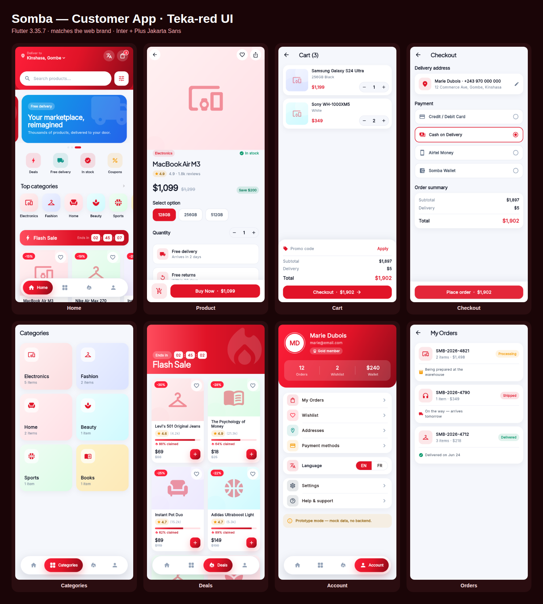

# Somba — Customer App (Flutter)

The customer-facing marketplace app for **Somba&Teka**, built with Flutter.

## Highlights

- Modern, top-tier e-commerce UI: gradient header, hero carousel, live flash-sale
  countdown, premium product cards, wishlist, variant & quantity selectors, a full
  cart → checkout → order-success flow, and a polished account area.
- Contemporary touches: **floating capsule navigation** with an animated expanding
  pill, **Plus Jakarta Sans** display headings paired with Inter body text, a "For You / Trending"
  feed selector, and "% claimed" urgency bars on deals.
- Centralised design system (`lib/theme/app_theme.dart`) — colour, type, radius,
  elevation and component themes in one place.
- Bundled **Inter + Plus Jakarta Sans** fonts (no runtime font fetching) and self-contained product
  visuals (gradient tiles with category glyphs) that fall back gracefully when
  network images are unavailable.
- English / French localisation.
- **Live data** — the app is wired to the NestJS + MySQL backend in [`../api`](../api).
  The catalogue (categories, products, deals, stores, coupons) hydrates from the
  API at startup, and auth, wishlist, addresses, orders (real checkout),
  reviews, and coupon validation all persist server-side. Everything **fails
  soft**: when the backend is unreachable the app falls back to bundled data so
  a demo build still works fully offline.

## Run locally

```bash
cd mobile
flutter pub get
flutter run            # device / emulator
flutter run -d chrome  # web
```

Requires Flutter **3.35.7**.

### Connecting to the backend

The API base URL is a build-time define (default `http://localhost:3001/api`):

```bash
# Start the backend first (see ../api/README.md), then:
flutter run --dart-define=API_BASE=http://localhost:3001/api
# Android emulator reaches the host via 10.0.2.2:
flutter run --dart-define=API_BASE=http://10.0.2.2:3001/api
```

Seeded customer login: `marie@mail.com` / `password123`. "Continue as guest"
browses the live catalogue without an account.

## CI/CD — Android APK

`.github/workflows/customer-app-apk.yml` builds the release APK on every push that
touches `mobile/`:

1. Sets up JDK 17 + Flutter 3.35.7
2. `flutter pub get` → `flutter analyze` → `flutter test`
3. `flutter build apk --release` (universal) and `--split-per-abi`
4. Uploads the APKs as a workflow artifact (`somba-customer-apk`)
5. Publishes a GitHub Release with `somba-customer.apk` attached

Download the latest APK from the repository **Releases** page or from the workflow
run's **Artifacts**.

## Screenshots

Rendered from the web build. See [`docs/screenshots/`](docs/screenshots).



## Project layout

```
lib/
  theme/app_theme.dart     # design system
  util/format.dart         # currency / number formatting
  widgets/                 # product card, product image, shared UI (badges, countdown…)
  screens/                 # home, categories, deals, product detail, cart, checkout,
                           # order success, orders, account
  data/                    # mock catalogue, cart/shop state, market profiles
  l10n/strings.dart        # EN/FR strings
```
