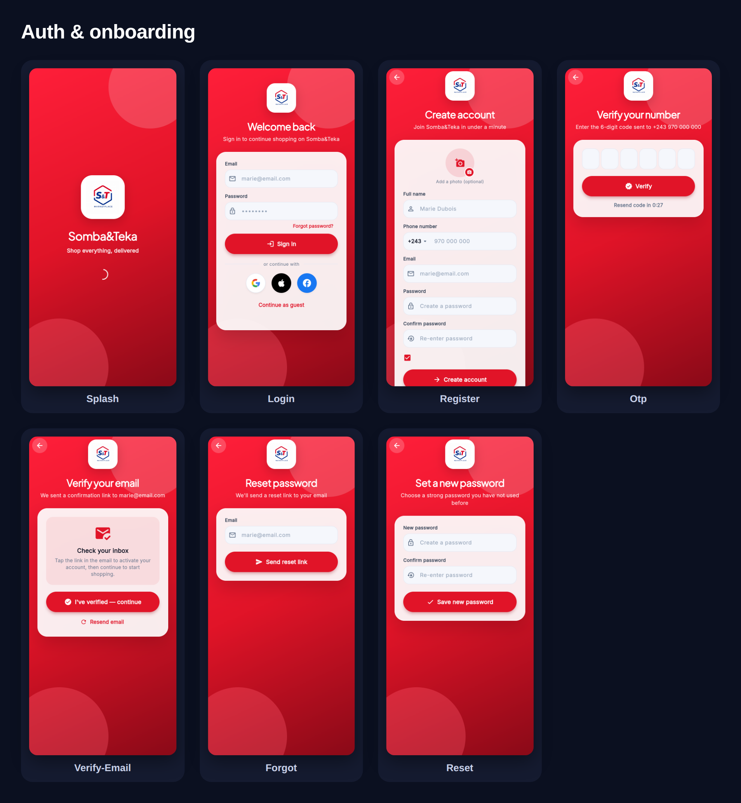
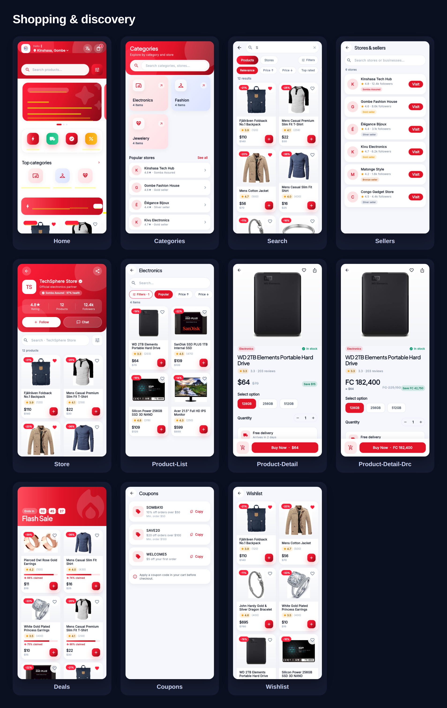
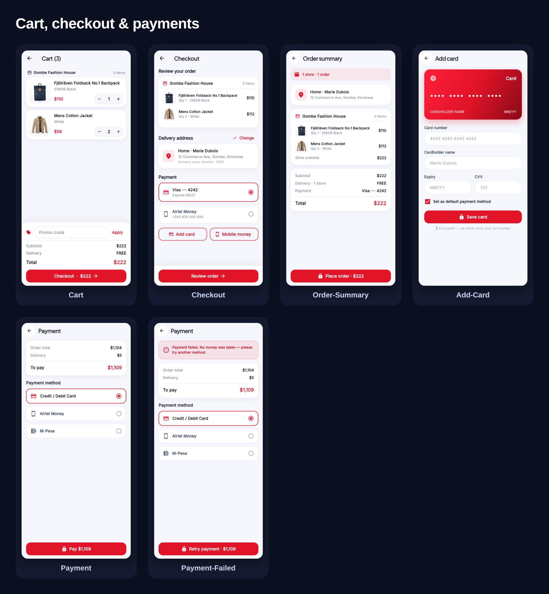
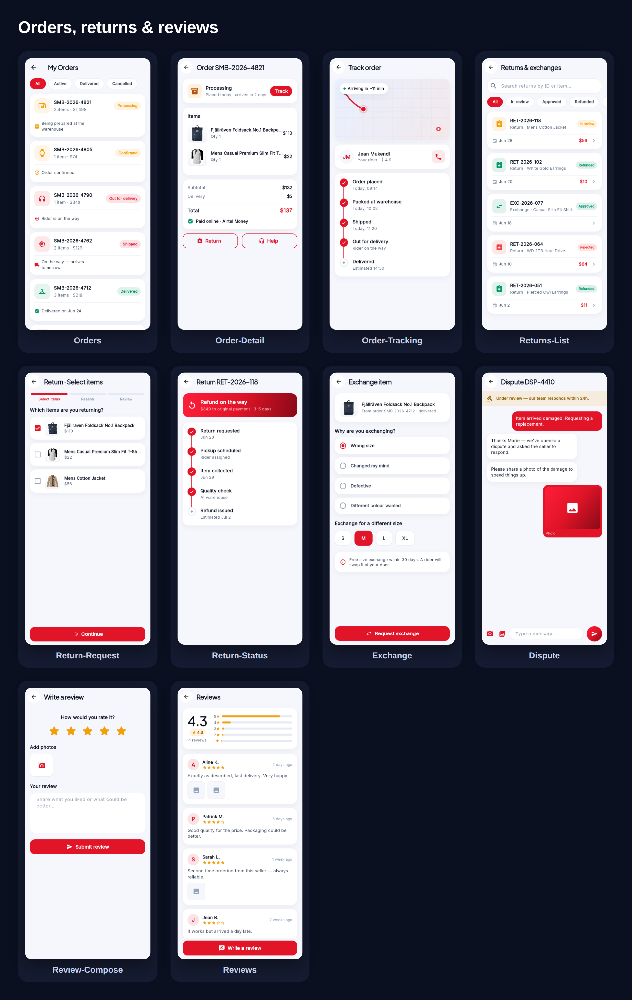
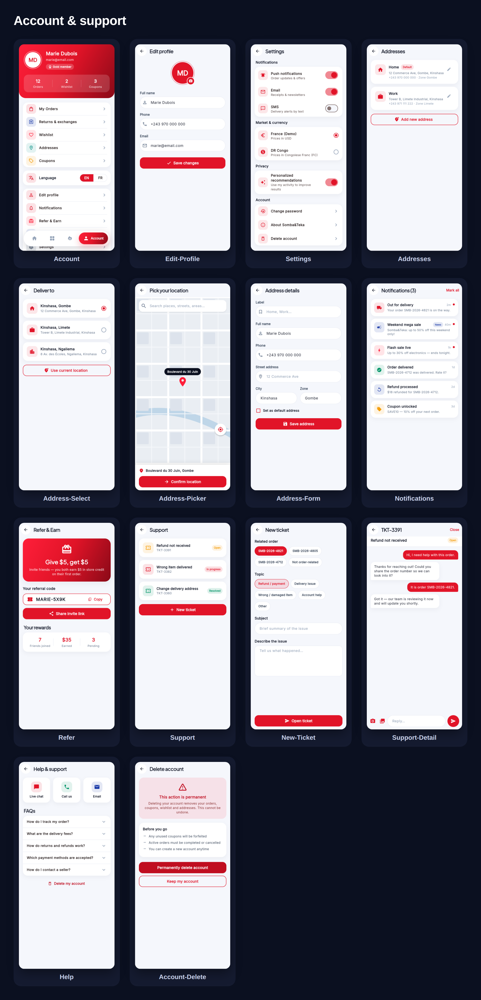
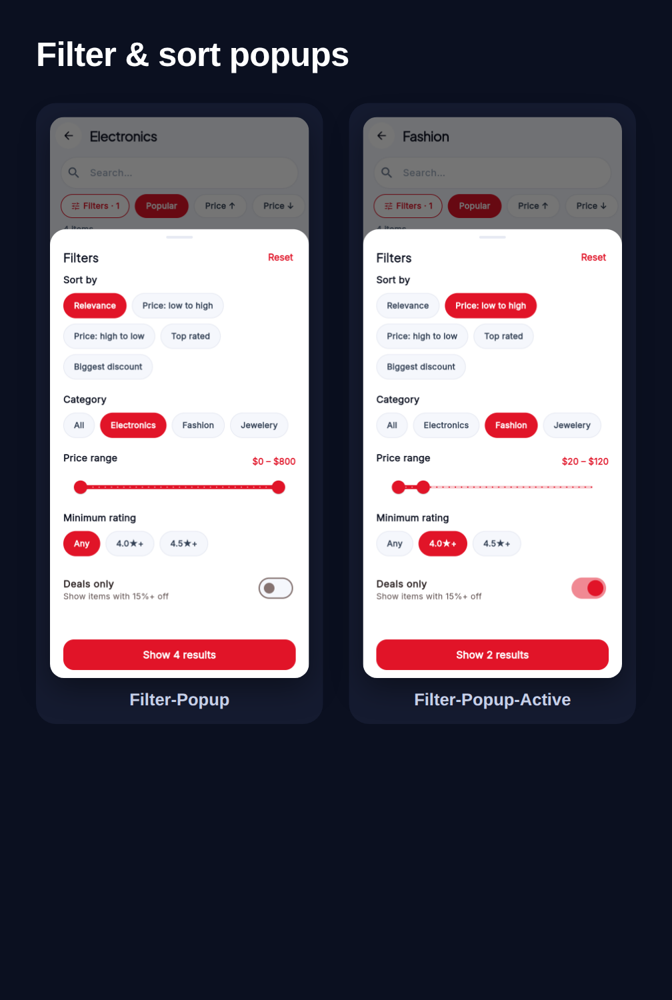

# Somba&Teka — Customer App Screens

Full screen-by-screen captures of every customer-app flow (390×844 @2x),
regenerated from the current build. Individual screens live in
[`flows/`](flows/); the grouped contact sheets below index them.

## Auth & onboarding

Splash · Login · Register · OTP · Verify email · Forgot password · Reset password

The shorter flows — number verification, email verification, forgot password
and set-a-new-password — are vertically centered for a balanced, premium layout.

## Shopping & discovery

Home · Categories · Search · Stores & sellers · Store front · Store chat ·
Product list · Product detail · Product detail (dual-currency) · Deals ·
Coupons · Wishlist

Home, Categories and Account are shown inside the app shell with the floating
bottom navigation bar.

## Cart, checkout & payments

Cart (multi-store) · Checkout · Order summary · Add card · Payment · Payment failed

## Orders, returns & reviews

Orders · Order detail · Order tracking · Returns & exchanges · Return request ·
Return status · Exchange · Dispute · Write a review · Reviews

## Account & support

Account · Edit profile · Settings · Addresses · Choose address · Location picker ·
Address form · Notifications · Refer & earn · Support · New ticket · Ticket detail ·
Help · Delete account

## Filter & sort popups

The AliExpress-style filter sheet (default and with filters applied): sort,
category, price range, minimum rating, deals-only, and a live result count.

---

### Full-screen catalogs (one image per screen — for the client)

- **English:** [`flows/README.md`](flows/README.md)
- **French:** [`fr/README.md`](fr/README.md) · [`flows-fr/README.md`](flows-fr/README.md)

All screens are localized (English / French) and functional in the mock build.
