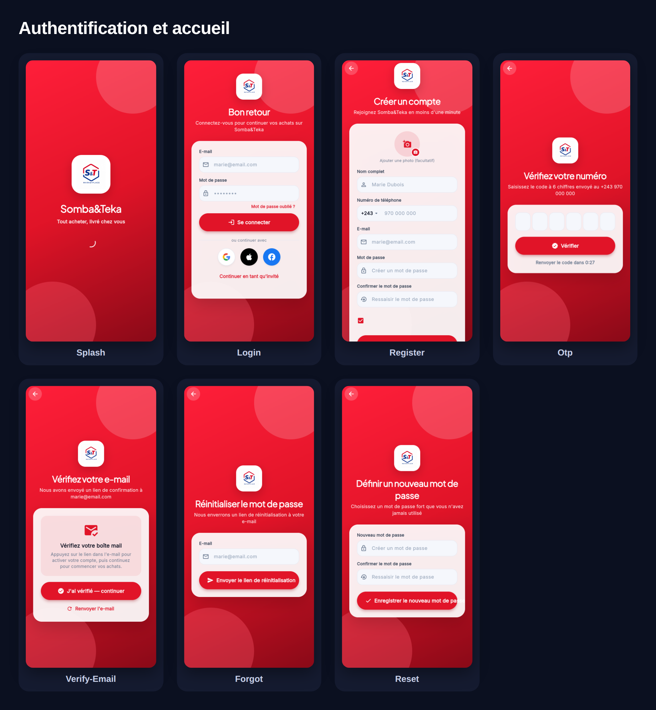
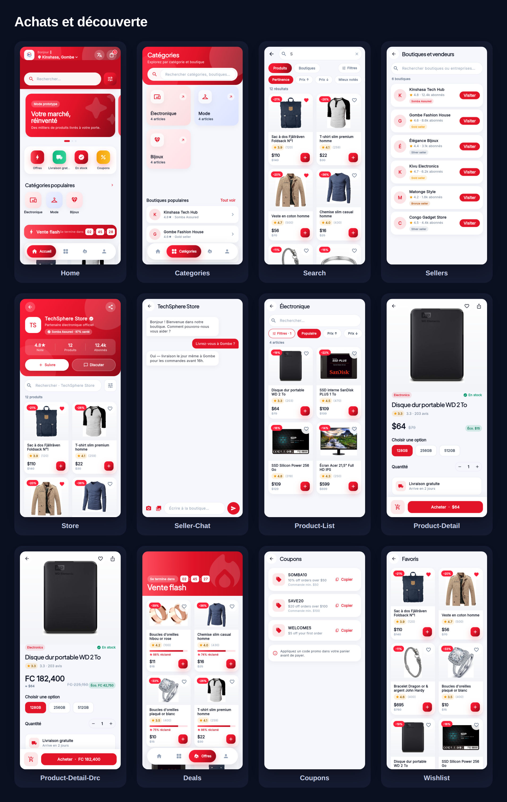
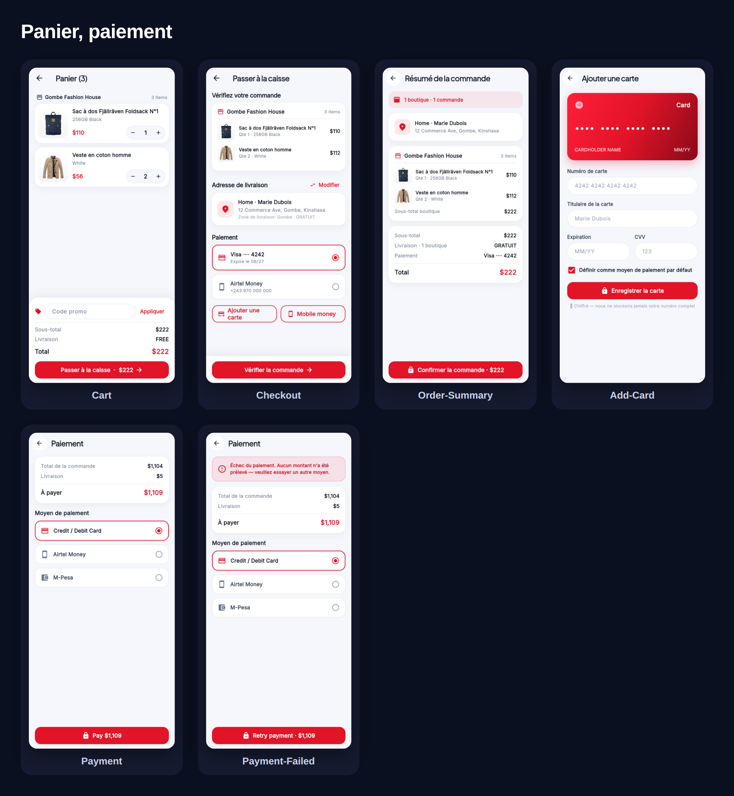
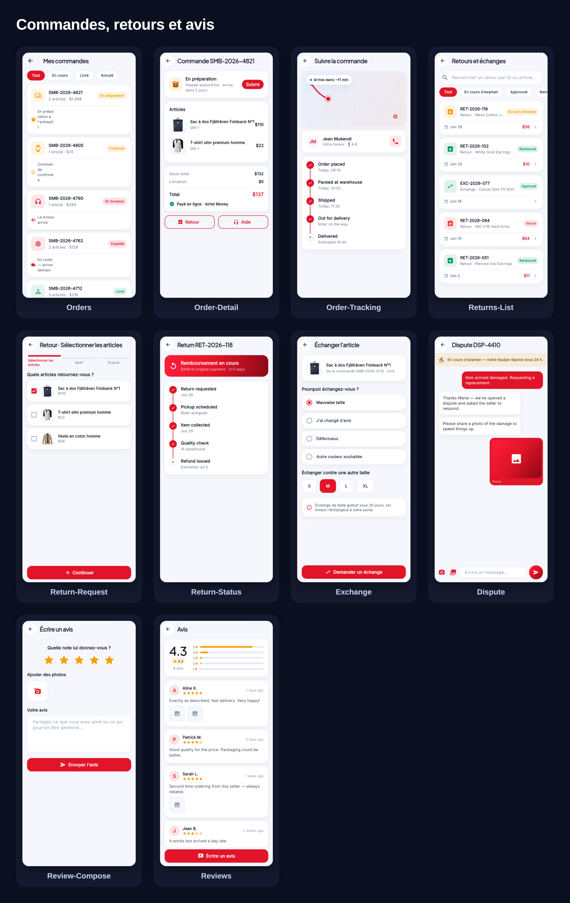
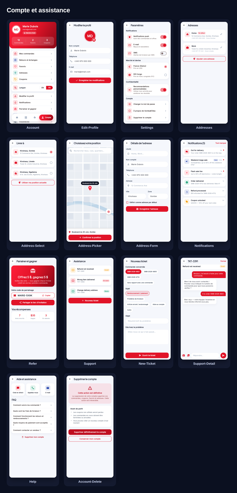
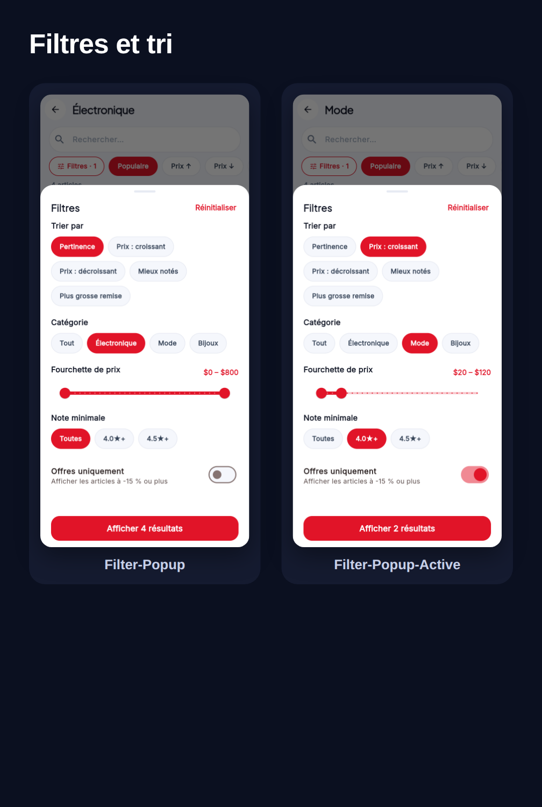

# Somba&Teka — Écrans de l'application client (Français)

Captures écran par écran de tous les parcours de l'application client
(390×844 @2x), en français. Les écrans individuels se trouvent dans
[`../flows-fr/`](../flows-fr/) ; les planches groupées ci-dessous les indexent.

## Authentification et accueil

Démarrage · Connexion · Créer un compte · Vérification du numéro ·
Vérification de l'e-mail · Mot de passe oublié · Nouveau mot de passe

## Achats et découverte

Accueil · Catégories · Recherche · Boutiques et vendeurs · Boutique ·
Chat boutique · Liste de produits · Détail produit · Détail (double devise) ·
Offres · Coupons · Favoris

## Panier, paiement

Panier (multi-boutiques) · Passer à la caisse · Résumé de la commande ·
Ajouter une carte · Paiement · Paiement échoué

## Commandes, retours et avis

Commandes · Détail · Suivi · Retours et échanges · Demande de retour ·
Statut du retour · Échange · Litige · Écrire un avis · Avis

## Compte et assistance

Compte · Modifier le profil · Paramètres · Adresses · Choisir une adresse ·
Choisir la position · Détails de l'adresse · Notifications · Parrainer et gagner ·
Assistance · Nouveau ticket · Détail du ticket · Aide · Supprimer le compte

## Filtres et tri

Popup de filtres (par défaut · appliqués) : tri, catégorie, fourchette de prix,
note minimale, offres uniquement.

---

Catalogue plein écran (chaque écran individuellement) :
[`../flows-fr/README.md`](../flows-fr/README.md).
