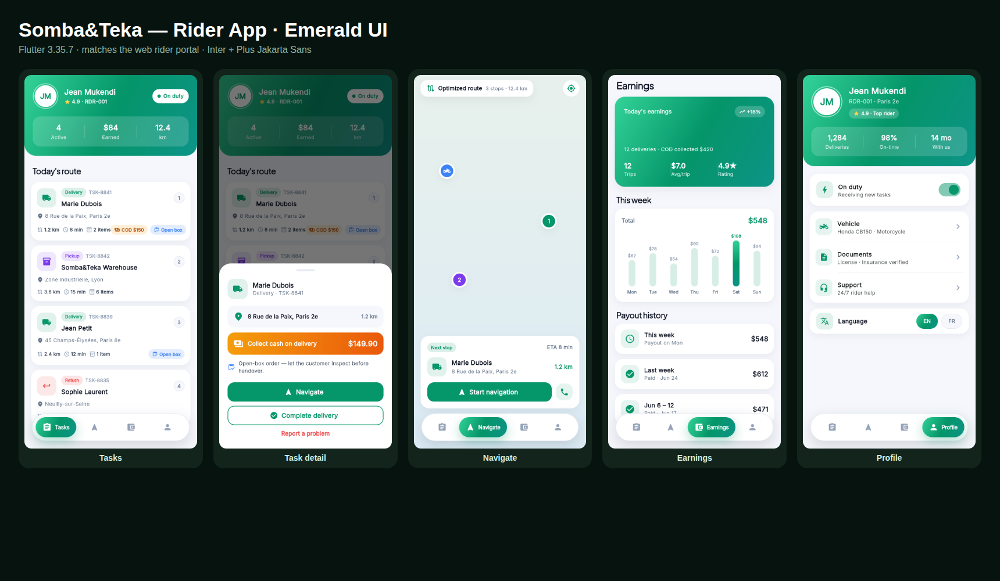

# Somba&Teka — Rider App (Flutter)

The rider/courier app for the Somba&Teka marketplace: manage delivery, pickup and
return tasks, collect cash on delivery, navigate an optimized route, and track
earnings.

## Realtime backend connection

The whole app runs on live data (no mock tasks): it connects to the NestJS backend (`../api`) over a single
authenticated **Socket.IO** connection (services in `lib/services/`). The rider
accepts tasks from the unassigned pool, advances delivery status, and streams
GPS — each action pushes live to the customer app and the web dashboards.

Configure the endpoint with `--dart-define` (defaults target the Android
emulator loopback `10.0.2.2`):

```bash
flutter run --dart-define=API_URL=http://localhost:3001 \
            --dart-define=SOCKET_URL=http://localhost:3001
```

Seeded dev login (`npm run seed` in `api/` only): `rider@somba.app` / `Somba@2026`. Production riders
are created by the fleet team in the admin panel. The sign-in screen never pre-fills credentials and
never lets anyone in offline.

Tabs: **Deliveries** (Active / Available / Done; claim → picked up → in transit → delivered, with a
cash-collected confirmation for COD), **Earnings** (server-computed totals + cash to hand over),
**Profile** (notifications, language, sign out). While a delivery is on the road the app streams the
real GPS position (`geolocator`; permission declared in the Android manifest) as `delivery:location`.

### Tests

```bash
flutter analyze && flutter test                      # widget tests
# live end-to-end against a seeded, running API (sign in, claim, deliver, GPS, earnings):
flutter test test/live_api_test.dart --dart-define=LIVE_TEST=true \
  --dart-define=API_URL=http://localhost:3001 --dart-define=SOCKET_URL=http://localhost:3001
```

## Highlights

- Modern royal-blue identity (logo colour) with a **floating capsule navigation** (animated
  expanding pill), **Plus Jakarta Sans** display headings paired with Inter body text.
- **Tasks**: gradient on-duty header with live stats, colour-coded task cards
  (delivery / pickup / return) with COD and open-box chips, distance · ETA · items,
  and a rich task-action bottom sheet (navigate, complete, report).
- **Navigate**: a custom-painted route map with sequenced stop markers and a
  next-stop action card.
- **Earnings**: gradient balance hero, a weekly bar chart with the best day
  highlighted, and payout history.
- **Profile**: stats header, on-duty switch, vehicle/documents/support, EN/FR toggle.
- Bundled **Inter + Plus Jakarta Sans** fonts — no runtime font fetching; fully self-contained.

## Run locally

```bash
cd rider-app
flutter pub get
flutter run            # device / emulator
flutter run -d chrome  # web
```

Requires Flutter **3.35.7** or newer (verified with 3.47.6).

## CI/CD — Android APK

`.github/workflows/rider-app-apk.yml` builds the release APK on every push that
touches `rider-app/`:

1. JDK 17 + Flutter 3.35.7
2. `flutter pub get` → `flutter analyze` → `flutter test`
3. `flutter build apk --release` (universal) and `--split-per-abi`
4. Uploads the APKs as the `somba-rider-apk` artifact
5. Publishes a GitHub Release with `somba-rider.apk` attached

## Screenshots

Rendered from the web build. See [`docs/screenshots/`](docs/screenshots).


